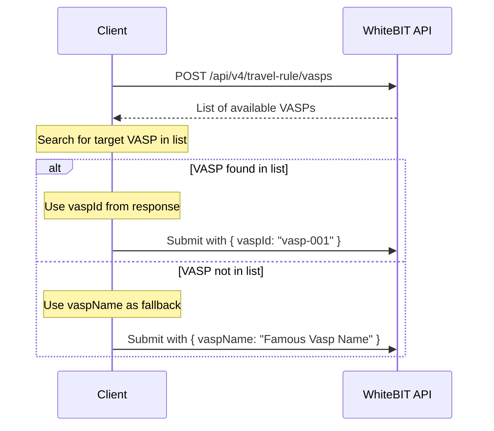

## Overview

This endpoint retrieves the list of VASPs that can be used when submitting travel rule data for deposits and withdrawals. For detailed Travel Rule requirements, see [Travel Rule](/concepts/travel-rule).

**When to use `vaspId` vs `vaspName`:**
- If the destination/originating VASP appears in this list, use its `vaspId` for accurate identification
- If the VASP is not in the list, use `vaspName` as a fallback with the VASP's name as a string

---

## Usage Notes

<Note>
The list may vary depending on the account's region.
</Note>

---

## VASP Selection Flow

---

## Related

- [Submit deposit verification](/api-reference/travel-rule/submit-deposit-verification) — Use VASPs when submitting deposit originator data
- [Create withdraw request](/api-reference/account-wallet/create-withdraw-request) — Use VASPs when creating withdrawals with travel rule data
- [Travel Rule](/concepts/travel-rule) — Detailed requirements and workflows
