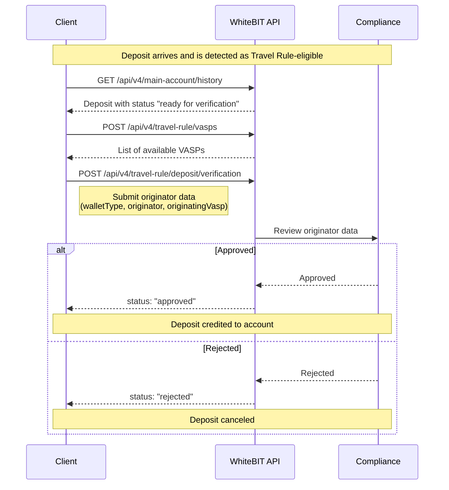
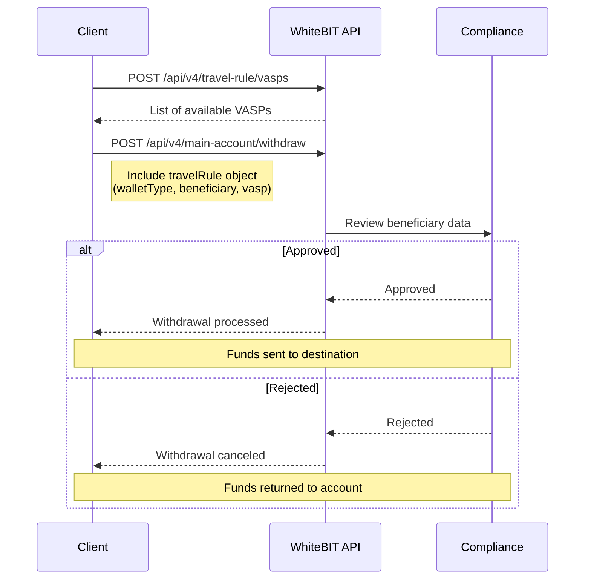

The Travel Rule requires Virtual Asset Service Providers (VASPs) to share originator and beneficiary information for cryptocurrency transfers above certain thresholds. This regulatory requirement, mandated by frameworks like FATF and MiCA, helps prevent money laundering and terrorist financing.

WhiteBIT provides API endpoints for Travel Rule compliance, enabling B2B clients to submit required data for deposits and withdrawals.

---

## When Travel Rule applies

Travel Rule verification is required when:
- The transaction involves cryptocurrency deposits or withdrawals
- The account is registered in the [European Economic Area (EEA)](/glossary#european-economic-area-eea)
- The transaction meets regional threshold requirements
- The Travel Rule API is enabled for the account

<Note>
The Travel Rule API is not available to all accounts. To request access, contact the assigned Account Manager or email institutional@whitebit.com.
</Note>

---

## Wallet types

| Type | Description | VASP required |
|------|-------------|---------------|
| `hosted` | VASP-hosted wallet (exchange, custodian) | Yes — provide `vasp` or `originatingVasp` object |
| `unhosted` | Self-custody wallet (hardware, software) | No |

---

## Party types

| Type | Description | Required fields |
|------|-------------|-----------------|
| `individual` | Natural person | `firstName`, `lastName`, `residenceCountry`, `address` |
| `entity` | Legal entity | `fullName`, `residenceCountry`, `address` |

---

## VASP identification

When the destination or originating wallet is hosted:
- **VASP in list** — Use `vaspId` from the [Get VASPs endpoint](/api-reference/travel-rule/get-vasps) response
- **VASP not in list** — Use `vaspName` with the VASP's name as a string fallback

---

## Country codes

All country fields use [ISO 3166-1 alpha-3](https://en.wikipedia.org/wiki/ISO_3166-1_alpha-3) codes (3-letter):

| Code | Country |
|------|---------|
| `DEU` | Germany |
| `GBR` | United Kingdom |
| `NLD` | Netherlands |
| `FRA` | France |
| `USA` | United States |

---

## Deposit verification

### Flow



### Deposit examples

**Individual from hosted wallet (VASP in list):**
```json
{
  "uniqueId": "550e8400-e29b-41d4-a716-446655440000",
  "walletType": "hosted",
  "originator": {
    "type": "individual",
    "firstName": "Alice",
    "lastName": "Johnson",
    "residenceCountry": "NLD",
    "walletAddress": "0x9876543210fedcba9876543210fedcba98765432",
    "address": {
      "country": "NLD",
      "city": "Amsterdam",
      "addressLine1": "Damrak 1"
    }
  },
  "originatingVasp": {
    "vaspId": "vasp-002"
  }
}
```

**Entity from hosted wallet (VASP not in list):**
```json
{
  "uniqueId": "550e8400-e29b-41d4-a716-446655440000",
  "walletType": "hosted",
  "originator": {
    "type": "entity",
    "fullName": "Acme Corporation Ltd",
    "residenceCountry": "GBR",
    "walletAddress": "0xabcdef1234567890abcdef1234567890abcdef12",
    "address": {
      "country": "GBR",
      "city": "London",
      "postCode": "EC2A 4BX",
      "addressLine1": "123 Finsbury Square"
    }
  },
  "originatingVasp": {
    "vaspName": "Famous Vasp Inc"
  }
}
```

**Individual from unhosted wallet:**
```json
{
  "uniqueId": "550e8400-e29b-41d4-a716-446655440000",
  "walletType": "unhosted",
  "originator": {
    "type": "individual",
    "firstName": "Bob",
    "lastName": "Smith",
    "residenceCountry": "DEU",
    "walletAddress": "bc1qxy2kgdygjrsqtzq2n0yrf2493p83kkfjhx0wlh",
    "address": {
      "country": "DEU",
      "city": "Berlin",
      "addressLine1": "Alexanderplatz 1"
    }
  }
}
```

---

## Withdrawal with Travel Rule

### Flow



### Withdrawal examples

**Individual to hosted wallet (VASP in list):**
```json
{
  "ticker": "BTC",
  "amount": "0.5",
  "address": "bc1qxy2kgdygjrsqtzq2n0yrf2493p83kkfjhx0wlh",
  "uniqueId": "withdraw-tr-001",
  "travelRule": {
    "walletType": "hosted",
    "beneficiary": {
      "type": "individual",
      "firstName": "John",
      "lastName": "Doe",
      "residenceCountry": "DEU",
      "address": {
        "country": "DEU",
        "city": "Berlin",
        "addressLine1": "Alexanderplatz 1"
      }
    },
    "vasp": {
      "vaspId": "vasp-001"
    }
  }
}
```

**Entity to hosted wallet (VASP not in list):**
```json
{
  "ticker": "USDT",
  "amount": "10000",
  "address": "0x742d35Cc6634C0532925a3b844Bc9e7595f8a2B1",
  "network": "ERC20",
  "uniqueId": "withdraw-tr-002",
  "travelRule": {
    "walletType": "hosted",
    "beneficiary": {
      "type": "entity",
      "fullName": "Acme Trading Ltd",
      "residenceCountry": "GBR",
      "address": {
        "country": "GBR",
        "city": "London",
        "postCode": "EC2A 4BX",
        "addressLine1": "123 Finsbury Square"
      }
    },
    "vasp": {
      "vaspName": "Famous Vasp Inc"
    }
  }
}
```

**Individual to unhosted wallet:**
```json
{
  "ticker": "ETH",
  "amount": "2.5",
  "address": "0xabcdef1234567890abcdef1234567890abcdef12",
  "uniqueId": "withdraw-tr-003",
  "travelRule": {
    "walletType": "unhosted",
    "beneficiary": {
      "type": "individual",
      "firstName": "Jane",
      "lastName": "Smith",
      "residenceCountry": "NLD",
      "address": {
        "country": "NLD",
        "city": "Amsterdam",
        "addressLine1": "Damrak 1"
      }
    }
  }
}
```

---

## Legacy format (withdrawals only)

<Warning>
The API still accepts the legacy flat format for withdrawals, but it will **not pass Travel Rule verification**. To complete Travel Rule compliance, use the new structured format.
</Warning>

**Field mapping:**

| Legacy field | New field |
|--------------|-----------|
| `type` | `beneficiary.type` |
| `vasp` | `vasp.vaspId` or `vasp.vaspName` |
| `name` | `beneficiary.firstName` (individual) or `beneficiary.fullName` (entity) |
| `address` | `beneficiary.lastName` (individual) or `beneficiary.address` (entity) |

**Legacy format example (won't pass verification):**
```json
{
  "ticker": "BTC",
  "amount": "0.5",
  "address": "bc1qxy2kgdygjrsqtzq2n0yrf2493p83kkfjhx0wlh",
  "uniqueId": "withdraw-tr-legacy",
  "travelRule": {
    "type": "individual",
    "vasp": "Binance",
    "name": "John",
    "address": "Doe"
  }
}
```

---

## What's next

<CardGroup cols={2}>
  <Card title="Get available VASPs" icon="building-columns" href="/api-reference/travel-rule/get-vasps">
    Retrieve the list of VASPs for travel rule submissions.
  </Card>
  <Card title="Submit deposit verification" icon="file-import" href="/api-reference/travel-rule/submit-deposit-verification">
    Submit originator data for a deposit pending verification.
  </Card>
  <Card title="Create withdraw request" icon="money-bill-transfer" href="/api-reference/account-wallet/create-withdraw-request">
    Create withdrawals with travel rule data.
  </Card>
  <Card title="EEA definition" icon="globe" href="/glossary#european-economic-area-eea">
    European Economic Area countries where Travel Rule applies.
  </Card>
</CardGroup>
