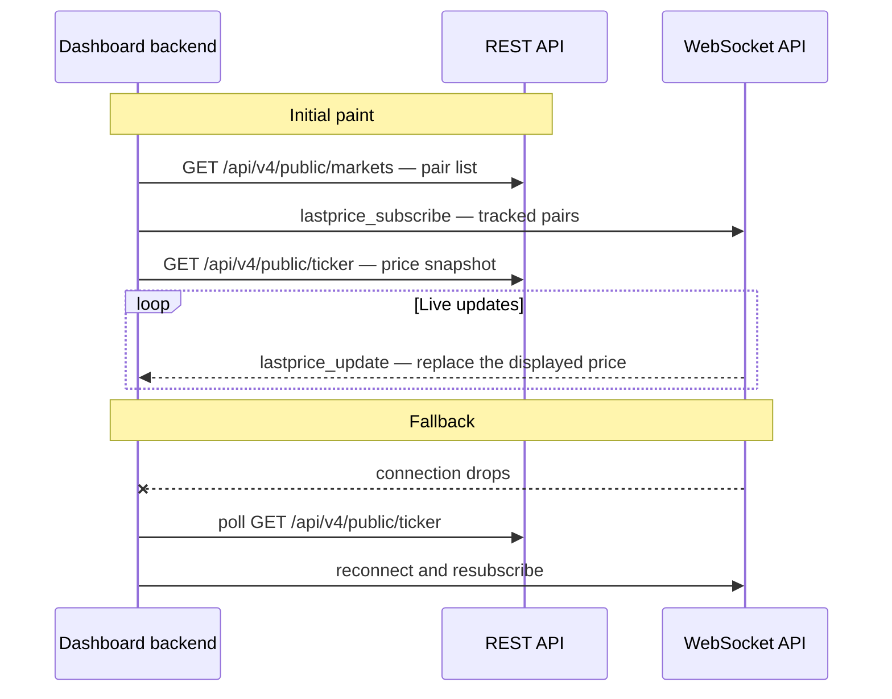

import { RegionBaseUrl } from '/snippets/RegionBaseUrl.jsx';

<RegionBaseUrl />

Build a live price dashboard on WhiteBIT public market data: one REST call paints the initial board, and a single WebSocket subscription keeps every displayed price current. The full flow runs without an account or API key. The guide targets price aggregators and market-data consumers.

## Prerequisites

- A terminal with curl, or any HTTP client
- Python 3 with the `websocket-client` package, or `wscat` for interactive testing — for the streaming step
- No WhiteBIT account or API key needed — every endpoint in this guide is public

## Architecture

The dashboard combines two data paths: a REST snapshot for the initial paint and a WebSocket stream for continuous updates. A REST polling loop substitutes for the stream while a dropped connection recovers.



## Select markets to track

Market discovery comes first. [`GET /api/v4/public/markets`](/api-reference/market-data/market-info) returns configuration and trading rules for every market enabled for trading. Read `name` for the pair identifier and filter by `type` (`spot`, `futures`, or `tradfiFutures`) to scope the board — a spot-only dashboard keeps `type: spot` entries. Market configuration is reference data: the server re-syncs the response approximately every 10 seconds, so fetch the list once at startup and refresh on a slow cycle.

For a step-by-step first call against each public market-data endpoint, see the [Market Data Quickstart](/products/market-data/quickstart).

## Fetch the price snapshot

[`GET /api/v4/public/ticker`](/api-reference/market-data/market-activity) returns a 24-hour pricing and volume summary for every market pair in a single response — one call fills the whole board.

<Tabs>
  <Tab title="cURL">
    ```bash
    curl https://whitebit.com/api/v4/public/ticker
    ```
  </Tab>
  <Tab title="Python">
    ```python
    import requests

    ticker = requests.get("https://whitebit.com/api/v4/public/ticker").json()

    board = {
        pair: entry["last_price"]
        for pair, entry in ticker.items()
        if pair in ("BTC_USDT", "ETH_USDT")
    }
    print(board)
    ```
  </Tab>
</Tabs>

For Go and PHP examples, see [SDKs](/sdks).

**Response (BTC_USDT entry, trimmed):**

```json
{
  "BTC_USDT": {
    "last_price": "62741.43",
    "base_volume": "1653.886345",
    "quote_volume": "104493656.92108444",
    "isFrozen": false,
    "change": "-0.55"
  }
}
```

Key fields for a dashboard: `last_price` (most recent trade price in the quote currency), `change` (percentage change against the rolling 24-hour open), `quote_volume` (24-hour volume in the quote currency), and `isFrozen` (`true` when trading is disabled for the pair — flag or hide the entry). The API caches the response for 1 second, so polling faster than once per second returns identical data.

## Stream price updates

Polling covers one-shot lookups; a live board needs continuous updates. Subscribe to the [Last Price channel](/websocket/market-streams/lastprice) — the server pushes an update every second when the price changes, and each update replaces the displayed value. One connection carries the full watchlist: the subscription accepts an array of market names. A single connection maintains subscriptions across 200 or more markets (see [WebSocket Rate Limits](/websocket/rate-limits)).

<Tabs>
  <Tab title="Python">
    ```python
    import json
    import websocket

    ws = websocket.create_connection("wss://wss.whitebit.com/ws")
    ws.send(json.dumps({
        "id": 1,
        "method": "lastprice_subscribe",
        "params": ["BTC_USDT", "ETH_USDT"]
    }))
    print(ws.recv())  # subscribe confirmation

    while True:
        message = json.loads(ws.recv())
        if message.get("method") == "lastprice_update":
            market, price = message["params"]
            print(f"{market}: {price}")  # replace the displayed price
    ```
  </Tab>
  <Tab title="wscat">
    ```bash
    > {"id": 1, "method": "lastprice_subscribe", "params": ["BTC_USDT", "ETH_USDT"]}
    ```
  </Tab>
</Tabs>

**Subscribe confirmation:**

```json
{"id": 1, "result": {"status": "success"}, "error": null}
```

**Update message:**

```json
{"id": null, "method": "lastprice_update", "params": ["BTC_USDT", "62708.25"]}
```

The `params` array contains the market name (index 0) and the last traded price (index 1).

For an [order book](/glossary#order-book) widget next to the price board, add the [Depth channel](/websocket/market-streams/depth) — a snapshot-plus-delta stream with recovery rules of its own, covered in [State recovery after reconnect](/guides/websocket-quickstart#state-recovery-after-reconnect).

The [WebSocket Quickstart](/guides/websocket-quickstart) covers connection setup, keepalive pings, and the 60-second inactivity timeout; the dashboard reuses the same connection pattern.

## Reconcile snapshot and stream

Last price updates follow a replacement model: each `lastprice_update` fully replaces the previous value for the market, so the board needs no gap handling. Three rules keep the board consistent:

1. **Startup ordering.** Subscribe first, then fetch the [ticker](/glossary#ticker) snapshot. Apply snapshot values only to pairs without a streamed value yet — the snapshot response can lag behind the stream by its 1-second cache. With replacement semantics, even the reverse order self-corrects within one update interval.
2. **Liveness.** Do not infer connection health from update frequency alone. Send a `ping` every 50 seconds or less — the server closes a connection after 60 seconds of client inactivity — and treat a missed pong as a dropped connection. Reconnection with backoff and resubscription follows the standard pattern in [Reconnection and state recovery](/guides/websocket-quickstart#reconnection-and-state-recovery).
3. **Polling fallback.** While a connection recovers, keep the board live by polling [`GET /api/v4/public/ticker`](/api-reference/market-data/market-activity). The 1-second server-side cache makes one request per second the effective polling ceiling. Stop polling once resubscription confirms.

## Rate limits

The endpoints and channels used on this page carry the following limits:

| Surface | Limit |
|---------|-------|
| `GET /api/v4/public/markets` | 2,000 requests per 10 seconds |
| `GET /api/v4/public/ticker` | 2,000 requests per 10 seconds |
| WebSocket connections | 1,000 new connections per minute |
| WebSocket requests | 12,000 JSON-RPC requests per 10 seconds per connection |

Full reference: [Rate Limits & Error Codes](/api-reference/rate-limits) and [WebSocket Rate Limits & Error Codes](/websocket/rate-limits).

## Complete example

The two snippets above cover the critical path — the ticker snapshot and the price stream. The remaining assembly (multi-pair state, staleness flags, reconnection, the polling fallback) is standard application code. A complete runnable dashboard is planned as a clone-and-run starter repository.

## What's next

<CardGroup cols={3}>
  <Card title="Market Data Quickstart" icon="chart-bar" href="/products/market-data/quickstart">
    First calls against each public market-data endpoint — ping, markets, ticker, orderbook, trades.
  </Card>
  <Card title="WebSocket Quickstart" icon="bolt" href="/guides/websocket-quickstart">
    Connection setup, keepalive, reconnection, and state recovery patterns.
  </Card>
  <Card title="Partner Solutions" icon="route" href="/guides/partner-solutions">
    Integration routes by use case — trading bots, payments, account monitoring.
  </Card>
</CardGroup>
