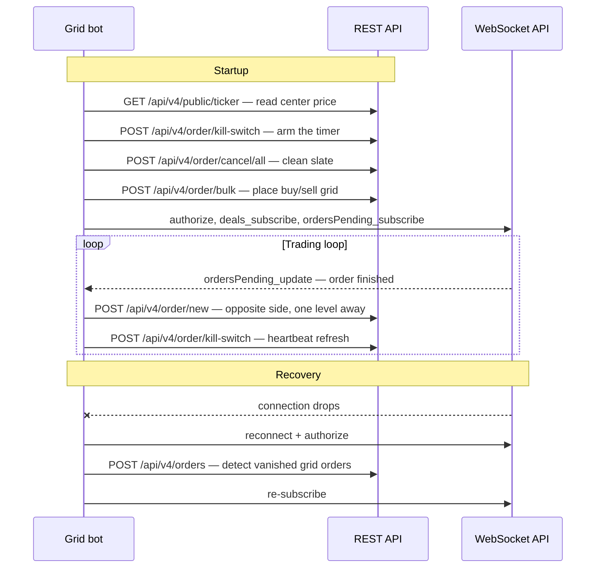

import { RegionBaseUrl } from '/components/RegionBaseUrl.jsx';

<RegionBaseUrl />

Build an automated trading bot on the WhiteBIT API in Python, using `requests` for signed REST calls and `websockets` for streaming market data and fills. The guide assumes Python 3.9+ and a WhiteBIT account with a Trading-permission API key (see Prerequisites below).

## Prerequisites

- A WhiteBIT account ([register](https://whitebit.com/auth/register))
- An API key with **Trading** permission ([create one](https://whitebit.com/settings/api))
- Funds in the **Trade** balance — transfer from Main balance if needed (see [Balances & Transfers](/concepts/balances)). Grid strategies require both the quote currency (for buy orders) and the base currency (for sell orders).
- Familiarity with HMAC-SHA512 signing — see [Authentication](/api-reference/authentication) for the contract and [First API Call](/guides/first-api-call) for a worked signing example with troubleshooting
- Python 3.9+ with `requests` and `websockets` packages installed (the production guidance in the worked example relies on `asyncio.to_thread`, added in Python 3.9)

<Warning>
  WhiteBIT has no public testnet or sandbox. All orders execute against the live
  orderbook. For risk-free testing, use Demo Tokens (DBTC/DUSDT) — activate from
  the [WhiteBIT Codes page](https://whitebit.com/codes). Test with the
  `DBTC_DUSDT` market pair before switching to real assets.
</Warning>

## Architecture overview

A trading bot operates as a continuous loop:

```text
┌─────────────────┐     ┌──────────────────┐     ┌──────────────────┐
│  Market Data     │────▶│  Signal / Logic   │────▶│  Order Execution │
│  (WS + REST)     │     │  (Strategy)       │     │  (REST API)      │
└─────────────────┘     └──────────────────┘     └──────────────────┘
        ▲                                                 │
        │           ┌──────────────────┐                  │
        └───────────│  Fill Monitoring  │◀─────────────────┘
                    │  (WebSocket)      │
                    └──────────────────┘
```

1. **Market data** — receive prices and orderbook updates via WebSocket (or REST polling for lower-frequency strategies)
2. **Signal generation** — apply strategy logic to determine when and what to trade
3. **Order execution** — place orders via REST API (single or bulk)
4. **Fill monitoring** — track order fills and state changes via WebSocket
5. **Position management** — update internal state, replace filled orders, manage risk

Signal generation (step 2) is strategy-specific. The grid bot example at the end of the guide demonstrates one concrete strategy.

## Market data ingestion

### REST polling

For strategies that do not require sub-second data, poll market data via REST:

<Tabs>
  <Tab title="cURL">
    ```bash
    # Fetch ticker data for BTC_USDT
    curl -X GET "https://whitebit.com/api/v4/public/ticker"

    # Fetch orderbook for BTC_USDT (depth: 20 levels)
    curl -X GET "https://whitebit.com/api/v4/public/orderbook/BTC_USDT?limit=20"
    ```
  </Tab>
  <Tab title="Python">
    ```python
    import requests

    BASE_URL = "https://whitebit.com"

    # Fetch ticker data
    ticker = requests.get(f"{BASE_URL}/api/v4/public/ticker").json()
    btc_price = ticker.get("BTC_USDT", {})
    print(f"BTC_USDT last price: {btc_price.get('last_price')}")

    # Fetch orderbook
    orderbook = requests.get(
        f"{BASE_URL}/api/v4/public/orderbook/BTC_USDT",
        params={"limit": 20}
    ).json()
    best_bid = orderbook["bids"][0] if orderbook.get("bids") else None
    best_ask = orderbook["asks"][0] if orderbook.get("asks") else None
    print(f"Best bid: {best_bid}, Best ask: {best_ask}")
    ```
  </Tab>
</Tabs>

For Go and PHP examples, see [SDKs](/sdks).

**Endpoints:**
- [`GET /api/v4/public/ticker`](/api-reference/market-data/market-activity) — 24h ticker statistics for all markets
- [`GET /api/v4/public/orderbook/{market}`](/api-reference/market-data/orderbook) — orderbook snapshot with configurable depth

### WebSocket streaming

For real-time data, subscribe to WebSocket market streams:

| Channel | Subscribe method | Data |
|---------|-----------------|------|
| [Last Price](/websocket/market-streams/lastprice) | `lastprice_subscribe` | Price updates on every trade |
| [Depth](/websocket/market-streams/depth) | `depth_subscribe` | Orderbook depth updates |

```python
import json, asyncio, websockets

async def stream_market_data():
    async with websockets.connect("wss://api.whitebit.com/ws") as ws:
        # Subscribe to last price updates
        await ws.send(json.dumps({
            "id": 1,
            "method": "lastprice_subscribe",
            "params": ["BTC_USDT"]
        }))
        # Subscribe to orderbook depth
        await ws.send(json.dumps({
            "id": 2,
            "method": "depth_subscribe",
            # params: [market, limit, price_interval, multi_subscription_flag]
            "params": ["BTC_USDT", 20, "0", True]
        }))

        async for message in ws:
            data = json.loads(message)
            method = data.get("method")
            if method == "lastprice_update":
                print(f"Price: {data['params']}")
            elif method == "depth_update":
                print(f"Orderbook update: {len(data['params'][1].get('bids', []))} bids")
```

See the [WebSocket Quickstart](/guides/websocket-quickstart) for connection setup and authentication.

<Note>
  Incremental `depth_update` deltas chain via `past_update_id`. If a delta's
  `past_update_id` does not match the last-seen `update_id` for this subscription,
  a message was missed — resnapshot by unsubscribing and re-subscribing.
  Keepalive snapshots (`params[0]` is `true`, `past_update_id` absent) are full
  resets, not gap signals — the snapshot `update_id` may exceed the last delta's. See
  [WS Quickstart — State recovery after reconnect](/guides/websocket-quickstart#state-recovery-after-reconnect)
  for the full pattern.
</Note>

## Order placement

Every private endpoint in this guide is signed with HMAC-SHA512. The `send_request` helper below handles the signing and a thread-safe nonce; the rest of the guide reuses it.

<Note>
  `send_request` uses a millisecond nonce. If multiple threads call the helper
  in the same millisecond, the server rejects the duplicate via its nonceWindow
  (±5 seconds). The helper below uses a monotonic counter protected by a lock
  — safe under concurrent callers (for example, the kill-switch heartbeat
  thread and the strategy thread placing orders simultaneously).
</Note>

```python
import base64, hashlib, hmac, json, threading, time, requests

API_KEY = "YOUR_API_KEY"
API_SECRET = "YOUR_API_SECRET"
BASE_URL = "https://whitebit.com"

_nonce_lock = threading.Lock()
_last_nonce = 0

def _next_nonce():
    """Monotonic millisecond nonce — safe under concurrent callers."""
    global _last_nonce
    with _nonce_lock:
        n = max(int(time.time() * 1000), _last_nonce + 1)
        _last_nonce = n
        return str(n)

def send_request(path, data=None):
    """Send a signed request. Returns the decoded JSON body.
    Raises requests.HTTPError on HTTP 4xx/5xx — caller can inspect
    `.response.status_code` and `.response.json()`."""
    data = dict(data or {})
    data["request"] = path
    data["nonce"] = _next_nonce()
    data_json = json.dumps(data)
    payload_b64 = base64.b64encode(data_json.encode()).decode()
    signature = hmac.new(
        API_SECRET.encode(), payload_b64.encode(), hashlib.sha512
    ).hexdigest()
    headers = {
        "Content-Type": "application/json",
        "X-TXC-APIKEY": API_KEY,
        "X-TXC-PAYLOAD": payload_b64,
        "X-TXC-SIGNATURE": signature,
    }
    resp = requests.post(BASE_URL + path, headers=headers, data=data_json)
    resp.raise_for_status()
    return resp.json()
```

Private WebSocket channels require an `authorize` handshake. The helper below fetches a token via REST (rate limit: 10 requests / 60 s) and sends the `authorize` message. Call it once per WebSocket connection, before any private subscribe:

```python
async def authenticate_ws(ws):
    """Fetch a WebSocket token via REST and authorize the WS connection."""
    token_resp = send_request("/api/v4/profile/websocket_token")
    token = token_resp["websocket_token"]
    await ws.send(json.dumps({
        "id": 999,
        "method": "authorize",
        "params": [token, "public"],
    }))
    ack = json.loads(await ws.recv())
    if ack.get("id") != 999 or ack.get("result", {}).get("status") != "success":
        raise RuntimeError(f"WS authorize failed: {ack}")
```

See [Authentication](/api-reference/authentication) for the full signing walkthrough.

### Single order

Place a limit order using the order creation endpoint:

**Endpoint:** [`POST /api/v4/order/new`](/api-reference/spot-trading/create-limit-order)

<Tabs>
  <Tab title="cURL">
    ```bash
    curl -X POST https://whitebit.com/api/v4/order/new \
      -H "Content-Type: application/json" \
      -H "X-TXC-APIKEY: YOUR_API_KEY" \
      -H "X-TXC-PAYLOAD: BASE64_PAYLOAD" \
      -H "X-TXC-SIGNATURE: HMAC_SIGNATURE" \
      -d '{"market":"BTC_USDT","side":"buy","amount":"0.001","price":"60000","request":"/api/v4/order/new","nonce":1700000000000}'
    ```
  </Tab>
  <Tab title="Python">
    ```python
    order = send_request("/api/v4/order/new", {
        "market": "BTC_USDT",
        "side": "buy",
        "amount": "0.001",
        "price": "60000"
    })
    print(f"Order placed: {order.get('orderId')}")
    ```
  </Tab>
</Tabs>

<Note>
  For bot integrations, include `clientOrderId` in the request to map fills
  back to internal strategy state without depending on the server-assigned
  `orderId`. The identifier is preserved across `order/modify` calls (modify
  issues a new `orderId` but retains the caller-supplied `clientOrderId`),
  which makes it the right key for order reconciliation. See
  [Client Order ID](/guides/client-order-id) for usage patterns.
</Note>

### Bulk orders

Place up to 20 limit orders in a single request — one round trip instead of up to 20 for multi-order strategies.

**Endpoint:** [`POST /api/v4/order/bulk`](/api-reference/spot-trading/bulk-limit-order)

<Tabs>
  <Tab title="cURL">
    ```bash
    curl -X POST https://whitebit.com/api/v4/order/bulk \
      -H "Content-Type: application/json" \
      -H "X-TXC-APIKEY: YOUR_API_KEY" \
      -H "X-TXC-PAYLOAD: BASE64_PAYLOAD" \
      -H "X-TXC-SIGNATURE: HMAC_SIGNATURE" \
      -d '{"orders":[{"market":"BTC_USDT","side":"buy","amount":"0.001","price":"59900"},{"market":"BTC_USDT","side":"buy","amount":"0.001","price":"59800"}],"request":"/api/v4/order/bulk","nonce":1700000000000}'
    ```
  </Tab>
  <Tab title="Python">
    ```python
    # Place 5 buy orders at descending prices.
    # Note: `market` goes on each order item, not at the top level.
    orders = [
        {"side": "buy", "amount": "0.001", "price": str(60000 - i * 100), "market": "BTC_USDT"}
        for i in range(5)
    ]
    result = send_request("/api/v4/order/bulk", {"orders": orders})

    # Bulk response is an array of {result, error} pairs. `result` is null on failure.
    for i, item in enumerate(result):
        if item.get("result"):
            print(f"Order {i}: placed (ID {item['result']['orderId']})")
        else:
            err = item.get("error") or {}
            print(f"Order {i}: failed — code {err.get('code')}, {err.get('message', 'unknown')}")
    ```
  </Tab>
</Tabs>

<Note>
  The bulk endpoint accepts up to **20 limit orders** per request. All orders in a batch must target the same market pair. Partial failures are possible — always check each order result individually, or set `stopOnFail: true` to stop processing at the first failed order.
</Note>

## Kill-switch setup

The kill-switch cancels every active order on the configured market after a timeout that the bot must refresh. If the bot crashes or loses connectivity to the API, the timer expires and the API cancels every stale order automatically.

**Endpoints:**
- [`POST /api/v4/order/kill-switch`](/api-reference/spot-trading/sync-kill-switch-timer) — activate or refresh the timer
- [`POST /api/v4/order/kill-switch/status`](/api-reference/spot-trading/status-kill-switch-timer) — check current timer state

### Activate kill-switch

<Tabs>
  <Tab title="cURL">
    ```bash
    curl -X POST https://whitebit.com/api/v4/order/kill-switch \
      -H "Content-Type: application/json" \
      -H "X-TXC-APIKEY: YOUR_API_KEY" \
      -H "X-TXC-PAYLOAD: BASE64_PAYLOAD" \
      -H "X-TXC-SIGNATURE: HMAC_SIGNATURE" \
      -d '{"market":"BTC_USDT","timeout":"60","request":"/api/v4/order/kill-switch","nonce":1700000000000}'
    ```
  </Tab>
  <Tab title="Python">
    ```python
    # Activate kill-switch with 60-second timeout.
    # Note: the API expects `timeout` as a STRING, not an integer.
    ks = send_request("/api/v4/order/kill-switch", {
        "market": "BTC_USDT",
        "timeout": "60"  # seconds as string, valid range: "5"–"600"
    })
    print(f"Kill-switch active, cancellationTime: {ks.get('cancellationTime')}")
    ```
  </Tab>
</Tabs>

<Note>
  The kill-switch scope defaults to **all order types** (spot, margin, futures).
  To scope it to just spot orders — for example, when the same account runs
  futures positions that must not be canceled by a spot kill-switch — pass
  `"types": ["spot"]` in the request.
</Note>

### Heartbeat refresh loop

The bot must refresh the kill-switch before the timer expires. If the bot fails to refresh, all orders cancel automatically. Retry a failed refresh after a short delay instead of waiting the full interval — with a 45-second interval and a 60-second timeout, one skipped refresh expires the timer before the next scheduled attempt.

```python
import threading

def kill_switch_heartbeat(market, timeout_seconds, refresh_interval):
    """Refresh kill-switch on a regular interval. If this thread stops,
    the kill-switch expires and all orders are canceled automatically."""
    timeout_str = str(timeout_seconds)  # API requires timeout as string
    while True:
        try:
            send_request("/api/v4/order/kill-switch", {
                "market": market,
                "timeout": timeout_str,
            })
        except Exception as e:
            print(f"Kill-switch refresh failed: {e} — retrying in 5s")
            time.sleep(5)
            continue
        time.sleep(refresh_interval)

# Refresh every 45 seconds with a 60-second timeout (15-second safety margin).
# Runs as a daemon thread (not an asyncio task) so refreshes continue even
# when the event loop is busy processing WebSocket messages.
heartbeat = threading.Thread(
    target=kill_switch_heartbeat,
    args=("BTC_USDT", 60, 45),
    daemon=True
)
heartbeat.start()
```

### Deactivate kill-switch

<Tabs>
  <Tab title="cURL">
    ```bash
    curl -X POST https://whitebit.com/api/v4/order/kill-switch \
      -H "Content-Type: application/json" \
      -H "X-TXC-APIKEY: YOUR_API_KEY" \
      -H "X-TXC-PAYLOAD: BASE64_PAYLOAD" \
      -H "X-TXC-SIGNATURE: HMAC_SIGNATURE" \
      -d '{"market":"BTC_USDT","timeout":null,"request":"/api/v4/order/kill-switch","nonce":1700000000000}'
    ```
  </Tab>
  <Tab title="Python">
    ```python
    # Deactivate by setting timeout to null (None in Python → null in JSON)
    send_request("/api/v4/order/kill-switch", {
        "market": "BTC_USDT",
        "timeout": None
    })
    ```
  </Tab>
</Tabs>

## WebSocket fill monitoring

Subscribe to account streams to receive real-time notifications for order state changes and trade executions:

| Channel | Subscribe method | Events |
|---------|-----------------|--------|
| [Deals](/websocket/account-streams/deals) | `deals_subscribe` | Trade executions (fills) |
| [Orders Pending](/websocket/account-streams/orders-pending) | `ordersPending_subscribe` | Order placed, partially filled, canceled |

```python
async def monitor_fills(ws):
    # Subscribe to trade fills
    await ws.send(json.dumps({
        "id": 10,
        "method": "deals_subscribe",
        "params": [["BTC_USDT"]]
    }))
    # Subscribe to order state changes
    await ws.send(json.dumps({
        "id": 11,
        "method": "ordersPending_subscribe",
        "params": ["BTC_USDT"]
    }))

    async for message in ws:
        data = json.loads(message)
        method = data.get("method")

        if method == "deals_update":
            # params is a flat 11-element tuple — not an array of objects.
            # Elements: [deal_id, time, market, order_id, price, amount, fee,
            #            client_order_id, side_int, role_int, fee_asset]
            p = data["params"]
            deal_id, ts, market, order_id, price, amount, fee, client_oid, side_int, role_int, fee_asset = p
            side = "sell" if side_int == 1 else "buy"
            print(f"Fill: {side} {amount} @ {price} (order {order_id})")

        elif method == "ordersPending_update":
            # params is [event_id, order_object].
            # event_id: 1=new, 2=update, 3=finish (cancel or execute)
            event_id, order = data["params"]
            event_label = {1: "new", 2: "update", 3: "finish"}.get(event_id, "?")
            print(f"Order {event_label}: {order['id']} — remaining: {order.get('left', 'N/A')}")
```

## Error handling

Unattended bots must handle three failure modes: HTTP 429 rate limits, transient HTTP 5xx responses, and HTTP 4xx validation errors that should not be retried.

### Rate limit backoff

```python
import random

def send_request_with_retry(path, data=None, max_retries=5):
    """Send a request with exponential backoff on HTTP 429 or 5xx.
    Requires `send_request` to raise on HTTP errors (via resp.raise_for_status())."""
    for attempt in range(max_retries):
        try:
            return send_request(path, data)
        except requests.HTTPError as e:
            status = e.response.status_code
            if status == 429 or 500 <= status < 600:
                delay = min(30, 2 ** attempt) + random.uniform(0, 1)
                print(f"HTTP {status}, retrying in {delay:.1f}s...")
                time.sleep(delay)
                continue
            raise  # 4xx other than 429 — don't retry
    raise Exception(f"Max retries exceeded for {path}")
```

### Error classification

| Signal | Example | Action | Auto-retry? |
|--------|---------|--------|-------------|
| HTTP `429` | — | Exponential backoff (1s → 2s → 4s → max 30s, with jitter) | Yes |
| HTTP `401` | — | Stop trading, investigate — never auto-retry auth failures | No |
| HTTP `422` + body `code: 5` | Not enough balance | Log, skip order, re-check balance | No |
| HTTP `422` + body `code: 30/31/32/33` | Validation failed (field-specific) | Fix the request — inspect the `errors` map | No |
| HTTP `422` + body `code: 10` | Market not found or disabled | Skip market, check status via REST | No |
| HTTP `5xx` | — | Backoff and retry | Yes |

<Warning>
  Never auto-retry `401` authentication errors. A failed auth indicates an incorrect signature, expired key, or IP whitelist mismatch — retrying floods the API without resolving the root cause.
</Warning>

See [Rate Limits & Error Codes](/api-reference/rate-limits) for the complete error reference.

## Reconnection and recovery

WebSocket connections drop due to network issues, server maintenance, or idle timeouts. A production bot must handle disconnections without losing state.

### Ping/pong keepalive

Send periodic ping messages to detect stale connections before a timeout occurs. The server closes idle connections after 60 seconds of inactivity; send a ping every 50 seconds and treat a pong that takes longer than 10 seconds as a dead connection (see [WebSocket rate limits](/websocket/rate-limits)). A longer pong wait delays disconnect detection — long enough for the kill-switch timer to expire and cancel the working orders before the bot even notices the drop:

```python
PING_INTERVAL = 50   # seconds between pings
PONG_TIMEOUT = 10    # reconnect if no pong arrives within 10 seconds

async def keepalive(ws):
    """Send ping messages and monitor for pong responses."""
    while True:
        try:
            await ws.send(json.dumps({"id": 0, "method": "ping", "params": []}))
            pong = await asyncio.wait_for(ws.recv(), timeout=PONG_TIMEOUT)
            data = json.loads(pong)
            if data.get("result") != "pong":
                # Not a pong — process as regular message and wait for pong
                pass
        except (asyncio.TimeoutError, websockets.exceptions.ConnectionClosed):
            print("Connection lost — triggering reconnection")
            break
        await asyncio.sleep(PING_INTERVAL)
```

<Note>
  The keepalive function above is shown in isolation. In production, integrate
  ping/pong handling into the main message loop — running a separate `recv()`
  consumer conflicts with the primary message loop and causes missed messages.
</Note>

### Reconnection with exponential backoff

```python
async def connect_with_retry(url, max_delay=60):
    """Connect to WebSocket with exponential backoff."""
    delay = 1
    while True:
        try:
            ws = await websockets.connect(url)
            print("WebSocket connected")
            return ws
        except Exception as e:
            jitter = random.uniform(0, 1)
            print(f"Connection failed: {e}. Retrying in {delay + jitter:.1f}s...")
            await asyncio.sleep(delay + jitter)
            delay = min(max_delay, delay * 2)
```

### Auto-resubscription after reconnect

After reconnecting, the bot must re-authenticate (for private channels) and re-subscribe to all channels.

```python
async def run_bot():
    """Main bot loop with automatic reconnection and resubscription."""
    subscriptions = [
        {"method": "lastprice_subscribe", "params": ["BTC_USDT"]},
        {"method": "depth_subscribe", "params": ["BTC_USDT", 20, "0", True]},
        {"method": "deals_subscribe", "params": [["BTC_USDT"]]},
        {"method": "ordersPending_subscribe", "params": ["BTC_USDT"]},
    ]

    while True:
        ws = await connect_with_retry("wss://api.whitebit.com/ws")
        try:
            # Private channels require authentication first
            await authenticate_ws(ws)

            # Re-subscribe to all channels
            for i, sub in enumerate(subscriptions):
                await ws.send(json.dumps({"id": i + 1, **sub}))

            # Process messages — `handle_message` is a strategy-specific
            # callback the caller provides. The grid-bot walkthrough below
            # shows the strategy-specific replacement trigger.
            async for message in ws:
                data = json.loads(message)
                await handle_message(data)

        except websockets.exceptions.ConnectionClosed:
            print("Disconnected — reconnecting...")
            continue
```

### State reconciliation

WebSocket streams do not replay messages that arrived during a disconnection. After reconnecting and re-authenticating, reconcile local state against the authoritative server state:

```python
def reconcile_state(market, local_orders):
    """Query active orders; reconcile against local state."""
    # 1. Active orders on the exchange right now
    active = send_request("/api/v4/orders", {"market": market})
    server_ids = {o["orderId"] for o in active}

    # 2. Drop any local order that the server no longer knows about
    disappeared = set(local_orders) - server_ids
    for oid in disappeared:
        local_orders.pop(oid)
        print(f"Reconcile: {oid} vanished — assuming filled or canceled")

    # 3. Orders the server knows about that are missing from local state
    #    (e.g., after a restart)
    unknown_locally = server_ids - set(local_orders)
    for oid in unknown_locally:
        print(f"Reconcile: adopting server-side order {oid}")
```

Call `reconcile_state(MARKET, grid_orders)` after `authenticate_ws(ws)` and before re-subscribing. For a per-fill audit trail, also query [`POST /api/v4/trade-account/executed-history`](/api-reference/spot-trading/query-executed-order-history) to see fills that happened during the disconnect.

## Worked example: Grid bot

A grid bot places buy and sell orders at fixed price intervals around a center price. When a buy fills, a sell is placed one grid level above. When a sell fills, a buy is placed one grid level below. The strategy profits from price oscillation within the grid range.

The bot assembles the building blocks from the previous sections — the signed `send_request` helper, `authenticate_ws`, the kill-switch heartbeat, and the reconnection loop — around one strategy-specific piece: the fill-replacement trigger.



The lifecycle, mapped to the sections above:

1. **Center the grid** — fetch the market's `last_price` from [`GET /api/v4/public/ticker`](/api-reference/market-data/market-activity) and snap to the grid spacing.
2. **Arm the kill-switch first** — activate the timer and start the [heartbeat refresh loop](#heartbeat-refresh-loop) before any order exists, so a crash mid-startup still cleans up.
3. **Clean slate** — cancel leftovers from a previous run with `POST /api/v4/order/cancel/all` scoped to the market. The call removes every open spot order on the market, including manually placed ones.
4. **Place the grid** — buy levels below center, sell levels above, batched through the [bulk endpoint](#bulk-orders) in groups of 20. Track `orderId → {side, price, level}` in a local dict (`grid_orders` below).
5. **Monitor and replace** — subscribe to the [account streams](#websocket-fill-monitoring); each fully executed grid order triggers an opposite order one level away.
6. **Recover** — on disconnect, [reconnect with backoff](#reconnection-with-exponential-backoff), re-authorize, [reconcile](#state-reconciliation) against `POST /api/v4/orders` (a grid order missing from the server filled or was canceled during the gap), then re-subscribe.

The replacement trigger is the only strategy-specific code — and the step bots most often get wrong:

```python
async def handle_message(data):
    """Replacement trigger. deals_update fires per PARTIAL execution —
    log fills there, never replace. Replace only on ordersPending
    event 3 (finish) with left == 0 (fully executed, not canceled)."""
    if data.get("method") == "ordersPending_update":
        event_id, order = data["params"]
        if event_id == 3 and float(order.get("left", "0")) == 0:
            filled = grid_orders.pop(order["id"], None)
            if filled is None:
                return  # not a grid order
            up = filled["side"] == "buy"
            send_request("/api/v4/order/new", {
                "market": MARKET,
                "side": "sell" if up else "buy",
                "amount": ORDER_AMOUNT,
                "price": str(float(filled["price"]) + (GRID_SPACING if up else -GRID_SPACING)),
            })
```

<Note>
  Inside the async message loop, wrap synchronous REST calls in
  `asyncio.to_thread()` — blocking calls (including the backoff sleeps in
  `send_request_with_retry`) delay WebSocket message processing. When
  reconciling after a reconnect, confirm a vanished order's outcome via
  [`POST /api/v4/trade-account/executed-history`](/api-reference/spot-trading/query-executed-order-history)
  before treating the disappearance as a fill.
</Note>

<Warning>
  Before running against real funds: validate all order parameters against the market's `minAmount` and `minTotal` from [`GET /api/v4/public/markets`](/api-reference/market-data/market-info), and add proper logging. The startup `order/cancel/all` call removes every open spot order on the configured market — including orders placed manually — so run the bot on a dedicated account or sub-account.
</Warning>

## What's Next

<CardGroup cols={3}>
  <Card title="Account Monitoring" icon="chart-line" href="/guides/account-monitoring">
    Monitor balances, deposits, and order activity across all account types.
  </Card>
  <Card title="Client Order ID" icon="fingerprint" href="/guides/client-order-id">
    Attach custom identifiers to orders for tracking across systems.
  </Card>
  <Card title="Rate Limits & Errors" icon="gauge" href="/api-reference/rate-limits">
    Per-endpoint rate limits, error codes, and retry strategies.
  </Card>
</CardGroup>
