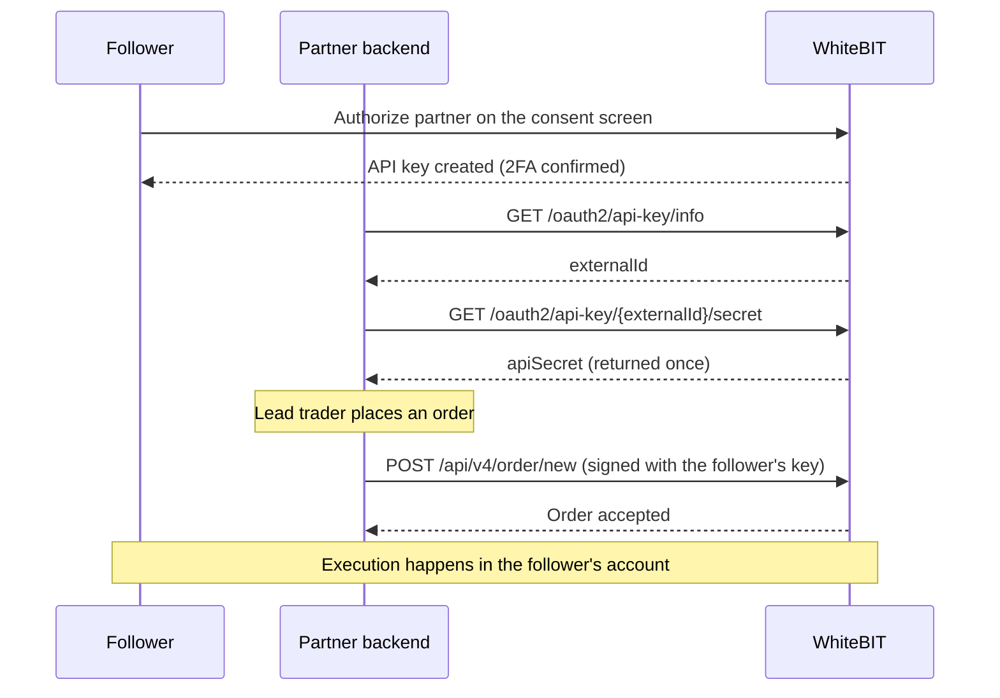

Copy trading is a partner use case, not a WhiteBIT product feature. A partner platform decides which orders to mirror and places each order, through an OAuth-issued API key, on the follower's own WhiteBIT account. Execution happens inside the follower's account.

<Note>
  This use case builds on the [Fast API Key via OAuth](/guides/fast-api-key-via-oauth) integration — the prerequisite flow for consent, key issuance, one-time secret retrieval, signing, and revocation. Complete that integration first. Copy-trading access is granted on top of an approved Fast API Key integration.
</Note>

## Architecture

Each follower keeps a personal WhiteBIT account — WhiteBIT performs KYC and holds custody — and grants the partner an OAuth-issued API key on the consent screen. One key is issued per follower. The partner backend computes the copy logic — which lead-trader orders to mirror, position sizing, and timing. The backend then places the resulting orders on the follower's account, signing each request with that follower's key.

The account an order lands on is determined by which follower's key signs the request. The V4 trade API has no account-selector parameter — a request always acts on the account that owns the API key in the `X-TXC-APIKEY` header. Mirroring the same lead trade across many followers means placing one signed order per follower, each with that follower's own key.

## Permissions and scope

Copy trading requires order placement and cancellation on the follower's account. Under the Fast API Key [API key types](/guides/fast-api-key-via-oauth#api-key-types), these operations map to the **Trade** type: read access plus order placement and cancellation, convert, and internal transfer between the follower's own balances. External withdrawal is excluded — external withdrawal is a separate, user-controlled grant behind an additional consent-screen confirmation and is not needed for copy trading.

The partner reads the permissions a follower actually granted from the `permissions` array on `GET /oauth2/api-key/info`, and branches on the locale-independent `name` value. See [Key permissions](/guides/fast-api-key-via-oauth#key-permissions) for the full permission model.

<Warning>
  The OAuth-issued key places live orders on the follower's account. Store each follower's `apiSecret` in encrypted server-side storage, and request only the Trade scope — external withdrawal is not required for copy trading. See the [Security checklist](/guides/fast-api-key-via-oauth#security-checklist).
</Warning>

## Order placement

The partner places each mirrored order on the follower's account through the V4 trade API, signing with the follower's OAuth-issued key. Requests are authenticated by the `X-TXC-APIKEY`, `X-TXC-PAYLOAD`, and `X-TXC-SIGNATURE` headers — `externalId` is the value sent in `X-TXC-APIKEY`. The signing process is the same as for a manually-created key; see [Private HTTP API authentication](/api-reference/authentication).

The fields below are the copy-trading-relevant subset of the limit-order request. The full request and response schemas, including all order types and the signed-payload fields, are on the API Reference pages linked at the end of each table.

**Request — [Create Limit Order](/api-reference/spot-trading/create-limit-order) (`POST /api/v4/order/new`):**

| Field | Type | Required | Notes for copy trading |
|-------|------|----------|------------------------|
| `market` | string | Yes | Trading pair (`BASE_QUOTE`, e.g. `BTC_USDT`) — mirror the lead trade's market. |
| `side` | string | Yes | `buy` or `sell` — mirror the lead trade's side. |
| `amount` | string | Yes | Quantity in base currency, sized per follower by the copy logic. |
| `price` | string | Conditional | Limit price in quote currency. Required unless a best-bid/offer execution method is used. |
| `clientOrderId` | string | No | Partner-assigned identifier, useful to reconcile a mirrored order back to its lead trade and follower. |

For market and stop variants, see [Create Market Order](/api-reference/spot-trading/create-market-order) and the other [order endpoints](/api-reference/spot-trading/overview).

**Response — order confirmation (subset of the shared order shape):**

| Field | Type | Notes for copy trading |
|-------|------|------------------------|
| `orderId` | integer | Matching-engine order id; store it against the follower and lead trade. |
| `clientOrderId` | string | Echoes the request value; empty string when not supplied. |
| `status` | string | Order lifecycle status; the value tracks order fills and cancellations. |
| `dealStock` | string | Filled amount in base currency; `"0"` while unfilled. |
| `dealMoney` | string | Filled amount in quote currency; `"0"` while unfilled. |
| `left` | string | Remaining unfilled quantity. |

Full field list: [Create Limit Order](/api-reference/spot-trading/create-limit-order).

## Approval and commercial terms

Copy-trading access is approval-gated — it is not available by default and requires an internal review in addition to Fast API Key approval. To request it, contact `institutional@whitebit.com` with the intended use case, the jurisdiction where the partner's legal entity is registered, and the licenses it holds. Whether attribution or commercial terms apply is confirmed with WhiteBIT during enrollment.

## What's next

<CardGroup cols={2}>
  <Card title="Fast API Key via OAuth" icon="key" href="/guides/fast-api-key-via-oauth">
    The prerequisite flow: consent, key issuance, secret retrieval, signing, and revocation.
  </Card>
  <Card title="Create Limit Order" icon="file-lines" href="/api-reference/spot-trading/create-limit-order">
    Full request and response schema for order placement.
  </Card>
  <Card title="Broker Overview" icon="briefcase" href="/guides/broker-overview">
    The two Broker Program integration architectures and enrollment.
  </Card>
</CardGroup>
