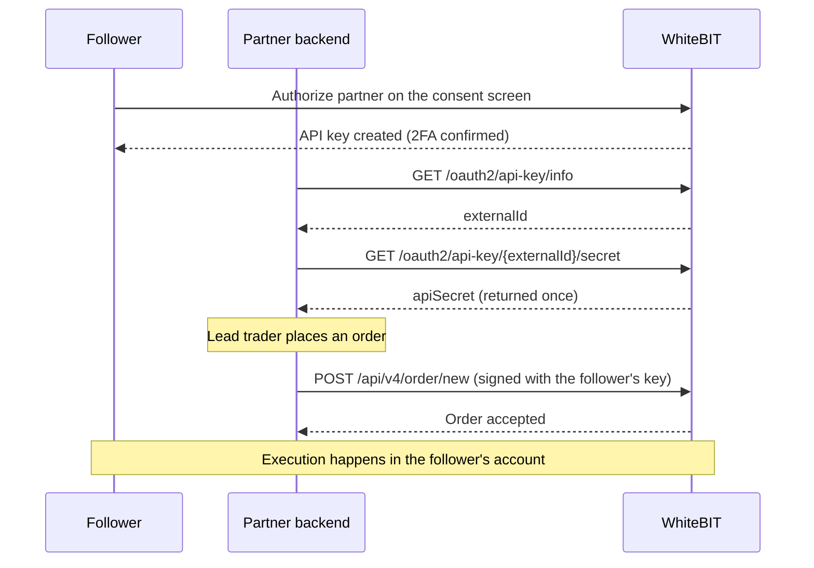

Copy trading is a partner use case, not a WhiteBIT product feature. A partner platform decides which orders to mirror and places each order, through an OAuth-issued API key, on the follower's own WhiteBIT account. Execution happens inside the follower's account.

<Note>
  This use case builds on the [Fast API Key via OAuth](/guides/fast-api-key-integration) integration — the prerequisite flow for consent, key issuance, one-time secret retrieval, signing, and revocation. Complete that integration first. Copy-trading access is granted on top of an approved Fast API Key integration.
</Note>

## Architecture

Each follower keeps a personal WhiteBIT account — WhiteBIT performs KYC and holds custody — and grants the partner an OAuth-issued API key on the consent screen. One key is issued per follower. The partner backend computes the copy logic — which lead-trader orders to mirror, position sizing, and timing. The backend then places the resulting orders on the follower's account, signing each request with that follower's key.

The account an order lands on is determined by which follower's key signs the request. The V4 trade API has no account-selector parameter — a request always acts on the account that owns the API key in the `X-TXC-APIKEY` header. Mirroring the same lead trade across many followers means placing one signed order per follower, each with that follower's own key.

## Permissions and scope

Copy trading requires order placement and cancellation on the follower's account. The follower selects the key's permissions on the WhiteBIT consent screen — the partner does not pass a permission set in the authorization request and cannot influence the follower's choice (see [Key permissions](/guides/fast-api-key-integration#key-permissions)). To mirror orders, the follower must grant trade-level access: order placement and cancellation, convert, and internal transfer between the follower's own balances. External withdrawal is a separate, user-controlled grant behind an additional consent-screen confirmation and is not needed for copy trading.

Named [API key types](/guides/fast-api-key-integration#api-key-types) — Read-only, Trade, and Custom — are being introduced for the Fast API Key flow. Once available, the operations above map to the **Trade** type, which caps a key at trade-level access and excludes external withdrawal.

The partner reads the permissions a follower actually granted from the `permissions` array on `GET /oauth2/api-key/info`, and branches on the locale-independent `name` value. See [Key permissions](/guides/fast-api-key-integration#key-permissions) for the full permission model.

<Warning>
  The OAuth-issued key places live orders on the follower's account. Store each follower's `apiSecret` in encrypted server-side storage. The follower selects permissions on the consent screen — external withdrawal is not required for copy trading, so followers grant trade-level access only. See the [Security checklist](/guides/fast-api-key-integration#security-checklist).
</Warning>

## Order placement

The partner places each mirrored order on the follower's account through the V4 trade API, signing with the follower's OAuth-issued key. Requests are authenticated by the `X-TXC-APIKEY`, `X-TXC-PAYLOAD`, and `X-TXC-SIGNATURE` headers — `externalId` is the value sent in `X-TXC-APIKEY`. The signing process is the same as for a manually-created key; see [Private HTTP API authentication](/api-reference/authentication).

The fields below are the copy-trading-relevant subset of the limit-order request. The full request and response schemas, including all order types and the signed-payload fields, are on the API Reference pages linked at the end of each table.

**Request — [Create Limit Order](/api-reference/spot-trading/create-limit-order) (`POST /api/v4/order/new`):**

| Field | Type | Required | Notes for copy trading |
|-------|------|----------|------------------------|
| `market` | string | Yes | Trading pair (`BASE_QUOTE`, e.g. `BTC_USDT`) — mirror the lead trade's market. |
| `side` | string | Yes | `buy` or `sell` — mirror the lead trade's side. |
| `amount` | string | Yes | Quantity in base currency, sized per follower by the copy logic. |
| `price` | string | Conditional | Limit price in quote currency. Required unless a best-bid/offer execution method is used. |
| `clientOrderId` | string | No | Partner-assigned identifier, useful to reconcile a mirrored order back to its lead trade and follower. |

For market and stop variants, see [Create Market Order](/api-reference/spot-trading/create-market-order) and the other [order endpoints](/api-reference/spot-trading/overview).

**Response — order confirmation (subset of the shared order shape):**

| Field | Type | Notes for copy trading |
|-------|------|------------------------|
| `orderId` | integer | Matching-engine order id; store it against the follower and lead trade. |
| `clientOrderId` | string | Echoes the request value; empty string when not supplied. |
| `status` | string | Order lifecycle status; the value tracks order fills and cancellations. |
| `dealStock` | string | Filled amount in base currency; `"0"` while unfilled. |
| `dealMoney` | string | Filled amount in quote currency; `"0"` while unfilled. |
| `left` | string | Remaining unfilled quantity. |

Full field list: [Create Limit Order](/api-reference/spot-trading/create-limit-order).

## Endpoints

Copy trading composes the Fast API Key management endpoints with the standard V4 spot trading and monitoring endpoints. Every trade request acts on the account whose key signs it. A copy-trading backend calls the endpoints below, grouped by role.

**Key management, per follower** (from the [Fast API Key flow](/guides/fast-api-key-integration)):

| Purpose | Endpoint | Reference |
|---------|----------|-----------|
| Check whether a follower key exists and read the granted permissions | `GET /oauth2/api-key/info` | [API key info](/api-reference/oauth/usage/api-key-info) |
| Retrieve the follower's API secret once | `GET /oauth2/api-key/{externalId}/secret` | [API key secret](/api-reference/oauth/usage/api-key-secret) |
| Revoke a follower key on unfollow or offboarding | `DELETE /oauth2/api-key/{externalId}` | [Delete API key](/api-reference/oauth/usage/api-key-delete) |

**Order placement and management, signed with the follower's key:**

| Purpose | Endpoint | Reference |
|---------|----------|-----------|
| Place a limit order | `POST /api/v4/order/new` | [Create limit order](/api-reference/spot-trading/create-limit-order) |
| Place a market order | `POST /api/v4/order/market` | [Create market order](/api-reference/spot-trading/create-market-order) |
| Modify an open order | `POST /api/v4/order/modify` | [Modify order](/api-reference/spot-trading/modify-order) |
| Cancel one order | `POST /api/v4/order/cancel` | [Cancel order](/api-reference/spot-trading/cancel-order) |
| Cancel every order on a market for one follower | `POST /api/v4/order/cancel/all` | [Cancel all orders](/api-reference/spot-trading/cancel-all-orders) |
| List a follower's open orders | `POST /api/v4/orders` | [Query unexecuted orders](/api-reference/spot-trading/query-unexecuted-orders) |

**Fill monitoring and reconciliation, per follower:**

| Purpose | Where |
|---------|-------|
| Order updates in real time | [Orders Executed](/websocket/account-streams/orders-executed) WebSocket stream |
| Fills in real time | [Deals](/websocket/account-streams/deals) WebSocket stream |
| Executed-order history, as a polling fallback | [Query executed order history](/api-reference/spot-trading/query-executed-order-history) (`POST /api/v4/trade-account/executed-history`) |
| Trade-level deals for an order | [Query executed order deals](/api-reference/spot-trading/query-executed-order-deals) |

<Note>
  Subscribing to a follower's private WebSocket streams requires a WebSocket authentication token from `POST /api/v4/profile/websocket_token`. Confirm that an OAuth-issued key can obtain this token for the follower's account before making the WebSocket streams the primary fill-monitoring path; until then, poll [executed-order history](/api-reference/spot-trading/query-executed-order-history) as the reliable per-follower fallback.
</Note>
{/* TODO: confirm with Engineering whether an OAuth-issued key can call POST /api/v4/profile/websocket_token (and its 10 req/60s limit) — copytrading-03. */}

## Operational pitfalls

Copy trading fans one lead trade out to many independent accounts, which introduces failure modes a single-account integration does not have.

- **No batch or account selector.** The V4 trade API acts only on the account that owns the signing key. Mirroring one lead trade means one signed request per follower; no endpoint places an order across multiple accounts.
- **Rate limits apply per IP address, not per follower.** REST rate limits are enforced per IP — the default is 10,000 requests per 10 seconds, and `/trade-account/executed-history` allows 12,000 per 10 seconds. A backend that serves many followers from one IP shares a single budget across every follower's signed requests, so per-IP sharing — not a per-follower budget — is the fan-out constraint to design around. Pace requests across the window, handle `429` with backoff, and consider spreading a large follower base across egress IPs — see [Rate limits](/api-reference/rate-limits).
- **Follower keys are revoked outside the partner's control.** An OAuth-issued key is revoked when the follower changes the account password or the account is blocked or frozen, and it is disabled after 14 days of inactivity. Signed requests then fail; re-run the consent flow to reissue. The OAuth access token used for key management lasts 4 hours with no refresh — obtain a new one through a fresh consent when it expires. See [Fast API Key via OAuth](/guides/fast-api-key-integration).
- **Permission grants vary per follower.** The follower chooses permissions on the consent screen, so a follower can grant less than trade-level access. Read the `permissions` array on `GET /oauth2/api-key/info` before mirroring, and skip followers without order-placement permission. External withdrawal is never required for copy trading — do not request it.
- **Balances and market minimums differ per follower.** Size each mirrored order to the follower's own balance and the market's minimum order size. Expect per-follower rejections for insufficient balance and partial fills rather than uniform execution.
- **Regional restrictions apply per follower.** For EEA followers, USDT deposits, withdrawals, and WhiteBIT Codes are unavailable under MiCA — USDC and EURI are the documented alternatives — which constrains how those followers are funded and which stablecoins those followers hold. Account for per-follower differences rather than assuming a uniform asset set. See [Regulatory Compliance](/institutional/compliance).
- **Retries can double-place.** Set a `clientOrderId` on each mirrored order so a retried request reconciles to the same lead trade and follower instead of creating a duplicate.
- **The API secret is returned once.** Capture and encrypt `apiSecret` at issuance. A re-fetch returns `409 Conflict` and requires deleting and re-issuing the key.

## Common questions

Common questions from copy-trading partners, beyond the eligibility and gating covered in the [Broker FAQ](/guides/broker-faq).

### Copy-trading API availability

There is no copy-specific endpoint. Copy trading is an orchestration of the [Fast API Key](/guides/fast-api-key-integration) flow and the standard spot order endpoints — the partner backend supplies the copy logic.

### Follower connection and revocation

A follower grants an OAuth-issued key on the WhiteBIT consent screen; the partner captures `externalId` and the one-time secret. To disconnect, revoke the key with `DELETE /oauth2/api-key/{externalId}` — the platform emails the follower on revocation.

`DELETE` is authenticated with a Bearer access token that lasts 4 hours with no refresh, so revocation depends on holding a valid token: revoke during the follower's active session, or obtain a fresh token through a new consent flow. A dormant follower's key still winds down without action — an OAuth-issued key auto-deactivates after 14 days without API activity, and is revoked when the follower changes the account password or the account is blocked or frozen. If revoking a dormant follower's key without fresh consent is required, confirm the available management path with WhiteBIT.
{/* TODO: confirm with Frontend/OAuth whether a partner can obtain a management token to revoke a dormant key without fresh follower interaction — copytrading-04. */}

### Per-follower fill tracking

Poll [Query executed order history](/api-reference/spot-trading/query-executed-order-history) for per-follower fills, and subscribe to each follower's [Orders Executed](/websocket/account-streams/orders-executed) and [Deals](/websocket/account-streams/deals) account streams for real-time updates where an OAuth-issued key can obtain a WebSocket token (see the monitoring note under [Endpoints](#endpoints)). Reconcile each fill to its lead trade and follower with the `clientOrderId` set at placement.

### Sandbox-free testing

WhiteBIT has no public testnet. Validate the flow on the live API with a small follower cohort and minimum order sizes; Demo Tokens (`DBTC`/`DUSDT`) allow risk-free spot practice. Work through the [Go-Live Checklist](/best-practices/go-live-checklist) before scaling.

## Approval and commercial terms

Copy-trading access is approval-gated — it is not available by default and requires an internal review in addition to Fast API Key approval. To request it, contact `institutional@whitebit.com` with the intended use case, the jurisdiction where the partner's legal entity is registered, and the licenses it holds. Whether attribution or commercial terms apply is confirmed with WhiteBIT during enrollment.

## What's next

<CardGroup cols={2}>
  <Card title="Fast API Key via OAuth" icon="key" href="/guides/fast-api-key-integration">
    The prerequisite flow: consent, key issuance, secret retrieval, signing, and revocation.
  </Card>
  <Card title="Create Limit Order" icon="file-lines" href="/api-reference/spot-trading/create-limit-order">
    Full request and response schema for order placement.
  </Card>
  <Card title="App Builders Overview" icon="mobile-screen" href="/guides/app-builders-overview">
    What App Builders can build, who it is for, and how to get started.
  </Card>
  <Card title="App Builders FAQ" icon="circle-question" href="/guides/app-builders-faq">
    Key types, rate limits, revocation, and copy-trading gating questions.
  </Card>
</CardGroup>
