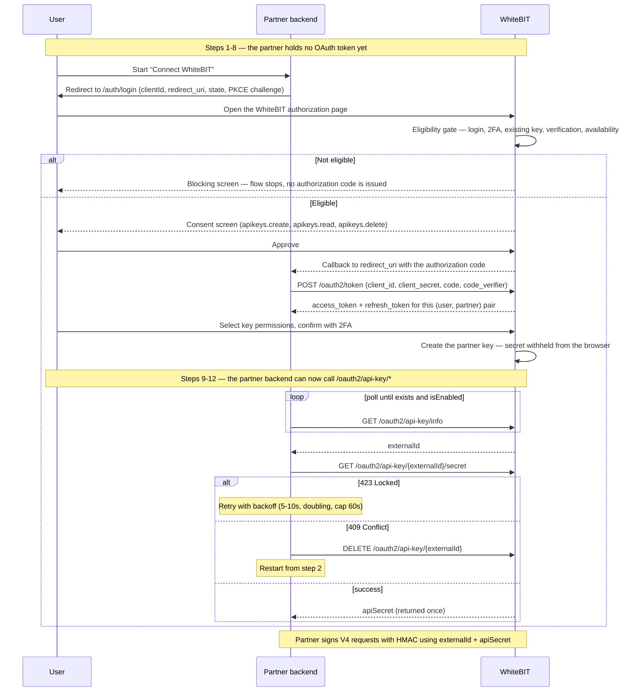

The OAuth API key flow lets a partner platform issue a WhiteBIT API key for an authenticated WhiteBIT user without the user manually copying credentials between sites. The user authorizes the partner on the WhiteBIT consent screen, the WhiteBIT platform issues a partner-scoped API key, and the partner backend reads the API secret once through a Bearer-authenticated endpoint and persists it. The flow uses Authorization Code with PKCE (S256); the authorization server issues a short-lived access token together with a refresh token. See the [Fast API Key](/glossary#fast-api-key) glossary entry for the short definition.

## Partner use cases

The flow fits partners whose end users keep personal WhiteBIT accounts: WhiteBIT performs KYC and holds custody, and the partner operates on the user's account through the OAuth-issued key.

- **Copy trading** — the copy-trading platform mirrors lead-trader positions into followers' accounts. Each follower connects a personal WhiteBIT account through the consent screen, and the partner platform places orders with the issued key; execution happens inside the follower's own account. See the [Copy Trading guide](/guides/copy-trading) for the architecture and order-placement schema.
- **Trading bots** — the service runs strategies on the user's account. The user approves the permission set on the consent screen — trading scopes for execution, with withdrawal remaining a separate, user-controlled grant behind an additional confirmation (see [Key permissions](#key-permissions)).
- **Portfolio and aggregator apps** — the app aggregates balances and transaction history through a read-scoped key and places no orders.

Partners operating accounts *for* customers — a dedicated sub-account per end customer under a partner master account — integrate via [Embedded Trading](/guides/embedded-trading-overview) instead; the [Partner Solutions](/guides/partner-solutions) page maps all partner types. Whether [attribution](/guides/waas-overview) or commercial terms apply for own-account partners is confirmed with WhiteBIT during enrollment.

## Prerequisites

<Note>
  Partner enrollment is approval-gated. New partners apply via `institutional@whitebit.com` with the details listed under [How to apply](/guides/partner-solutions#how-to-apply); a partner agreement and KYB review are part of onboarding; client registration is then coordinated through the same channel, as described below.
</Note>

- Partner-registered OAuth2 client (`client_id`, `client_secret`, redirect URIs). Contact `institutional@whitebit.com` to enroll a client; the OAuth API key feature must be approved for the partner platform before a `client_id` is issued.
- End user with a WhiteBIT account, 2FA enabled, the required verification level passed, and operating in a region where the feature is available. A user who meets none of these can still start the flow — WhiteBIT walks the user through registration, 2FA, and KYC on its own pages, as described under [Account status and eligibility](#account-status-and-eligibility). The OAuth API key endpoints are available on the global server (`https://whitebit.com`) only.
- Partner backend that supports HTTPS, server-side secret storage, and OAuth 2.0 Authorization Code with PKCE (S256).

### What to prepare for client registration

WhiteBIT registers the OAuth2 client manually, so the request to `institutional@whitebit.com` should carry everything the administrator needs in one message. The company-level items are the ones listed under [How to apply](/guides/partner-solutions#how-to-apply); the integration-level items below are specific to this flow.

| Item | Provided by | Notes |
|------|-------------|-------|
| Redirect URI(s) | Partner | Exact HTTPS URLs where the authorization code is delivered. Matching is exact: no wildcards and no path prefixes, so each environment's callback URL is registered on its own. |
| Scopes | Partner | Which of `apikeys.create`, `apikeys.read`, `apikeys.delete` the client needs — see [Scopes](#scopes). Fixed at registration. |
| Partner display name and logo | Partner | Shown to the user on the WhiteBIT consent screen as "Create an API key for [Partner Name]". |
| Intended use case and key type | Partner | Copy trading, bot, aggregator, or other, and the [key type](#api-key-types) requested. Withdrawal access requires the Custom type and KYB. |
| Technical contact | Partner | Email WhiteBIT uses for questions about the OAuth2 client. |
| `client_id` | WhiteBIT | Permanent identifier, sent as the `clientId` query parameter. |
| `client_secret` | WhiteBIT | Server-side only. Used in the token exchange and never sent to the browser. |

## Endpoint surface

| Method | Path | Auth | Required scope | Purpose |
|--------|------|------|----------------|---------|
| `GET` | [`/oauth2/api-key/info`](/api-reference/oauth/usage/api-key-info) | Bearer | `apikeys.read` | Check whether a key exists for the `(user, OAuth2 client)` pair |
| `GET` | [`/oauth2/api-key/{externalId}/secret`](/api-reference/oauth/usage/api-key-secret) | Bearer | `apikeys.read` | Retrieve the API secret once |
| `DELETE` | [`/oauth2/api-key/{externalId}`](/api-reference/oauth/usage/api-key-delete) | Bearer | `apikeys.delete` | Delete a partner-owned key |

### Scopes

Three scopes govern the flow, and the consent screen names the ones the OAuth2 client holds:

- `apikeys.create` — permits key creation. The scope authorizes the consent screen the user completes in step 8; no partner-facing endpoint consumes it, which is why it carries no row above.
- `apikeys.read` — permits reading key state and retrieving the secret once.
- `apikeys.delete` — permits deleting a key the OAuth2 client owns.

Holding at least one of the three admits a client to the flow; holding all three is not required. A client that issues keys and retrieves the secrets needs `apikeys.create` and `apikeys.read`, and adds `apikeys.delete` to revoke keys from its own side. Scopes are fixed when the OAuth2 client is registered and cannot be varied per authorization request.

## Integration flow



For the remaining failure modes (401, 403, 404) and both consent-screen error codes, see [Error handling](#error-handling) below.

Every `/oauth2/api-key/*` endpoint is Bearer-authenticated, so none of the three can be called until the partner backend holds an OAuth token for that specific user. Steps 1 through 8 cover everything that runs before that point — client registration, and the consent journey WhiteBIT hosts on its own pages. The partner writes code for steps 1, 2, 3, 6, 7, and 9 through 12; steps 4, 5, and 8 happen on WhiteBIT's side and are observable to the partner only as an authorization code on the callback, or as no callback at all.

<Steps>
  <Step title="Register the OAuth2 client">
    A WhiteBIT administrator creates the OAuth2 client after enrollment and issues a permanent `client_id`, a `client_secret`, and the exact redirect URIs. Partners cannot self-register a client. See [Prerequisites](#prerequisites) for the enrollment channel.
  </Step>
  <Step title="Pre-check">
    Applies to a returning user whose token from an earlier authorization is still valid — a first-time user has no token yet, so the flow starts at step 3. Call `GET /oauth2/api-key/info` and interpret the `(exists, isEnabled)` response using the decision matrix on the endpoint page: `(false, false)` proceeds to step 3; `(true, true)` reuses the existing key instead of running the flow again; `(true, false)` asks the user to delete the disabled key from the WhiteBIT dashboard first. See [Returning users](#returning-users).
  </Step>
  <Step title="Build the authorization URL and send the user to WhiteBIT">
    The user starts the connection in the partner's app ("Connect WhiteBIT"). Generate a cryptographically secure `code_verifier` (43–128 characters, unreserved alphabet) and derive `code_challenge = BASE64URL(SHA256(code_verifier))`. Store `code_verifier` and `state` in a server-side session keyed by a short-lived cookie, then redirect the browser to [`GET /auth/login`](/api-reference/oauth/usage/authorize) with the following query parameters:

    | Parameter | Required | Description |
    |-----------|----------|-------------|
    | `clientId` | Yes | The `client_id` issued at registration. |
    | `redirect_uri` | Yes | One of the registered redirect URIs, character-for-character. |
    | `state` | Optional in the spec; always send it | Opaque random string, at least 32 bytes of entropy, bound to the user's session. Returned unchanged on the callback. |
    | `code_challenge` | Yes | `BASE64URL(SHA256(code_verifier))`, without padding. |
    | `code_challenge_method` | Yes | Always `S256`. |

    Scopes are not passed in the URL. The scopes registered on the OAuth2 client apply (see [Scopes](#scopes)).

    ```text
    https://whitebit.com/auth/login
      ?clientId=YOUR_CLIENT_ID
      &redirect_uri=https%3A%2F%2Fpartner.example%2Foauth%2Fwhitebit%2Fcallback
      &state=Zm9vYmFyLXN0YXRlLTMyLWJ5dGVz
      &code_challenge=E9Melhoa2OwvFrEMTJguCHaoeK1t8URWbuGJSstw-cM
      &code_challenge_method=S256
    ```

    <Tabs>
      <Tab title="Python">
        ```python
        import base64, hashlib, secrets
        from urllib.parse import urlencode

        code_verifier = secrets.token_urlsafe(64)[:128]           # 43-128 chars, unreserved alphabet
        code_challenge = base64.urlsafe_b64encode(
            hashlib.sha256(code_verifier.encode()).digest()
        ).rstrip(b"=").decode()
        state = secrets.token_urlsafe(32)

        session["oauth"] = {"code_verifier": code_verifier, "state": state}  # server-side session

        authorize_url = "https://whitebit.com/auth/login?" + urlencode({
            "clientId": CLIENT_ID,
            "redirect_uri": REDIRECT_URI,
            "state": state,
            "code_challenge": code_challenge,
            "code_challenge_method": "S256",
        })
        # redirect the browser to authorize_url
        ```
      </Tab>
      <Tab title="cURL">
        ```bash
        # The authorization step is a browser redirect, not an API call.
        # Use the Python tab to derive code_challenge, then open the resulting URL in the user's browser.
        ```
      </Tab>
    </Tabs>

    For Go and PHP examples, see [SDKs](/sdks).
  </Step>
  <Step title="WhiteBIT runs the eligibility gate">
    Before showing the consent screen, WhiteBIT checks the account behind the request — sign-in state, 2FA, verification level, and whether the feature is available for the OAuth2 client and for the account's region. Each blocking outcome renders as a variant of the same screen and stops the flow on WhiteBIT's page: no authorization code is issued and the partner receives no callback. Whether a key already exists is enforced separately, at the moment key creation is attempted. [Account status and eligibility](#account-status-and-eligibility) lists every outcome and what the partner can observe.
  </Step>
  <Step title="The user grants the OAuth scopes">
    The consent screen names the partner and the `apikeys.*` scopes the OAuth2 client holds — see [Scopes](#scopes). The user approves or declines. Approval is what produces the short-lived authorization code on the registered `redirect_uri`.
  </Step>
  <Step title="Handle the callback">
    On the redirect back to the registered `redirect_uri`, validate the returned `state` matches the stored value (anti-CSRF). Capture the `code` query parameter. Reject the callback when `state` is missing, mismatched, or expired.

    ```text
    https://partner.example/oauth/whitebit/callback
      ?code=AUTHORIZATION_CODE
      &state=Zm9vYmFyLXN0YXRlLTMyLWJ5dGVz
    ```

    The code is single-use and short-lived; exchange it immediately in step 7.
  </Step>
  <Step title="Exchange the code for an access token">
    POST to [`/oauth2/token`](/api-reference/oauth/usage/get-access-token) with `client_id`, `client_secret`, `code`, and `code_verifier`, server-to-server, as `application/x-www-form-urlencoded`.

    <Tabs>
      <Tab title="cURL">
        ```bash
        curl -X POST https://whitebit.com/oauth2/token \
          -H "Content-Type: application/x-www-form-urlencoded" \
          -d "client_id=YOUR_CLIENT_ID" \
          -d "client_secret=YOUR_CLIENT_SECRET" \
          -d "code=AUTHORIZATION_CODE" \
          -d "code_verifier=YOUR_CODE_VERIFIER"
        ```
      </Tab>
      <Tab title="Python">
        ```python
        import requests

        resp = requests.post(
            "https://whitebit.com/oauth2/token",
            data={
                "client_id": CLIENT_ID,
                "client_secret": CLIENT_SECRET,
                "code": callback_code,
                "code_verifier": session["oauth"]["code_verifier"],
            },
            timeout=10,
        )
        resp.raise_for_status()
        token = resp.json()["data"]
        # persist token alongside the partner-side user record
        ```
      </Tab>
    </Tabs>

    ```json
    {
      "data": {
        "access_token": "MZM1MDBMMJYTNWM4MI0ZNTIYLTKXNDATNZY1MZHKM2Y2MJY3",
        "expires_in": 300,
        "refresh_token": "ODK5ZTVKZDUTYTI5ZC01NWJHLTGZZDMTYWFKYTNMNJHHMGZM",
        "scope": "apikeys.create,apikeys.read,apikeys.delete",
        "token_type": "Bearer"
      }
    }
    ```

    The response carries a short-lived access token and a refresh token; read the lifetime from `expires_in` rather than hardcoding it. The token pair is bound to the `(user, OAuth2 client)` pair, not to the partner as a whole: a partner serving 1,000 users holds 1,000 token pairs. WhiteBIT does not store the mapping between its user and the partner's own account — persist the token alongside the partner-side user record. Renew through [`POST /oauth2/refresh_token`](/api-reference/oauth/usage/refresh-token) and replace the stored pair on every refresh. Re-run the consent flow only when the refresh token itself has expired.
  </Step>
  <Step title="The user creates the key on WhiteBIT">
    The user selects the key permissions on WhiteBIT's own page, reviews the selection in a confirmation modal, and confirms with a second factor — a passkey or an authenticator-app code. A key cannot be created without 2FA, and the partner never calls the creation endpoint. WhiteBIT creates the key and withholds the secret from the browser by design, which is why the secret is fetched server-side in step 10.
  </Step>
  <Step title="Poll for externalId">
    Poll `GET /oauth2/api-key/info` with the OAuth access token until `exists=true` and `isEnabled=true`, then capture `externalId` (short backoff, 1–2 second intervals, total budget under 30 seconds).
  </Step>
  <Step title="Retrieve the secret">
    Call `GET /oauth2/api-key/{externalId}/secret`. The response returns `apiSecret` exactly once; persist `(externalId, apiSecret)` in encrypted server-side storage immediately — `externalId` is the public key value sent in the `X-TXC-APIKEY` header. On `423 Locked`, retry with exponential backoff starting at 5–10 seconds, doubling per attempt, capped at 60 seconds, total budget 3–5 minutes. On `409 Conflict`, the secret has already been retrieved for this key — delete the key via `DELETE /oauth2/api-key/{externalId}` and restart the flow from step 2.

    <Tabs>
      <Tab title="cURL">
        ```bash
        # Step 9 — poll until exists and isEnabled are both true
        curl https://whitebit.com/oauth2/api-key/info \
          -H "Authorization: Bearer YOUR_ACCESS_TOKEN"

        # Step 10 — one-time secret retrieval
        curl https://whitebit.com/oauth2/api-key/YOUR_EXTERNAL_ID/secret \
          -H "Authorization: Bearer YOUR_ACCESS_TOKEN"
        ```
      </Tab>
      <Tab title="Python">
        ```python
        import time, requests

        headers = {"Authorization": f"Bearer {token['access_token']}"}
        base = "https://whitebit.com/oauth2/api-key"

        deadline = time.monotonic() + 30                          # step 9 budget
        while time.monotonic() < deadline:
            info = requests.get(f"{base}/info", headers=headers, timeout=10).json()["data"]
            if info["exists"] and info["isEnabled"]:
                break
            time.sleep(2)
        else:
            raise TimeoutError("key not created yet — keep the Connect entry point available")

        resp = requests.get(f"{base}/{info['externalId']}/secret", headers=headers, timeout=10)
        if resp.status_code == 423:
            ...  # retry with backoff: 5-10 s start, doubling, cap 60 s, budget 3-5 min
        elif resp.status_code == 409:
            ...  # secret already released: DELETE the key and restart from step 2
        resp.raise_for_status()
        api_secret = resp.json()["data"]["apiSecret"]
        # persist (info["externalId"], api_secret) in encrypted server-side storage
        ```
      </Tab>
    </Tabs>
  </Step>
  <Step title="Use the key">
    Sign V4 trade API requests with HMAC: send `externalId` as the `X-TXC-APIKEY` value and use `apiSecret` for the signature. The OAuth-issued key follows the same signing rules as a manually-created key. See [Private HTTP API authentication](/api-reference/authentication) for the canonical signing process.
  </Step>
  <Step title="Delete when no longer needed">
    Call `DELETE /oauth2/api-key/{externalId}` to revoke the key. The platform sends a notification email to the user. The endpoint applies to active keys — disabled keys (post-inactivity) require user-initiated deletion from the WhiteBIT dashboard.
  </Step>
</Steps>

## Account status and eligibility

The flow assumes an end user who already holds a WhiteBIT account with 2FA and the required verification level. A user who meets none of that is not turned away: WhiteBIT hosts registration, 2FA setup, and KYC on its own pages, and the gate in step 4 routes the user to whichever one is missing. The partner does not implement any of these screens.

| Account state | What the user sees on WhiteBIT | What the partner observes |
|---|---|---|
| No WhiteBIT account, or not signed in | The WhiteBIT sign-in page, where the user signs in or registers before the authorization request continues | Nothing until the user finishes; the callback arrives only after consent |
| 2FA disabled | A blocking screen — "2FA is required. To proceed with API key creation, please enable 2FA" — offering Decline or Enable 2FA | No callback |
| Verification level not met, KYC available | An instruction screen: sign in to the WhiteBIT main account, pass KYC under Verification, return to the partner app, and reconnect the account | No callback |
| Verification level not met, KYC not available for the account | The same instructions without a verification link — the case for a sub-account that inherits KYC from its main account — plus a Go to Homepage action | No callback |
| Active key already exists for this partner | A notice that an API key for this partner already exists on the account, and that the existing key must be deleted in platform settings before a new one can be created | No callback |
| Feature unavailable — region restriction, or API keys disabled for the account | "API key creation is not available. Please contact support for more details" | No callback |

An abandoned flow is indistinguishable from a blocked one, because the gate runs before any token exists. Treat a missing callback as "not connected yet": keep the Connect WhiteBIT entry point available so the user can retry after fixing the account, rather than blocking the partner-side account on a timeout.

### Checking status from the partner side

Nothing about the user is readable before consent. The `/oauth2/api-key/*` endpoints are Bearer-authenticated and the token is issued only after the user approves, so the first partner-observable signal is the callback itself.

Nothing needs to be read after consent either. A callback means a registered, 2FA-enabled, verified user who approved the consent screen, so the account statuses the gate checks are already settled by the time the partner holds a token. [`GET /oauth2/api-key/info`](/api-reference/oauth/usage/api-key-info) covers what remains — key state for the `(user, OAuth2 client)` pair — and needs only `apikeys.read`. The account-data scopes belong to the [deprecated classic OAuth flow](/platform/oauth/overview) and are not part of this integration.

## Returning users

A `(user, OAuth2 client)` pair holds one partner key at a time, whatever state that key is in. Re-running the authorization flow does not produce a second key: the creation attempt is rejected with `partner_key_active_exists` when the existing key is active and `partner_key_expired_exists` when it is disabled after inactivity.

The path for a returning user starts at step 2 instead. `GET /oauth2/api-key/info` returns `exists`, `isEnabled`, `externalId`, and `permissions` for the existing key, which is enough to skip creation entirely and keep using the key already issued — the stored `externalId` and secret remain valid, and the `permissions` array shows the scope the user originally granted.

A lost secret has no recovery path. The secret is released once, a repeat call returns `409 Conflict`, and no endpoint re-issues it. Delete the key with `DELETE /oauth2/api-key/{externalId}` and take the user through the flow again from step 2.

## Key permissions

The user picks API key permissions on the WhiteBIT consent screen from the same list shown when creating a manual API key in the dashboard — read, spot, collateral, withdrawal, and the other granular scopes. The partner does not pass the permission set in the authorization request and cannot influence the user's choice. The issued key carries those permissions for its lifetime; changing the permission set requires deleting the key and re-running the OAuth API key flow.

The partner reads the granted permission set through the `permissions` array on [`GET /oauth2/api-key/info`](/api-reference/oauth/usage/api-key-info). Each entry is a permission group with a locale-independent `name` (use for partner-side logic), a locale-dependent display `title`, and per-endpoint `enable` flags that reflect the user's choices on the consent screen. The array also covers disabled keys — the grant-time permission set stays readable so the partner can show the original scope.

If the user selects withdrawal permission, the consent modal adds a warning block and a confirmation checkbox before the user can accept. Step-up MFA is enforced after consent for every Fast API Key creation, regardless of which permissions were selected.

After issuance the key behaves the same as a manually-created key with matching permissions. Trade and withdrawal endpoints are authorized by the HMAC signature on each request — see [Private HTTP API authentication](/api-reference/authentication). KYC for fiat withdrawals, AML and fraud monitoring, and withdrawal limits apply on every call.

### API key types

<Note>
Named API key types are being introduced for the Fast API Key flow. The model below describes how key access is scoped once the types are available.
</Note>

A key's type sets the maximum permissions it can carry; the user chooses within that maximum on the consent screen. Every type requires WhiteBIT approval — the flow is not available by default. Until the types ship, the consent screen offers the full permission list described under [Key permissions](#key-permissions).

- **Read-only** — read access to balances, orders, deals, and history. No fund movement.
- **Trade** — read access plus order placement and cancellation, convert, and internal transfer between the user's own balances. Excludes external withdrawal.
- **Custom** — a configurable type, and the only one that can include external withdrawal. Requires WhiteBIT approval and business verification (KYB) of the partner.

To request Fast API Key access, contact `institutional@whitebit.com` with the intended use cases, the jurisdiction where the partner's legal entity is registered, and the licenses it holds. Partner KYB is part of the review.

## Lifecycle and revocation

OAuth-issued API keys are revoked or deleted by any of the following events:

- The user changes the account password.
- The user account is blocked (AML / fraud / compliance) or frozen.
- The key has no API activity for 14 days (cron-driven auto-deactivation).
- The partner calls `DELETE /oauth2/api-key/{externalId}`.
- The partner's authorization for that user is revoked.
- The user removes the key from the WhiteBIT dashboard.

All revocation events except user-initiated dashboard deletion send an email notification to the user.

## Error handling

| Status | Endpoint | Cause | Recommended action |
|--------|----------|-------|--------------------|
| `401` | All three | Missing, invalid, or expired Bearer token, or a token that lacks the required `apikeys.*` scope — an insufficient scope is not reported separately. | Refresh the access token, or restart the OAuth authorization flow when the refresh token has expired too. |
| `403` | `secret`, `delete` | The key belongs to a different OAuth2 client, or the key was created manually rather than through OAuth. | Verify `externalId` came from `GET /info` issued by the same OAuth2 client. |
| `404` | `secret`, `delete` | No key with that `externalId`, or the key is not owned by the user the token identifies. A key deleted by the system (inactivity, account freeze, password change) returns the same `404` as one the user deleted. | Re-query `GET /info` to confirm the current state of the `(user, client)` pair; treat the key as gone and re-run the flow. |
| `409` | `secret` | Secret already retrieved. | Delete the key via `DELETE /oauth2/api-key/{externalId}` and restart the OAuth API key flow. |
| `423` | `secret` | Concurrent secret-retrieval attempt holds the lock. | Retry with exponential backoff (5–10s start, cap 60s, budget 3–5 minutes). |

`GET /oauth2/api-key/info` is the exception to the table: it never answers with `403` or `404`. Every absence — a deleted key, a key owned by another OAuth2 client, a manually created key — comes back as `200 OK` with `exists: false` and an empty `permissions` list, so partner-side logic branches on the payload rather than on the status code.

Two application-level error codes can surface during key creation on the WhiteBIT consent screen. Each code is observable to the partner only indirectly — when one of the codes fires, the consent flow terminates and the partner detects the failure as the absence of a created key on the subsequent `GET /info` poll:

- `partner_key_active_exists` — An active partner-issued key already exists for the `(user, OAuth2 client)` pair. The partner SHOULD re-run `GET /info` before starting the flow.
- `partner_key_expired_exists` — A disabled (post-inactivity) partner-issued key exists. The user must remove the disabled key from the WhiteBIT dashboard before a new key can be issued.

## Security checklist

- Store `client_secret` and `apiSecret` server-side only. Never embed in mobile, desktop, single-page, or browser-side code.
- Validate the `state` parameter on every callback to prevent CSRF.
- Use the exact registered `redirect_uri` — wildcards and open redirects are rejected.
- Use Authorization Code with PKCE (S256) on every authorization request.
- Rotate `apiSecret` by deleting and re-issuing keys. The secret cannot be retrieved a second time for an existing key.
- No IP check applies to the OAuth API key flow itself — the partner is identified by the OAuth token, which cannot be obtained without the user personally approving the consent screen. The IP-allowlist restriction available on manually created keys (exact-match addresses only; ranges and subnets are not supported, and a request from an unlisted address flags the key as compromised) is not part of this flow: the WhiteBIT dashboard exposes no allowlist control on an OAuth-issued key, and the partner manages no allowlist of its own.

## Limits

- One OAuth-issued API key per `(user, partner)` pair, whatever state the key is in. A second creation attempt is rejected — see [Returning users](#returning-users) — and the existing key is never invalidated automatically.
- A global limit of 50 API keys per user, shared between manually created and OAuth-issued keys. Partner keys have no separate quota.
- A user can have OAuth-issued keys from an unlimited number of partners.

## What's next

<CardGroup cols={2}>
  <Card title="OAuth endpoint overview" icon="key" href="/api-reference/oauth/usage/overview">
    Full list of OAuth endpoints in the API Reference, with required scopes per endpoint.
  </Card>
  <Card title="Private HTTP API authentication" icon="signature" href="/api-reference/authentication">
    HMAC signing process for the V4 trade API once the partner holds the api key and secret pair.
  </Card>
  <Card title="First API Call" icon="play" href="/guides/first-api-call">
    Sign a `POST /api/v4/main-account/balance` request with HMAC-SHA512 and read the response.
  </Card>
  <Card title="App Builders FAQ" icon="circle-question" href="/guides/app-builders-faq">
    Key types, rate limits, revocation, onboarding, and compliance questions.
  </Card>
</CardGroup>

## Related resources

<CardGroup cols={2}>
  <Card title="OAuth 2.0 (conceptual)" icon="circle-info" href="/platform/oauth/overview" horizontal/>
  <Card title="Check key existence" icon="magnifying-glass" href="/api-reference/oauth/usage/api-key-info" horizontal/>
  <Card title="Retrieve key secret" icon="lock" href="/api-reference/oauth/usage/api-key-secret" horizontal/>
  <Card title="Delete key" icon="trash" href="/api-reference/oauth/usage/api-key-delete" horizontal/>
</CardGroup>
