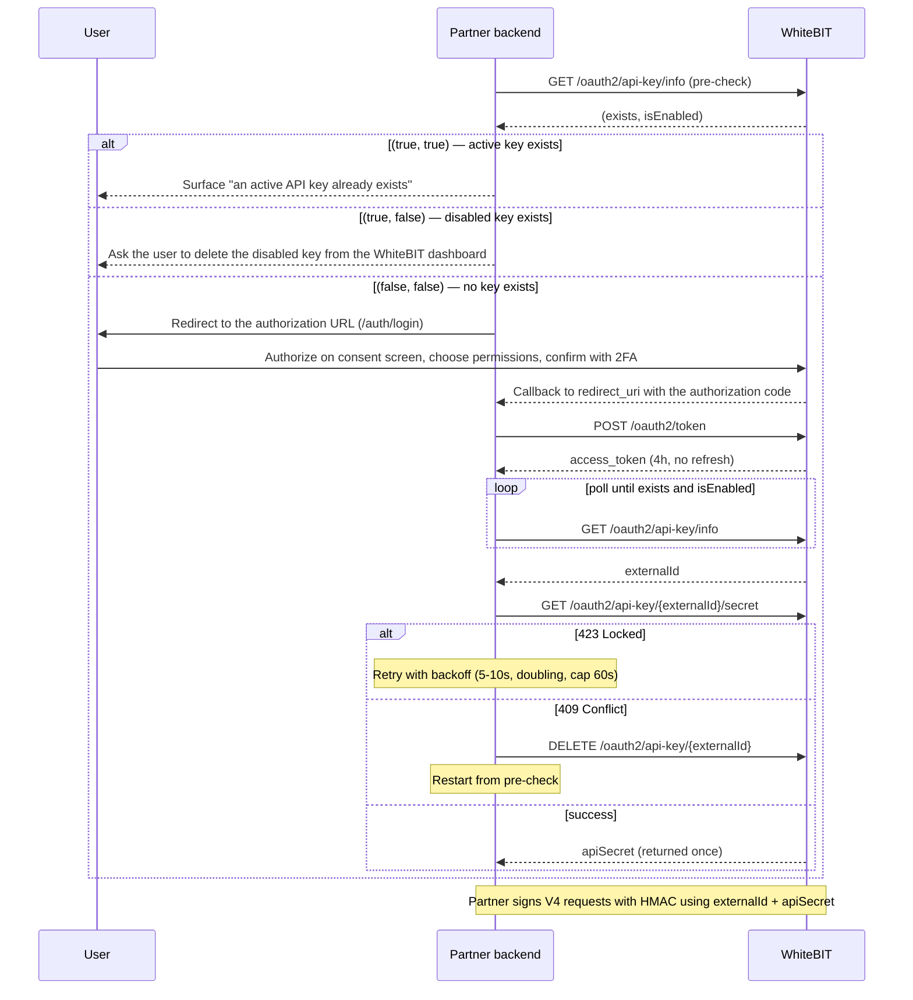

The OAuth API key flow lets a partner platform issue a WhiteBIT API key for an authenticated WhiteBIT user without the user manually copying credentials between sites. The user authorizes the partner on the WhiteBIT consent screen, the WhiteBIT platform issues a partner-scoped API key, and the partner backend reads the API secret once through a Bearer-authenticated endpoint and persists it. The flow uses Authorization Code with PKCE (S256) and a 4-hour access token without refresh. See the [Fast API Key](/glossary#fast-api-key) glossary entry for the short definition.

## Partner use cases

The flow fits partners whose end users keep personal WhiteBIT accounts: WhiteBIT performs KYC and holds custody, and the partner operates on the user's account through the OAuth-issued key.

- **Copy trading** — the copy-trading platform mirrors lead-trader positions into followers' accounts. Each follower connects a personal WhiteBIT account through the consent screen, and the partner platform places orders with the issued key; execution happens inside the follower's own account. See the [Copy Trading guide](/guides/copy-trading) for the architecture and order-placement schema.
- **Trading bots** — the service runs strategies on the user's account. The user approves the permission set on the consent screen — trading scopes for execution, with withdrawal remaining a separate, user-controlled grant behind an additional confirmation (see [Key permissions](#key-permissions)).
- **Portfolio and aggregator apps** — the app aggregates balances and transaction history through a read-scoped key and places no orders.

Partners operating accounts *for* customers — a dedicated sub-account per end customer under a partner master account — integrate via the [Broker Program](/guides/broker-overview) instead; the [Partner Solutions](/guides/partner-solutions) page maps all partner types. Whether [attribution](/guides/waas-overview) or commercial terms apply for own-account partners is confirmed with WhiteBIT during enrollment.

## Prerequisites

<Note>
  Partner enrollment is approval-gated. New partners apply via `institutional@whitebit.com` with the details listed under [How to apply](/guides/partner-solutions#how-to-apply); a partner agreement and KYB review are part of onboarding; client registration is then coordinated through the same channel, as described below.
</Note>

- Partner-registered OAuth2 client (`client_id`, `client_secret`, redirect URIs). Contact `institutional@whitebit.com` to enroll a client; the OAuth API key feature must be approved for the partner platform before a `client_id` is issued.
- End user with a WhiteBIT account, 2FA enabled, KYC passed, and operating in a region where the feature is available. The OAuth API key endpoints are available on the global server (`https://whitebit.com`) only.
- Partner backend that supports HTTPS, server-side secret storage, and OAuth 2.0 Authorization Code with PKCE (S256).

## Endpoint surface

| Method | Path | Auth | Required scope | Purpose |
|--------|------|------|----------------|---------|
| `GET` | [`/oauth2/api-key/info`](/api-reference/oauth/usage/api-key-info) | Bearer | `apikeys.read` | Check whether a key exists for the `(user, OAuth2 client)` pair |
| `GET` | [`/oauth2/api-key/{externalId}/secret`](/api-reference/oauth/usage/api-key-secret) | Bearer | `apikeys.read` | Retrieve the API secret once |
| `DELETE` | [`/oauth2/api-key/{externalId}`](/api-reference/oauth/usage/api-key-delete) | Bearer | `apikeys.delete` | Delete a partner-owned key |

## Integration flow

For the remaining failure modes (401, 403, 404) and both consent-screen error codes, see [Error handling](#error-handling) below.

<Steps>
  <Step title="Pre-check">
    Call `GET /oauth2/api-key/info` before redirecting the user. Interpret the `(exists, isEnabled)` response using the decision matrix on the endpoint page: `(false, false)` proceeds to Step 2; `(true, true)` skips the flow and surfaces "an active API key already exists" to the user; `(true, false)` asks the user to delete the disabled key from the WhiteBIT dashboard first.
  </Step>
  <Step title="Build the authorization URL">
    Generate a cryptographically secure `code_verifier` (43–128 characters, unreserved alphabet) and derive `code_challenge = BASE64URL(SHA256(code_verifier))`. Build the authorization URL using `/auth/login` with query parameters `clientId`, `redirect_uri`, `state`, `code_challenge`, and `code_challenge_method=S256`. Store `code_verifier` and `state` in a server-side session keyed by a short-lived cookie.
  </Step>
  <Step title="Handle the callback">
    On the redirect back to the registered `redirect_uri`, validate the returned `state` matches the stored value (anti-CSRF). Capture the `code` query parameter. Reject the callback when `state` is missing, mismatched, or expired.
  </Step>
  <Step title="Exchange the code for an access token">
    POST to `/oauth2/token` with `client_id`, `client_secret`, `code`, and `code_verifier`. Receive a 4-hour OAuth access token. A refresh token is not issued — obtain a fresh authorization through a new consent flow when the access token expires.
  </Step>
  <Step title="Wait for the user to create the key, then fetch externalId">
    After granting consent, the user creates the partner API key on WhiteBIT and confirms with two-factor authentication (a passkey or an authenticator-app code) — a key cannot be created without 2FA, and the partner does not call the creation endpoint. Poll `GET /oauth2/api-key/info` with the OAuth access token until `exists=true` and `isEnabled=true`, then capture `externalId` (short backoff, 1–2 second intervals, total budget under 30 seconds).
  </Step>
  <Step title="Retrieve the secret">
    Call `GET /oauth2/api-key/{externalId}/secret`. The response returns `apiSecret` exactly once; persist `(externalId, apiSecret)` in encrypted server-side storage immediately — `externalId` is the public key value sent in the `X-TXC-APIKEY` header. On `423 Locked`, retry with exponential backoff starting at 5–10 seconds, doubling per attempt, capped at 60 seconds, total budget 3–5 minutes. On `409 Conflict`, the secret has already been retrieved for this key — delete the key via `DELETE /oauth2/api-key/{externalId}` and restart the flow from the pre-check.
  </Step>
  <Step title="Use the key">
    Sign V4 trade API requests with HMAC: send `externalId` as the `X-TXC-APIKEY` value and use `apiSecret` for the signature. The OAuth-issued key follows the same signing rules as a manually-created key. See [Private HTTP API authentication](/api-reference/authentication) for the canonical signing process.
  </Step>
  <Step title="Delete when no longer needed">
    Call `DELETE /oauth2/api-key/{externalId}` to revoke the key. The platform sends a notification email to the user. The endpoint applies to active keys — disabled keys (post-inactivity) require user-initiated deletion from the WhiteBIT dashboard.
  </Step>
</Steps>

## Key permissions

The user picks API key permissions on the WhiteBIT consent screen from the same list shown when creating a manual API key in the dashboard — read, spot, collateral, withdrawal, and the other granular scopes. The partner does not pass the permission set in the authorization request and cannot influence the user's choice. The issued key carries those permissions for its lifetime; changing the permission set requires deleting the key and re-running the OAuth API key flow.

The partner reads the granted permission set through the `permissions` array on [`GET /oauth2/api-key/info`](/api-reference/oauth/usage/api-key-info). Each entry is a permission group with a locale-independent `name` (use for partner-side logic), a locale-dependent display `title`, and per-endpoint `enable` flags that reflect the user's choices on the consent screen. The array also covers disabled keys — the grant-time permission set stays readable so the partner can show the original scope.

If the user selects withdrawal permission, the consent modal adds a warning block and a confirmation checkbox before the user can accept. Step-up MFA is enforced after consent for every Fast API Key creation, regardless of which permissions were selected.

After issuance the key behaves the same as a manually-created key with matching permissions. Trade and withdrawal endpoints are authorized by the HMAC signature on each request — see [Private HTTP API authentication](/api-reference/authentication). KYC for fiat withdrawals, AML and fraud monitoring, and withdrawal limits apply on every call.

### API key types

<Note>
Named API key types are being introduced for the Fast API Key flow. The model below describes how key access is scoped once the types are available.
</Note>

A key's type sets the maximum permissions it can carry; the user chooses within that maximum on the consent screen. All three types require WhiteBIT approval — the flow is not available by default.

- **Read-only** — read access to balances, orders, deals, and history. No fund movement.
- **Trade** — read access plus order placement and cancellation, convert, and internal transfer between the user's own balances. Excludes external withdrawal.
- **Custom** — a configurable type, and the only one that can include external withdrawal. Requires WhiteBIT approval and business verification (KYB) of the partner.

To request Fast API Key access, contact `institutional@whitebit.com` with the intended use cases, the jurisdiction where the partner's legal entity is registered, and the licenses it holds. Partner KYB is part of the review.

## Lifecycle and revocation

OAuth-issued API keys are revoked or deleted by any of the following events:

- The user changes the account password.
- The user account is blocked (AML / fraud / compliance) or frozen.
- The key has no API activity for 14 days (cron-driven auto-deactivation).
- The partner calls `DELETE /oauth2/api-key/{externalId}`.
- The user removes the key from the WhiteBIT dashboard.

All revocation events except user-initiated dashboard deletion send an email notification to the user.

## Error handling

| Status | Endpoint | Cause | Recommended action |
|--------|----------|-------|--------------------|
| `401` | All three | Missing or invalid Bearer token, or token lacks the required `apikeys.*` scope. | Restart the OAuth authorization flow to obtain a fresh access token with the correct scopes. |
| `403` | `secret`, `delete` | The key does not belong to the authenticated OAuth2 client, or the key is not a partner-issued key. | Verify `externalId` came from `GET /info` issued by the same OAuth2 client. |
| `404` | `secret`, `delete` | Key not found. | Re-query `GET /info` to confirm the current state of the `(user, client)` pair. |
| `409` | `secret` | Secret already retrieved. | Delete the key via `DELETE /oauth2/api-key/{externalId}` and restart the OAuth API key flow. |
| `423` | `secret` | Concurrent secret-retrieval attempt holds the lock. | Retry with exponential backoff (5–10s start, cap 60s, budget 3–5 minutes). |

Two application-level error codes can surface during key creation on the WhiteBIT consent screen. Each code is observable to the partner only indirectly — when one of the codes fires, the consent flow terminates and the partner detects the failure as the absence of a created key on the subsequent `GET /info` poll:

- `partner_key_active_exists` — An active partner-issued key already exists for the `(user, OAuth2 client)` pair. The partner SHOULD re-run `GET /info` before starting the flow.
- `partner_key_expired_exists` — A disabled (post-inactivity) partner-issued key exists. The user must remove the disabled key from the WhiteBIT dashboard before a new key can be issued.

## Security checklist

- Store `client_secret` and `apiSecret` server-side only. Never embed in mobile, desktop, single-page, or browser-side code.
- Validate the `state` parameter on every callback to prevent CSRF.
- Use the exact registered `redirect_uri` — wildcards and open redirects are rejected.
- Use Authorization Code with PKCE (S256) on every authorization request.
- Rotate `apiSecret` by deleting and re-issuing keys. The secret cannot be retrieved a second time for an existing key.
- IP restrictions on the key, when enabled, are the end user's own account-level control — exact-match addresses (ranges and subnets are not supported), applied to trade-API requests. The partner does not manage a key-level IP allowlist; a user who enables the restriction must add the partner's egress addresses to the allowlist.

## Limits

- One active OAuth-issued API key per `(user, partner)` pair. A second creation attempt returns an error and the consent flow terminates.
- The 50-key limit applies per account context — the main account and each sub-account each have an independent 50-key allowance, and the count includes both manually-created and OAuth-issued keys.
- A user can have OAuth-issued keys from an unlimited number of partners.

## What's next

<CardGroup cols={2}>
  <Card title="OAuth endpoint overview" icon="key" href="/api-reference/oauth/usage/overview">
    Full list of OAuth endpoints in the API Reference, with required scopes per endpoint.
  </Card>
  <Card title="Private HTTP API authentication" icon="signature" href="/api-reference/authentication">
    HMAC signing process for the V4 trade API once the partner holds the api key and secret pair.
  </Card>
  <Card title="First API Call" icon="play" href="/guides/first-api-call">
    Sign a `POST /api/v4/main-account/balance` request with HMAC-SHA512 and read the response.
  </Card>
  <Card title="App Builders FAQ" icon="circle-question" href="/guides/app-builders-faq">
    Key types, rate limits, revocation, onboarding, and compliance questions.
  </Card>
</CardGroup>

## Related resources

<CardGroup cols={2}>
  <Card title="OAuth 2.0 (conceptual)" icon="circle-info" href="/platform/oauth/overview" horizontal/>
  <Card title="Check key existence" icon="magnifying-glass" href="/api-reference/oauth/usage/api-key-info" horizontal/>
  <Card title="Retrieve key secret" icon="lock" href="/api-reference/oauth/usage/api-key-secret" horizontal/>
  <Card title="Delete key" icon="trash" href="/api-reference/oauth/usage/api-key-delete" horizontal/>
</CardGroup>
