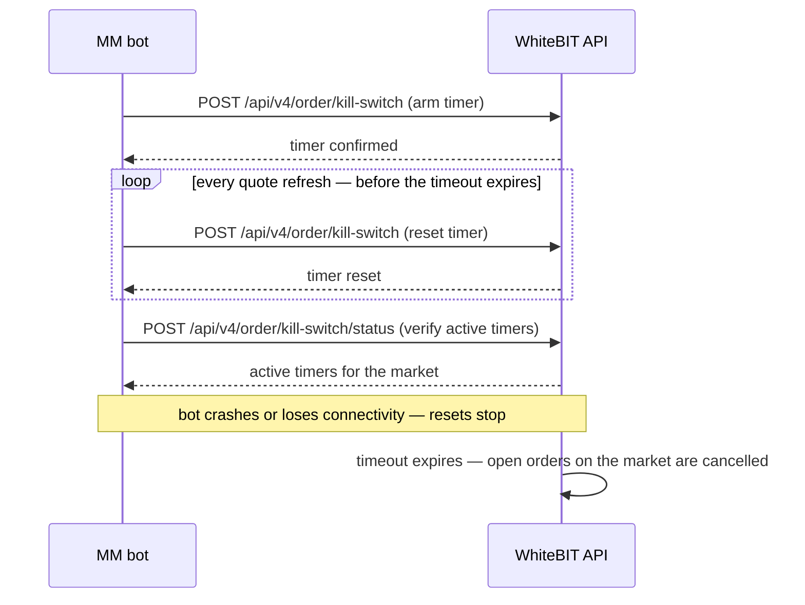

import { RegionBaseUrl } from '/snippets/RegionBaseUrl.jsx';
import { ConceptTable } from '/snippets/ConceptTable.jsx';
import { endpointLimits } from '/snippets/concept-data/rate-limits.jsx';

<RegionBaseUrl />

The Market-Making Program provides dedicated infrastructure for professional liquidity providers: maker-fee rebates, [colocation](/platform/colocation), and a 35-endpoint API subset reachable from inside the matching-engine zone.

## Market-Making Program overview

Maker-fee rebates are tiered by 30-day rolling trading volume, with separate tiers for spot and futures. Negative maker fees are rebates — the exchange pays the market maker for each maker order filled.

Rates and volume breakpoints change over time and are not duplicated here. For current fees and tier requirements, see the [Market-Making Program page](https://institutional.whitebit.com/market-making-program), the [trading fees page](https://whitebit.com/trading-data/trading-fees), or the [VIP program](https://whitebit.com/vip-program).

**Program benefits beyond fees:**

- [Colocation](/platform/colocation) access
- Dedicated account manager
- Cross-marketing support
- [Sub-accounts](/products/sub-accounts/overview) for strategy separation
- Access to [Liquidity Provision program](https://whitebit.com/m/liquidity-provision) for non-MM liquidity partnerships

## Prerequisites

- **Approved Market-Making Program enrollment** — contact `institutional@whitebit.com` with trading-volume history and target markets (see [How to apply](#how-to-apply)); the [Market-Making overview](/guides/market-maker-overview) covers program terms.
- **Colocation connection details** — provisioned by the account manager for latency-sensitive strategies (see [Colocation setup](#colocation-setup)).
- **API access** — [HMAC-signed requests](/api-reference/authentication).

## Colocation setup

Colocation provides low-latency API access from AWS infrastructure co-located with the WhiteBIT matching engine.

The account manager provides the specific AWS region, availability zone, and connection endpoints during onboarding.

**EC2 sizing recommendations:**

- Network: up to **10Gbit bandwidth**
- CPU: minimum **4 vCPU cores**
- Low-performance VPS instances result in higher latency

Both REST API and WebSocket connections are available via colocation.

Contact the designated account manager for connection details including base URLs and availability zone placement.

<Warning>
  Colocation endpoints are a SUBSET of the full WhiteBIT API. Only the 35 endpoints listed below are available via colocation infrastructure. All other API endpoints must be accessed through the standard public API.
</Warning>

See the [Colocation](/platform/colocation) page for additional infrastructure details.

## Available colocation endpoints

The colocation infrastructure exposes 35 endpoints organized into three categories: spot trading (17), collateral trading for both Margin and Futures (14), and utility (4).

### Spot trading (17 endpoints)

| Endpoint | Description |
|----------|-------------|
| `POST /api/v4/trade-account/balance` | Trade account balance |
| `POST /api/v4/trade-account/executed-history` | Executed order history |
| `POST /api/v4/trade-account/order` | Single order details |
| `POST /api/v4/trade-account/order/history` | Order history |
| `POST /api/v4/orders` | Active orders list |
| `POST /api/v4/order/cancel` | Cancel an order |
| `POST /api/v4/order/cancel/bulk` | Cancel up to 100 orders in one request |
| `POST /api/v4/order/cancel/all` | Cancel all open orders (optional `market` and `type` scope) |
| `POST /api/v4/order/new` | Place a limit order |
| `POST /api/v4/order/bulk` | Place up to 20 limit orders |
| `POST /api/v4/order/modify` | Modify an existing order |
| `POST /api/v4/order/market` | Place a market order |
| `POST /api/v4/order/stock_market` | Place a stock market order |
| `POST /api/v4/order/stop_limit` | Place a stop-limit order |
| `POST /api/v4/order/stop_market` | Place a stop-market order |
| `POST /api/v4/order/kill-switch` | Set or cancel the kill-switch timer |
| `POST /api/v4/order/kill-switch/status` | Check kill-switch status |

### Collateral / Margin and Futures trading (14 endpoints)

| Endpoint | Description |
|----------|-------------|
| `POST /api/v4/collateral-account/balance` | Collateral account balance |
| `POST /api/v4/collateral-account/balance-summary` | Collateral balance summary |
| `POST /api/v4/collateral-account/summary` | Collateral account summary |
| `POST /api/v4/collateral-account/leverage` | Set leverage |
| `POST /api/v4/collateral-account/positions/open` | Open positions |
| `POST /api/v4/collateral-account/positions/history` | Position history |
| `POST /api/v4/collateral-account/funding-history` | Funding history |
| `POST /api/v4/oco-orders` | OCO orders |
| `POST /api/v4/order/collateral/limit` | Collateral limit order |
| `POST /api/v4/order/collateral/market` | Collateral market order |
| `POST /api/v4/order/collateral/stop-limit` | Collateral stop-limit order |
| `POST /api/v4/order/collateral/trigger-market` | Collateral trigger-market order |
| `POST /api/v4/order/collateral/oco` | Collateral OCO order |
| `POST /api/v4/order/collateral/bulk` | Collateral bulk orders |

<Note>
  **API naming convention:** WhiteBIT's API uses "collateral" endpoints for both Margin and Futures trading. The market pair determines the product: spot pairs (e.g., `BTC_USDT`) for Margin, perpetual pairs (e.g., `BTC_PERP`) for Futures. All endpoints under `/api/v4/order/collateral/` and `/api/v4/collateral-account/` serve both products.
</Note>

### Utility (4 endpoints)

| Endpoint | Description |
|----------|-------------|
| `POST /api/v4/profile/websocket_token` | Generate WebSocket authentication token |
| `GET /api/v4/public/ping` | Server health check |
| `GET /api/v4/public/time` | Server time |
| `POST /api/v4/market/fee` | Query maker and taker fees for all markets |

For endpoints not listed above, use the standard WhiteBIT API at `https://whitebit.com`.

## Quoting strategy

Quoting on WhiteBIT uses limit orders placed via individual endpoints or `POST /api/v4/order/bulk` (up to 20 limit orders per request), paired with the `depth` and `bookTicker` WebSocket channels for price input.

**Bulk vs individual:** bulk reduces wire and auth overhead and gives atomic same-timestamp placement of a quote ladder. The bulk response only returns once every leg in the batch is processed. Pipelined individual orders give faster per-leg acknowledgment for clients optimized for that pattern. Use bulk for atomic quote refreshes and less-optimized clients; use individual orders when lowest per-leg ack latency matters most.

**RPI mode:** Each order item in `/order/bulk` can set `rpi: true` to enable Retail Price Improvement (RPI) mode. RPI orders are post-only and hidden from public `depth` and `bookTicker` feeds. RPI orders remain visible in the exchange UI order book (web/mobile) — capturing UI-driven retail flow rather than algorithmic flow consuming the public feed. RPI executions use an account-specific fee or rebate model. Incompatible with `ioc`. RPI is a flow-segmentation tool, not a default MM primitive — fit depends on volume targets and the account's fee arrangement. See the [API Reference](/api-reference/spot-trading/bulk-limit-order) and [glossary entry](/glossary#retail-price-improvement-rpi).

**Real-time orderbook:** Subscribe to the `depth` WebSocket channel for real-time orderbook updates. See the [WebSocket Quickstart](/guides/websocket-quickstart).

**Order modify:** `POST /api/v4/order/modify` — change an existing order's price, amount, or activation price. The matching engine internally cancels the original order and creates a replacement with a **new `orderId`**, so modify does NOT preserve queue priority. Use `clientOrderId` as the stable identifier across modifications. Identify the target by `orderId` OR `clientOrderId` — never both. See the [API Reference](/api-reference/spot-trading/modify-order). For how the engine sequences orders — price-time priority, participant fairness, and latency factors — see [Matching engine](/concepts/matching-engine).

**Kill-switch (circuit breaker):** `POST /api/v4/order/kill-switch` — sets a per-market timeout of 5–600 seconds; if the endpoint is not called again before it expires, the kill-switch cancels every open order on that market. Quoting several markets requires one timer per market. The deadman trigger for process crashes, lost connectivity, and operator absence. See the [API Reference](/api-reference/spot-trading/sync-kill-switch-timer).

- Configuration: set the timeout (5–600 seconds); each call to the endpoint resets the timer; `timeout: null` deletes it
- Scope: pass the optional `types` array (`"spot"`, `"margin"`, `"futures"`) to restrict the breaker to a subset of order types — useful when spot market-making runs alongside futures positions whose protective orders must stay on the book
- Check status: `POST /api/v4/order/kill-switch/status` — see the [API Reference](/api-reference/spot-trading/status-kill-switch-timer)

**Self-Trade Prevention:** Market makers providing two-sided quotes (bid + ask) must understand STP behavior to avoid self-trades. When a new order would match against an existing order from the same account, the STP mechanism cancels the new order, the existing order, both, or neither — depending on the `stp` mode passed at order placement. The default mode (`no`) allows self-trades, which is usually not what a two-sided quoter wants. See [Self-Trade Prevention](/platform/self-trade-prevention) for the available modes.

The examples below assume an API key with trade permissions. Payload signing (`X-TXC-PAYLOAD`, `X-TXC-SIGNATURE`) is covered in the [request-signing setup](/guides/first-api-call).

<Tabs>
  <Tab title="curl">
    ```bash
    # Place a bulk order — the "orders" array carries 1–20 limit orders.
    # Each order item has its own "market" field; there is no top-level
    # market parameter.
    curl -X POST "https://whitebit.com/api/v4/order/bulk" \
      -H "Content-Type: application/json" \
      -H "X-TXC-APIKEY: YOUR_API_KEY" \
      -H "X-TXC-PAYLOAD: YOUR_PAYLOAD" \
      -H "X-TXC-SIGNATURE: YOUR_SIGNATURE" \
      -d '{
        "orders": [
          {"market": "BTC_USDT", "side": "buy", "amount": "0.01", "price": "60000", "clientOrderId": "quote-bid-1"}
        ],
        "request": "/api/v4/order/bulk",
        "nonce": 1594297865000
      }'
    ```
  </Tab>
  <Tab title="Python">
    ```python
    # Request bodies for the quoting loop. To send each one: add "request"
    # (the endpoint path) and "nonce", sign with HMAC-SHA512, and send with
    # the X-TXC-* headers — implementation in the First API Call guide
    # linked above.

    # POST /api/v4/order/bulk — 1–20 limit orders; each item carries its own
    # "market". The response is a list of {"result": ..., "error": ...} pairs —
    # check each item individually; per-order failures do not fail the
    # HTTP request.
    bulk_body = {
        "orders": [
            {"market": "BTC_USDT", "side": "buy", "amount": "0.01", "price": "60000", "clientOrderId": "quote-bid-1"},
        ],
    }

    # POST /api/v4/order/modify — requote by clientOrderId. The response
    # carries a new orderId; clientOrderId is preserved so local tracking
    # survives the modify.
    modify_body = {
        "market": "BTC_USDT",
        "clientOrderId": "quote-bid-1",
        "price": "60050",
    }
    ```
  </Tab>
</Tabs>

For Go and PHP examples, see [SDKs](/sdks).

The kill-switch rides the same loop: arm one timer per quoted market, reset it on every quote refresh, and let expiry cancel that market's open orders if the bot stops calling in.



```python
# POST /api/v4/order/kill-switch — arm or reset the deadman timer.
# "timeout" is a string, "5"–"600" seconds; null deletes the timer.
# The optional "types" array restricts scope, e.g. ["spot"].
# Sign and send as above.
kill_switch_body = {
    "market": "BTC_USDT",
    "timeout": "60",
}
```

## WebSocket workflow for market making

The market-making loop runs on real-time WebSocket data, not REST polling. Quote inputs arrive on `depth` (deep book) or `bookTicker` (top of book); inventory state arrives on `balanceSpot`; fill confirmations arrive on `deals` (executions) and `ordersPending` (state transitions including partial fills and cancels). Wire those four channels together to close the loop: market data drives the quote, REST `order/bulk` or `order/modify` places it, `ordersPending` confirms the state transition, `deals` confirms the fill, `balanceSpot` confirms the inventory delta, and the loop recomputes.

The protocol primitives — connect, ping/pong, `authorize`, exponential-backoff reconnection, and the query-then-subscribe recovery pattern — are covered end-to-end in the [WebSocket Quickstart](/guides/websocket-quickstart).

| Channel | Carries | Recovery model | Where to learn the protocol |
|---|---|---|---|
| `depth` | Full orderbook (1/5/10/20/30/50/100 levels per market) | Snapshot on subscribe, then incremental updates; detect gaps via the `past_update_id` chain on deltas (keepalive snapshots are full resets, not gaps) | [Depth channel](/websocket/market-streams/depth) |
| `bookTicker` | Best bid + best ask only — lighter than depth, ideal for top-of-book quoting | Simple replacement on every change | [Book Ticker channel](/websocket/market-streams/book-ticker). Note: `bookTicker_update` excludes RPI orders. Track RPI quotes via the private active-orders state. |
| `balanceSpot` | Available + frozen balances per asset | Query-then-subscribe (`balanceSpot_request` then `balanceSpot_subscribe`) | [WS Quickstart — State recovery](/guides/websocket-quickstart#state-recovery-after-reconnect) |
| `ordersPending` | Active order state transitions: placed, partially filled, canceled | Query first (`ordersPending_request` or REST `POST /api/v4/orders`), then subscribe | [Bot Guide — WebSocket fill monitoring](/guides/building-a-trading-bot#websocket-fill-monitoring) |
| `deals` | Trade execution events with price, amount, fee, deal-id | Query first (`deals_request` or REST `POST /api/v4/trade-account/executed-history`), then subscribe | [Bot Guide — WebSocket fill monitoring](/guides/building-a-trading-bot#websocket-fill-monitoring) |

**Futures additions.** When quoting perpetuals (e.g. `BTC_PERP`), add two more channels:

| Channel | Carries | Recovery model | Where to learn the protocol |
|---|---|---|---|
| `positions` | Snapshot of open collateral positions (size, entry price, liquidation price, PnL) | Periodic full snapshot — full state arrives shortly after subscribing | [WS Quickstart — State recovery table](/guides/websocket-quickstart#state-recovery-after-reconnect) |
| `marginPositionsEvents` | Position-change events (open, update, close, liquidation) | Event-only — pair with `positions` for complete state | [WS Quickstart — State recovery table](/guides/websocket-quickstart#state-recovery-after-reconnect) |

**Canonical subscribe set (spot MM).** Send these messages after the [`authorize` handshake](/websocket/authentication) — the three private subscriptions will be rejected on an unauthenticated socket. For multi-symbol MM, repeat each `*_subscribe` per market or use the multiple-subscription flag where supported (see the [depth subscribe parameters](/websocket/market-streams/depth)). To stop quoting on one pair without disrupting the others, send `depth_unsubscribe` or `bookTicker_unsubscribe` with that market name in `params` — only that market's feed drops; an empty array unsubscribes from all markets on the stream.

```json
[
  {"id": 10, "method": "depth_subscribe",         "params": ["BTC_USDT", 20, "0", true]},
  {"id": 11, "method": "balanceSpot_subscribe",   "params": ["USDT", "BTC"]},
  {"id": 12, "method": "ordersPending_subscribe", "params": ["BTC_USDT"]},
  {"id": 13, "method": "deals_subscribe",         "params": [["BTC_USDT"]]}
]
```

Note the asymmetry: `ordersPending_subscribe` takes a flat array of markets, `deals_subscribe` takes a single-element array containing the array of markets. The full schema lives in `asyncapi/private/deals.yaml` (rendered as the [Deals channel](/websocket/account-streams/deals) page).

For the full reconnect-with-fresh-token + auto-resubscribe pattern that wraps these subscriptions in production, see [WS Quickstart — Reconnection and state recovery](/guides/websocket-quickstart#reconnection-and-state-recovery) and the worked grid-bot example in the [Bot Guide](/guides/building-a-trading-bot#auto-resubscription-after-reconnect).

## Infrastructure best practices

Three pieces are load-bearing in production: how the account is partitioned across strategies, how the socket recovers when it drops, and how requests stay under per-endpoint limits.

**Sub-accounts for strategy separation:** Use [sub-accounts](/products/sub-accounts/overview) to isolate different trading strategies or pair groups. Each sub-account has independent balances and can have dedicated API keys; transfers between sub-accounts are fee-free.

Worked example: run the BTC_USDT spot MM book in one sub-account funded with its own USDT balance, and a directional ETH_USDT swing book in a second sub-account with its own balance and leverage limit. A drawdown that wipes the swing book's collateral cannot pull capital from the MM book — the MM bot keeps quoting on its untouched balance, and the swing book's API key has no authority over the MM sub-account.

**WebSocket connection management:**

- Authenticate after connecting: fetch a token via `POST /api/v4/profile/websocket_token` (rate limit: **10 requests per 60 seconds** — cache the token across reconnects within its lifetime), then send `{"id": N, "method": "authorize", "params": ["<token>", "public"]}` on the socket. On `{"result": {"status": "success"}}`, subscribe to private channels such as `balanceSpot`, `ordersPending`, and `deals`
- Implement automatic reconnection with exponential backoff
- Re-subscribe to all channels after reconnection
- Use the ping/pong mechanism to detect stale connections
- After reconnecting, reconcile local state: call `POST /api/v4/orders` for the current active set and `POST /api/v4/trade-account/executed-history` for fills since the last-seen ID. Do not assume in-memory state survived the disconnect
- See the [WebSocket Quickstart](/guides/websocket-quickstart) for a full connection + auth example

**Rate limit management:**

All limits are per IP address. Order placement, cancellation, and modification sit at 10,000 requests per 10 seconds per endpoint; `trade-account` reads allow 12,000. The outlier is `POST /api/v4/profile/websocket_token` at 10 requests per 60 seconds. Full reference: [Rate Limits](/api-reference/rate-limits).

<ConceptTable
  title="Per-endpoint rate limits — common market-making operations"
  columns={[
    { key: 'endpoint', header: 'Endpoint' },
    { key: 'limit', header: 'Requests / 10 sec' },
  ]}
  rows={endpointLimits.filter((row) => !row.endpoint.includes('/main-account/'))}
  codeColumns={['endpoint']}
/>

- Use bulk orders (`/order/bulk`) to reduce request count: 20 orders per call vs. 20 individual calls
- Use WebSocket for market data instead of polling REST endpoints
- Maintain a per-endpoint token bucket sized to the table above; back off when the bucket empties rather than retrying after a 429

## Monitoring and safety

Set the kill-switch first; everything below is the loop that keeps it reset, the manual cancel that overrides it, and the balance and fee surfaces the loop reads from.

**Kill-switch configuration:** Set a kill-switch timer for every quoted market as the first action after connecting — each timer covers only its own market. Configure the timeout based on the maximum acceptable unmonitored period for the system. Reset the timers with each regular API call to the kill-switch endpoint. If the system crashes or loses connectivity, the kill-switch cancels each covered market's open orders as its timeout expires.

**Disconnect protection:** WhiteBIT provides no automatic cancel-on-disconnect for WebSocket clients — resting orders persist when the socket drops. The per-market kill-switch is the disconnect safeguard: set a timer for each quoted market and reset it on the connection heartbeat, so a dropped or crashed client has its open orders cancelled when the timer lapses.

**Emergency cancel:** `POST /api/v4/order/cancel/all` — cancel every open order synchronously; the response returns after the cancellations complete. Use the optional `market` field to scope to a single pair and the `type` array to scope to `"spot"`, `"margin"`, or `"futures"`; omit both to cancel everything on the account. This is the "big red button" for live traders; the kill-switch is the deadman timer for unattended operation. `order/cancel/all` is available on colocation as well as through the standard public API. See the [API Reference](/api-reference/spot-trading/cancel-all-orders).

<Tabs>
  <Tab title="curl">
    ```bash
    # Cancel all spot orders on BTC_USDT
    curl -X POST "https://whitebit.com/api/v4/order/cancel/all" \
      -H "Content-Type: application/json" \
      -H "X-TXC-APIKEY: YOUR_API_KEY" \
      -H "X-TXC-PAYLOAD: YOUR_PAYLOAD" \
      -H "X-TXC-SIGNATURE: YOUR_SIGNATURE" \
      -d '{
        "market": "BTC_USDT",
        "type": ["spot"],
        "request": "/api/v4/order/cancel/all",
        "nonce": 1594297865000
      }'
    ```
  </Tab>
  <Tab title="Python">
    ```python
    # POST /api/v4/order/cancel/all — request body; sign and send per the
    # First API Call guide (see Quoting strategy above).
    cancel_all_body = {
        "market": "BTC_USDT",
        "type": ["spot"],
    }
    ```
  </Tab>
</Tabs>

**Balance monitoring:** Use the WebSocket `balanceSpot` channel for real-time balance updates, or poll `POST /api/v4/trade-account/balance` for periodic checks. Monitor for unexpected balance changes.

**Fee tracking:** Use `POST /api/v4/market/fee` to pull the account's global maker and taker fees plus any per-pair custom fees — the `market` request parameter is currently ignored, so the endpoint returns fees for all markets regardless. Filter the per-pair `custom_fee` map client-side. Fee tiers are based on 30-day rolling volume — monitor tier changes as volume accumulates. Look up tier breakpoints on the [VIP program page](https://whitebit.com/vip-program) or the [trading fees page](https://whitebit.com/trading-data/trading-fees).

**Self-Trade Prevention:** Understand the STP mode active on the account. Two-sided quoters hit STP frequently when bid and ask orders overlap. See [Self-Trade Prevention](/platform/self-trade-prevention) for the available modes and behavior.

## How to apply

Contact **institutional@whitebit.com** with trading volume history and target markets. The dedicated account manager provides colocation connection details — AWS region, availability zone, and connection endpoints — during onboarding.

## What's next

<CardGroup cols={3}>
  <Card title="Colocation" icon="server" href="/platform/colocation">
    AWS regions, EC2 sizing, and availability-zone placement for colocation onboarding.
  </Card>
  <Card title="Spot Trading API" icon="square-terminal" href="/api-reference/spot-trading/overview">
    Full endpoint documentation for all spot trading endpoints.
  </Card>
  <Card title="Self-Trade Prevention" icon="shield" href="/platform/self-trade-prevention">
    STP modes and behavior for two-sided quoting.
  </Card>
</CardGroup>
