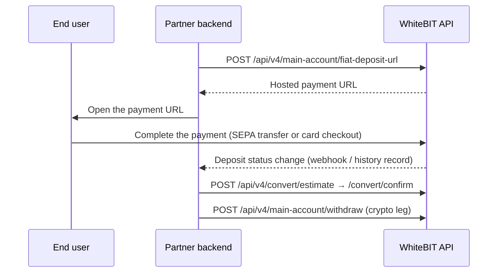
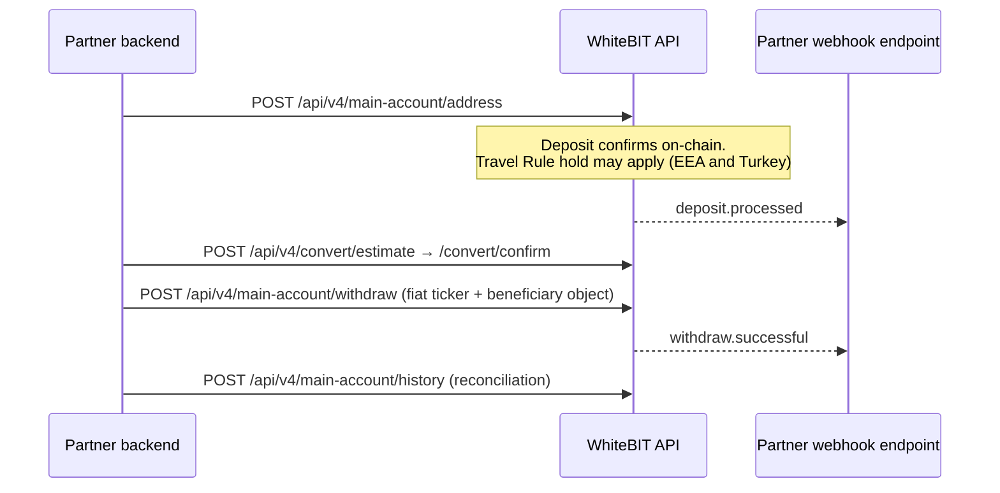

import { RegionBaseUrl } from '/snippets/RegionBaseUrl.jsx';

<RegionBaseUrl />

This guide serves companies that move corporate funds between fiat and digital assets on WhiteBIT — entities investing in crypto, and businesses settling revenue or payouts over EUR rails. It follows both directions, fiat in to crypto out and crypto back to EUR, and names the enablement gate behind each step. All fiat operations described here run at the partner's main account.

Adjacent scenarios route to separate guides:

- The integration collects payments from end users or processes merchant flows — see [Payment Integration](/guides/payment-integration).
- End customers hold dedicated accounts under a partner master account — see the [Broker Guide](/guides/broker-guide).
- The backend model (sub-accounts, attribution, KYC reliance) is still open — see [Wallet-as-a-Service](/guides/waas-overview).
- For the full partner-type map, see [Integration Paths](/guides/integration-paths).

## What the integration provides

- **Fiat deposits via API** — `POST /api/v4/main-account/fiat-deposit-url` returns a hosted payment URL for SEPA bank transfer or card checkout, per the providers enabled for the account. See [Fiat operations](/guides/payment-integration#fiat-deposit) in the Payment Integration guide.
- **Fiat withdrawals via API** — the same `POST /api/v4/main-account/withdraw` and `/withdraw-pay` endpoints used for crypto accept fiat tickers with a `beneficiary` object. EUR supports IBAN transfers (SEPA).
- **Quoted-rate conversion** — `POST /api/v4/convert/estimate` returns a quote; `POST /api/v4/convert/confirm` executes it at the quoted rate. See [Convert](/platform/convert).
- **The crypto leg** — deposit addresses, withdrawals, and the refund flow, documented in [Payment Integration](/guides/payment-integration).
- **Reconciliation** — signed [webhooks](/platform/webhook) plus history polling with client-side identifiers.

## Access and onboarding

Fiat access is the second phase of [Institutional Onboarding](/institutional/onboarding) and is not automatic after KYB approval. Phase 1 (corporate account, KYB, API keys) enables crypto operations; Phase 2 adds EUR/SEPA capabilities through a fiat processing partner review, with source-of-funds documentation. WhiteBIT manages the fiat-partner onboarding on the applicant's behalf.

**How to apply:** email `institutional@whitebit.com` with a description of the service. Include the registered legal entity (name, registration number, jurisdiction), licenses or registrations held, whether the scope is crypto-only or fiat as well, and the countries where the service operates. The full application question list is on the [Integration Paths](/guides/integration-paths#how-to-apply) page.

<Note>
  Fiat deposits and withdrawals operate at the partner's **main account** (institutional fiat access). Per-end-user fiat rails are not a standard shipped capability; confirm any such requirement with WhiteBIT before designing around it.
</Note>

Five capabilities in this guide carry a dedicated enablement gate:

| Capability | Gate | Contact |
|-----------|------|---------|
| Fiat operations (Phase 2) | Institutional onboarding, fiat-partner review | `institutional@whitebit.com` |
| `fiat-deposit-url` endpoint | Per-account activation | WhiteBIT support, with the API key |
| `successLink` / `failureLink` redirects | Feature activation and domain registration | WhiteBIT support |
| Dedicated deposit addresses (`/create-new-address`) | Per-account permission | `support@whitebit.com` |
| Travel Rule API | Per-account enablement | Account manager or `institutional@whitebit.com` |

## What the account manager confirms

Fee and limit figures are deliberately absent from this guide — each figure is set per individual agreement. During onboarding, the account manager confirms:

- The fee schedule for fiat deposits and withdrawals applicable to the account.
- Deposit and withdrawal limits, for both fiat and crypto.
- The enabled currency and provider matrix. At runtime, [Asset Status](/api-reference/market-data/asset-status-list) reports per-currency `can_deposit` / `can_withdraw` flags, and the [Fee](/api-reference/market-data/fee) endpoint lists the payment providers available per fiat asset.
- Settlement windows and cutoff behavior for the fiat rails in use, including weekends and holidays.
- The conversion pairs available to the account.

## On-ramp flow: fiat in, crypto out



<Note>
  The `fiat-deposit-url` endpoint works on demand. Contact WhiteBIT support and provide the API key to get access to the functionality. Without activation, the endpoint returns a permission error.
</Note>

Generate a deposit invoice with a client-side `uniqueId` (any string up to 255 characters). The `ticker` must be a [fiat](/glossary#fiat) currency with `can_deposit: true`, and the `provider` value comes from the Asset Status response — see the [provider](/glossary#provider) glossary entry. A `customer` block is required for USD or EUR with the VISAMASTER provider:

<Tabs>
  <Tab title="curl">
    ```bash
    curl -X POST "https://whitebit.com/api/v4/main-account/fiat-deposit-url" \
      -H "Content-Type: application/json" \
      -H "X-TXC-APIKEY: YOUR_API_KEY" \
      -H "X-TXC-PAYLOAD: YOUR_PAYLOAD" \
      -H "X-TXC-SIGNATURE: YOUR_SIGNATURE" \
      -d '{
        "ticker": "EUR",
        "provider": "VISAMASTER",
        "amount": "100",
        "uniqueId": "deposit-2026-000123",
        "customer": {
          "firstName": "John",
          "lastName": "Doe",
          "email": "john_doe@email.com",
          "birthDate": "1990-01-01",
          "address": {"line1": "Martinez Campos 37", "city": "Madrid",
                      "zipCode": "28010", "countryCode": "ES"}
        },
        "request": "/api/v4/main-account/fiat-deposit-url",
        "nonce": 1594297865000
      }'
    ```
  </Tab>
  <Tab title="Python">
    ```python
    import base64, hashlib, hmac, json, time, requests

    API_KEY, API_SECRET = "YOUR_API_KEY", "YOUR_SECRET"
    endpoint = "/api/v4/main-account/fiat-deposit-url"
    body = json.dumps({
        "ticker": "EUR",
        "provider": "VISAMASTER",
        "amount": "100",
        "uniqueId": "deposit-2026-000123",
        "customer": {"firstName": "John", "lastName": "Doe",
                     "email": "john_doe@email.com", "birthDate": "1990-01-01",
                     "address": {"line1": "Martinez Campos 37", "city": "Madrid",
                                 "zipCode": "28010", "countryCode": "ES"}},
        "request": endpoint,
        "nonce": int(time.time() * 1000),
    })
    payload = base64.b64encode(body.encode()).decode()
    signature = hmac.new(API_SECRET.encode(), payload.encode(), hashlib.sha512).hexdigest()
    response = requests.post(
        "https://whitebit.com" + endpoint,
        headers={"Content-Type": "application/json", "X-TXC-APIKEY": API_KEY,
                 "X-TXC-PAYLOAD": payload, "X-TXC-SIGNATURE": signature},
        data=body,
    )
    print(response.json())  # {"url": "..."}
    ```
  </Tab>
</Tabs>

For Go and PHP examples, see [SDKs](/sdks). The signing process is documented in [Private HTTP API authentication](/api-reference/authentication).

Operational rules for the deposit leg:

- **SEPA payment reference.** The `uniqueId` must appear in the SEPA payment-reference field of the bank transfer. If the end user omits or alters it, the deposit may settle unmatched and require manual reconciliation through institutional support — see [SEPA payment reference](/guides/payment-integration#sepa-payment-reference).
- **Redirect links.** `successLink` and `failureLink` require feature activation, and the destination domain must be registered with WhiteBIT support before use. `returnLink` needs no activation.
- **Card flows.** For the VISAMASTER provider, the browser must send the `Referer` header when opening the invoice link; messengers and email clients often strip it — see [Card-provider flows](/guides/payment-integration#card-provider-flows).
- **Web-only currencies.** The API does not accept GEL or UAH_VISAMASTER deposits; those run through the WhiteBIT web interface.

To complete the on-ramp, convert the credited balance where needed — request a quote via `POST /api/v4/convert/estimate`, then execute it with `POST /api/v4/convert/confirm` before the quote expires. Honor the per-quote expiry returned in the response rather than assuming a fixed window. The convert service routes balances internally; no manual transfers between Main and Trade balances are required. The crypto withdrawal step is documented in [Crypto Withdrawals](/guides/payment-integration#create-a-withdrawal).

## Off-ramp flow: crypto in, fiat out



Receive the crypto leg on a [deposit address](/api-reference/account-wallet/get-cryptocurrency-deposit-address) of the main account; dedicated per-transaction addresses via [`/create-new-address`](/api-reference/account-wallet/create-new-address-for-deposit) require per-account permission from `support@whitebit.com`. Inbound deposits for EEA and Turkey accounts are held until Travel Rule verification completes — see [Travel Rule](/concepts/travel-rule).

For the fiat leg, choose the fee semantics: `POST /api/v4/main-account/withdraw` treats `amount` as including the fee, while `POST /api/v4/main-account/withdraw-pay` charges the fee on top so the recipient receives the specified amount. Fiat withdrawals require a `beneficiary` object; the required sub-fields vary by ticker and provider, so verify the current contract on the [Create Withdraw Request](/api-reference/account-wallet/create-withdraw-request) reference before integration. A `customerIp` field is additionally required for USD or EUR with the VISAMASTER provider.

An EUR IBAN transfer (SEPA) request body:

```json
{
  "ticker": "EUR",
  "amount": "500",
  "address": "DE89370400440532013000",
  "beneficiary": {
    "firstName": "Firstname",
    "lastName": "Lastname"
  },
  "provider": "SEPA_BCB_GROUP",
  "uniqueId": "24529046",
  "request": "/api/v4/main-account/withdraw",
  "nonce": 1594297865000
}
```

- **Partial withdrawals.** `partialEnable: true` raises the maximum limit for fiat withdrawals; the application must then handle the `Partially successful` status (18) and reconcile `requestAmount` against `processedAmount` in the history record.
- **KYC.** Fiat withdrawals require KYC verification. In exceptional, documented cases the institutional team can arrange a per-account override — see [Fiat withdrawal](/guides/payment-integration#fiat-withdrawal).

<Warning>
  Withdrawals are irreversible once processed. Validate the destination details and amounts before submitting, and test the flow with minimum amounts first — WhiteBIT offers no public testnet or sandbox.
</Warning>

## Reconciliation and monitoring

Webhooks are the primary channel: verify the domain, then configure the webhook URL in the API key settings — see [Webhooks](/platform/webhook) for the setup flow. Verify the HMAC-SHA512 signature on every delivery using the `X-TXC-APIKEY`, `X-TXC-PAYLOAD`, and `X-TXC-SIGNATURE` headers, and track the strictly increasing `nonce` in each payload. Delivery is retried a small number of times spaced roughly an hour apart over a window of about one day; treat the cadence as best-effort. There is no webhook replay mechanism, so pair webhooks with polling: query `POST /api/v4/main-account/history` (`transactionMethod: 1` for deposits, `2` for withdrawals) on a regular cycle and deduplicate against received events. The [reconciliation pattern](/guides/payment-integration#webhook-reconciliation) in the Payment Integration guide walks through the full loop.

The identifier appears under different names across the API surface:

| Field | Where it appears | Meaning |
|-------|-----------------|---------|
| `uniqueId` | `fiat-deposit-url` and withdrawal requests | Client-side transaction identifier, up to 255 characters |
| `unique_id` | History filter and records | The deposit/withdraw identifier in history responses |
| `transactionId` | `refund-deposit` request | Transaction UUID, sourced from the `deposit.canceled` webhook |
| `transaction_id` | History records | System-wide transaction UUID, never reused |

Mark transactions complete only at terminal statuses: 3/7 for success, 4/9 for canceled deposits, 4 for canceled withdrawals. Platform availability is published at [status.whitebit.com](https://status.whitebit.com); per-asset deposit and withdrawal availability is reported by the [Asset Status](/api-reference/market-data/asset-status-list) endpoint.

## Failure and exception paths

Build handling for each of these before go-live:

| Scenario | Documented behavior | Partner action |
|----------|--------------------|----------------|
| SEPA deposit arrives without the `uniqueId` payment reference | The transfer cannot be matched to the deposit request automatically | Validate the reference field in the payment UX; unmatched settlements go through manual reconciliation with institutional support |
| Deposit canceled (status 4 or 9) | The `deposit.canceled` webhook fires; canceled crypto deposits may be refundable | Trigger [`refund-deposit`](/api-reference/account-wallet/refund-deposit) with the transaction UUID; outcomes arrive as `refund.successful` or `refund.failed` |
| Deposit unconfirmed by the user (status 5) | The transaction waits for manual confirmation on the platform | Notify the account operator; track the status via history polling |
| Deposit frozen for AML review (status 21) | The record surfaces in the deposit history with the frozen status | Escalate to `institutional@whitebit.com` if the freeze persists |
| Deposit held for Travel Rule (status 27/28) | No webhook fires for Travel Rule transitions; the hold surfaces via history polling | Submit originator data via the [deposit verification endpoint](/api-reference/travel-rule/submit-deposit-verification) where the Travel Rule API is enabled; otherwise complete verification on the platform |
| Partial fiat withdrawal (status 18, with `partialEnable`) | The withdrawal completes partially | Reconcile `requestAmount` against `processedAmount` and surface the remainder to operations |
| Fiat withdrawal without KYC | The request fails validation with an account-verification error | Complete KYC, or arrange the exception-only override with the institutional team |
| VISAMASTER invoice link opened without a `Referer` header | The end user lands on the WhiteBIT homepage instead of the payment provider | Test the redirect in the real delivery surface — messengers and email clients strip the header |

## Compliance essentials

<Warning>
  Since December 30, 2024, EEA accounts cannot deposit, withdraw, or create WhiteBIT Codes in USDT under MiCA. Use USDC or EURI as alternatives — see [Regulatory Compliance](/institutional/compliance).
</Warning>

- **Travel Rule, deposits (EEA and Turkey):** inbound crypto deposits are held until Travel Rule verification completes (statuses 27/28). The Travel Rule API is available on request for programmatic originator-data submission.
- **Travel Rule, withdrawals (EEA):** crypto withdrawals require a structured `travelRule` object (wallet type, beneficiary, and VASP data for hosted wallets); retrieve the VASP list via [`POST /api/v4/travel-rule/vasps`](/api-reference/travel-rule/get-vasps). See [Travel Rule](/concepts/travel-rule) for the submission flow.
- **Fiat KYC:** fiat withdrawals require KYC verification, subject to the exception-only override described above.

## Support and contacts

- **Onboarding status, limits, and institutional matters:** `institutional@whitebit.com`, or the assigned account manager once onboarded.
- **Fiat endpoint enablement and access questions:** WhiteBIT support, with the API key included in the request.
- **Dedicated deposit addresses:** `support@whitebit.com`.
- **OTC block trading** for large conversions is part of the institutional catalog — see the [Institutional Overview](/institutional/overview).
- **Self-service:** [help.whitebit.com](https://help.whitebit.com) for platform questions; this portal for API documentation.

## What's next

<CardGroup cols={3}>
  <Card title="Payment Integration" icon="arrow-right-arrow-left" href="/guides/payment-integration">
    Endpoint-level lifecycle reference: statuses, fees, fiat operations, refunds.
  </Card>
  <Card title="Institutional Onboarding" icon="building" href="/institutional/onboarding">
    The two-phase KYB and fiat access process with the document checklist.
  </Card>
  <Card title="Go-Live Checklist" icon="clipboard-check" href="/best-practices/go-live-checklist">
    Pre-production readiness verification for keys, webhooks, and compliance.
  </Card>
</CardGroup>
