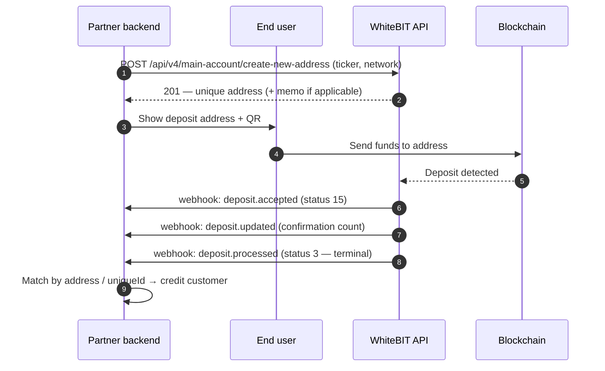
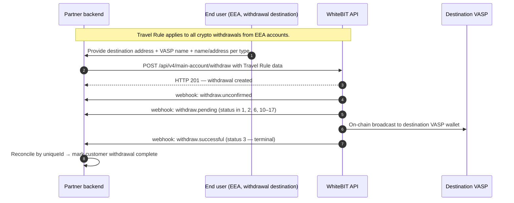
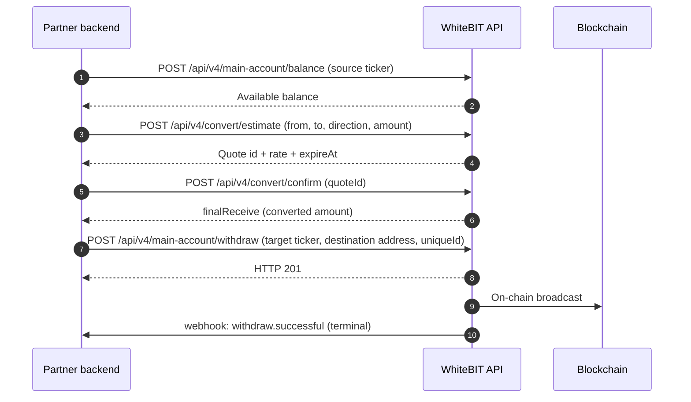

import { RegionBaseUrl } from '/components/RegionBaseUrl.jsx';

<RegionBaseUrl />

The Payment Integration guide covers every step required to move funds into and out of WhiteBIT programmatically — crypto deposits, crypto withdrawals, crypto withdrawals with currency conversion, fiat (SEPA) operations, and WhiteBIT Codes. Each section includes the full transaction lifecycle, status state machine, fee calculation, and webhook events.

<Warning>
  **EEA users:** USDT deposits and withdrawals are not available since December 30, 2024 (MiCA compliance). Use USDC or EURI as alternatives. See [Regulatory Compliance](/institutional/compliance) for details.
</Warning>

## Use cases

Common partner-integration scenarios. Each links to the relevant per-endpoint tabs below for the API reference.

### UC1 — Payment provider with per-end-user deposit address

A payment-provider partner assigns each end customer a unique deposit address and credits the customer's account when funds arrive. Reconciliation is webhook-driven by `uniqueId` (each deposit address corresponds to one customer in the partner's database).



See the [Crypto Deposits](#crypto-deposits) tab for endpoint detail.

### UC3 — EEA crypto withdrawal with Travel Rule

A partner serving EEA end users submits withdrawals with the required `travelRule` object. The withdrawal is processed immediately on the signed API request, then settles on-chain to the destination VASP.



See the [Crypto Withdrawals](#crypto-withdrawals) tab for endpoint detail.

### UC4 — Crypto payout with conversion

When the partner holds one currency in Main balance but needs to send another, request a conversion quote, confirm it, and submit the withdrawal. The convert service handles balance routing internally; no manual Main↔Trade transfers are required.



See the [Withdrawal with Conversion](#withdrawal-with-conversion) tab for endpoint detail.

<Tabs>
  <Tab title="Crypto Deposits">

## Deposit address generation

Generate a deposit address by calling `POST /api/v4/main-account/address`. See the [API Reference](/api-reference/account-wallet/get-cryptocurrency-deposit-address) for the full endpoint specification.

**Required parameters:**

| Parameter | Type | Description |
|-----------|------|-------------|
| `ticker` | string | Currency ticker (e.g., `BTC`, `ETH`). The currency must have `can_deposit: true` in the [Asset Status](/api-reference/market-data/asset-status-list) response. |
| `network` | string | Cryptocurrency network (e.g., `ERC20`, `TRC20`). Required for multi-network currencies like USDT. Query the [Asset Status](/api-reference/market-data/asset-status-list) endpoint for available networks per currency. |

**Optional parameters:** `type` (address-type selector — confirm valid values with the institutional team before integrating).

The endpoint returns the same address for the same ticker and network combination on repeated calls — addresses are permanent and reusable, not ephemeral.

**Key response fields:** `account.address`, `account.memo` (for currencies requiring a memo or destination tag), `required.fixedFee`, `required.flexFee`, `required.minAmount`, `required.maxAmount`.

**Rate limit:** subject to platform-level rate limits — see [Rate Limits](/api-reference/rate-limits) for current enforced values.

<Tabs>
  <Tab title="curl">
    ```bash
    # Generate a BTC deposit address
    curl -X POST "https://whitebit.com/api/v4/main-account/address" \
      -H "Content-Type: application/json" \
      -H "X-TXC-APIKEY: YOUR_API_KEY" \
      -H "X-TXC-PAYLOAD: YOUR_PAYLOAD" \
      -H "X-TXC-SIGNATURE: YOUR_SIGNATURE" \
      -d '{
        "ticker": "BTC",
        "request": "/api/v4/main-account/address",
        "nonce": 1594297865000
      }'

    # Generate an ERC20 USDT deposit address
    curl -X POST "https://whitebit.com/api/v4/main-account/address" \
      -H "Content-Type: application/json" \
      -H "X-TXC-APIKEY: YOUR_API_KEY" \
      -H "X-TXC-PAYLOAD: YOUR_PAYLOAD" \
      -H "X-TXC-SIGNATURE: YOUR_SIGNATURE" \
      -d '{
        "ticker": "USDT",
        "network": "ERC20",
        "request": "/api/v4/main-account/address",
        "nonce": 1594297865000
      }'
    ```
  </Tab>
  <Tab title="Python">
    ```python
    import hashlib
    import hmac
    import json
    import time
    import base64
    import requests

    API_KEY = "YOUR_API_KEY"
    API_SECRET = "YOUR_SECRET"
    BASE_URL = "https://whitebit.com"

    def send_request(endpoint, payload):
        payload["request"] = endpoint
        payload["nonce"] = int(time.time() * 1000)
        body = json.dumps(payload)
        encoded = base64.b64encode(body.encode()).decode()
        signature = hmac.new(
            API_SECRET.encode(), encoded.encode(), hashlib.sha512
        ).hexdigest()
        headers = {
            "Content-Type": "application/json",
            "X-TXC-APIKEY": API_KEY,
            "X-TXC-PAYLOAD": encoded,
            "X-TXC-SIGNATURE": signature,
        }
        return requests.post(f"{BASE_URL}{endpoint}", headers=headers, data=body)

    # Generate a BTC deposit address
    response = send_request("/api/v4/main-account/address", {"ticker": "BTC"})
    print(response.json())

    # Generate an ERC20 USDT deposit address
    response = send_request(
        "/api/v4/main-account/address", {"ticker": "USDT", "network": "ERC20"}
    )
    print(response.json())
    ```
  </Tab>
</Tabs>

For Go and PHP examples, see [SDKs](/sdks).

## Unique address per user

The `POST /api/v4/main-account/address` endpoint above returns the same address for the same ticker and network combination on every call. For payment provider integrations that assign a unique deposit address per end user, use `POST /api/v4/main-account/create-new-address` instead — this endpoint generates a fresh address on every call. See the [API Reference](/api-reference/account-wallet/create-new-address-for-deposit) for the full specification.

<Warning>
  The `/create-new-address` endpoint is not available by default. Contact support@whitebit.com to request access.
</Warning>

**Required parameters:**

| Parameter | Type | Description |
|-----------|------|-------------|
| `ticker` | string | Currency ticker (e.g., `BTC`, `ETH`) |
| `network` | string | Cryptocurrency network (e.g., `ERC20`, `TRC20`). Required for multi-network currencies. |

**Optional parameters:** `type` (address-type selector — confirm valid values with the institutional team before integrating).

**Rate limit:** subject to platform-level rate limits — see [Rate Limits](/api-reference/rate-limits) for current enforced values.

<Tabs>
  <Tab title="curl">
    ```bash
    # Generate a unique BTC deposit address
    curl -X POST "https://whitebit.com/api/v4/main-account/create-new-address" \
      -H "Content-Type: application/json" \
      -H "X-TXC-APIKEY: YOUR_API_KEY" \
      -H "X-TXC-PAYLOAD: YOUR_PAYLOAD" \
      -H "X-TXC-SIGNATURE: YOUR_SIGNATURE" \
      -d '{
        "ticker": "BTC",
        "request": "/api/v4/main-account/create-new-address",
        "nonce": 1594297865000
      }'
    ```
  </Tab>
  <Tab title="Python">
    ```python
    # Generate a unique BTC deposit address
    response = send_request("/api/v4/main-account/create-new-address", {
        "ticker": "BTC",
    })
    address = response.json()
    print("New address:", address["account"]["address"])
    ```
  </Tab>
</Tabs>

**Choosing between the two endpoints:** The choice depends on the partner's reconciliation model. If the partner manages one consolidated wallet per asset (treasury / market-maker / single-merchant), use `/address` — repeat calls return the same address, simplifying address management. If the partner assigns one address per end customer (payment provider / per-user wallet), use `/create-new-address` — repeat calls return fresh addresses, enabling deposit-amount-to-end-user mapping without bookkeeping.

| Endpoint | Behavior | Best for |
|----------|----------|----------|
| `POST /api/v4/main-account/address` | Returns the same address for the same ticker + network | Single-wallet setups, treasury management |
| `POST /api/v4/main-account/create-new-address` | Generates a new address on every call | Payment providers assigning one address per end user |

## Deposit lifecycle

After funds arrive at a generated deposit address, the deposit passes through a defined sequence of states before crediting to the Main balance.

1. Address generated (`POST /api/v4/main-account/address`)
2. Funds sent by the external party — mempool detection begins
3. Confirmation tracking begins — `deposit.accepted` webhook fires, `confirmations.actual` < `confirmations.required`
4. Confirmations reach the required threshold — `deposit.updated` webhook fires with updated `confirmations.actual`
5. Deposit credited to Main balance — `deposit.processed` webhook fires — **terminal success state**
6. OR: Deposit canceled — `deposit.canceled` webhook fires — **terminal failure state**
7. OR (EEA/Turkey): Travel Rule hold — deposit frozen (status 27 or 28), see Travel Rule section below

## Deposit status state machine

The deposit/withdraw history endpoint returns numeric status codes. The following table maps each code to the meaning and the corresponding webhook event.

<Note>
  Numeric status codes are namespaced by `transactionMethod`. The same code may mean different things for deposits (`transactionMethod: 1`) and withdrawals (`transactionMethod: 2`). Always interpret the code in the context of the transactionMethod that returned it.
</Note>

| Status | State | Webhook | Terminal? | Partner action | Description |
|--------|-------|---------|-----------|----------------|-------------|
| 15 | Pending | `deposit.accepted` | No | Wait for next webhook | Deposit detected, awaiting confirmations |
| 15 | Updated | `deposit.updated` | No | Wait for next webhook | Confirmation count changed |
| 3, 7 | Successful | `deposit.processed` | Yes | Credit end user, close watcher | Funds credited to Main balance |
| 4, 9 | Canceled | `deposit.canceled` | Yes | Surface refund flow | Deposit canceled (refund may be available) |
| 5 | Unconfirmed by user | — | No | Notify end user — manual action required at whitebit.com | Awaiting user action |
| 21 | AML frozen | — | No | Wait — under compliance review. Escalate to institutional team if >24h | Deposit frozen by AML controls |
| 22 | Uncredited | — | No | Wait — credit pending. Escalate to support if >24h | Detected but not credited |
| 27 | Travel Rule frozen | — | No | Notify end user — Travel Rule data required at whitebit.com | Awaiting Travel Rule data (EEA / Turkey) |
| 28 | Travel Rule processing | — | No | Wait — Travel Rule data under review | Travel Rule data submitted |

<Note>
  Use `POST /api/v4/main-account/history` with `transactionMethod: 1` and `status` filter to poll for deposits in specific states. See [Rate Limits](/api-reference/rate-limits) for the current enforced limit on this endpoint.
</Note>

## Network confirmations

Each cryptocurrency network requires a different number of block confirmations before a deposit is credited.

Webhook payloads include `confirmations.actual` and `confirmations.required` fields — use the `confirmations.required` value to determine when the deposit will complete. Query the [Asset Status](/api-reference/market-data/asset-status-list) endpoint (`GET /api/v4/public/assets`) for per-currency confirmation requirements.

Confirmation requirements vary by currency and network. Do not hardcode specific numbers — always retrieve the current values from the Asset Status endpoint.

## Partial / over-payment scenarios

Crypto deposits credit the actual on-chain amount received; the system does not flag deposits as "underpaid" or "overpaid". If a partner expects an exact amount (e.g., for invoice matching), reconciliation logic must compare the deposit amount in the `deposit.processed` webhook against the expected amount and surface mismatches as application-level alerts.

## Required endpoints for deposits

| Endpoint | Purpose | API Reference |
|----------|---------|---------------|
| `POST /api/v4/main-account/create-new-address` | Generate a unique deposit address per user | [Create New Address](/api-reference/account-wallet/create-new-address-for-deposit) |
| Webhooks (`deposit.accepted`, `deposit.updated`, `deposit.processed`) | Deposit status notifications | [Webhooks](/platform/webhook) |
| `POST /api/v4/main-account/history` | Query deposit and withdrawal history | [History](/api-reference/account-wallet/get-deposit-withdraw-history) |
| `POST /api/v4/main-account/balance` | Check Main balance | [Main Balance](/api-reference/account-wallet/main-balance) |
| `POST /api/v4/main-account/fee` | Available currencies, networks, and deposit limits | [Get Fees](/api-reference/account-wallet/get-fees) |

<Note>
  For integrations that use a single persistent deposit address instead of unique addresses per user, substitute `POST /api/v4/main-account/address` ([API Reference](/api-reference/account-wallet/get-cryptocurrency-deposit-address)) for the `/create-new-address` endpoint.
</Note>

## Travel Rule (EEA and Turkey)

Since May 19, 2025, inbound crypto deposits for EEA and Turkey accounts are placed on hold until Travel Rule verification completes.

- **Status 27** (`DEPOSIT_TRAVEL_RULE_FROZEN`): deposit frozen, awaiting Travel Rule data from the account holder
- **Status 28** (`DEPOSIT_TRAVEL_RULE_FROZEN_PROCESSING`): Travel Rule data submitted, under review by WhiteBIT

<Warning>
  Travel Rule verification for deposits requires the account holder to submit data through the WhiteBIT web interface. The API does not provide an endpoint to submit Travel Rule data for incoming deposits. Inform end users that frozen deposits require manual action at whitebit.com.
</Warning>

See [Regulatory Compliance](/institutional/compliance) for the full Travel Rule reference. See the [Travel Rule help center article](https://help.whitebit.com/hc/en-gb/articles/24093241373341-Travel-Rule-Requirements-Updates-to-Crypto-Withdrawals-Interface-and-API) for the complete requirements.

  </Tab>
  <Tab title="Crypto Withdrawals">

## Create a withdrawal

Submit a crypto withdrawal by calling `POST /api/v4/main-account/withdraw`. See the [API Reference](/api-reference/account-wallet/create-withdraw-request) for the full endpoint specification.

Two withdrawal endpoints are available:

| Endpoint | Fee Handling |
|----------|-------------|
| `POST /api/v4/main-account/withdraw` | Amount **includes** the fee — the receiver gets `amount - fee` |
| `POST /api/v4/main-account/withdraw-pay` | Amount **excludes** the fee — the receiver gets the exact amount specified; the fee is charged on top |

<Note>
  **Internal-transfer routing:** When the destination `address` belongs to another WhiteBIT user, the platform routes the transfer as an internal off-chain transfer rather than an on-chain broadcast. Internal transfers are fee-free; the partner does not pay blockchain fees and the recipient sees the funds immediately. For partner-to-partner or master-to-sub-account settlement, consider [WhiteBIT Codes](#whitebit-codes) for fee-free transfers without requiring the destination address.
</Note>

**Required parameters:**

| Parameter | Type | Description |
|-----------|------|-------------|
| `ticker` | string | Currency ticker (e.g., `BTC`, `ETH`) |
| `amount` | string | Withdrawal amount |
| `address` | string | Destination wallet address |
| `uniqueId` | string | Unique transaction identifier — any unique string up to 255 characters per request. Not validated as a UUID format. |

**Optional parameters:** `network` (required for multi-network currencies), `memo` (for currencies requiring a memo or destination tag).

**Rate limit:** subject to platform-level rate limits — see [Rate Limits](/api-reference/rate-limits) for current enforced values.

<Tabs>
  <Tab title="curl">
    ```bash
    curl -X POST "https://whitebit.com/api/v4/main-account/withdraw" \
      -H "Content-Type: application/json" \
      -H "X-TXC-APIKEY: YOUR_API_KEY" \
      -H "X-TXC-PAYLOAD: YOUR_PAYLOAD" \
      -H "X-TXC-SIGNATURE: YOUR_SIGNATURE" \
      -d '{
        "ticker": "BTC",
        "amount": "0.001",
        "address": "bc1qExample1234567890abcdef",
        "uniqueId": "order-12345-btc-001",
        "request": "/api/v4/main-account/withdraw",
        "nonce": 1594297865000
      }'
    ```
  </Tab>
  <Tab title="Python">
    ```python
    response = send_request("/api/v4/main-account/withdraw", {
        "ticker": "BTC",
        "amount": "0.001",
        "address": "bc1qExample1234567890abcdef",
        "uniqueId": "order-12345-btc-001",
    })
    print(response.json())
    ```
  </Tab>
</Tabs>

## Travel Rule for EEA withdrawals

Crypto withdrawals from EEA accounts require a `travelRule` object in the request body. The `travelRule` object is required when the currency is crypto AND the account is from the EEA.

<Note>
  **Field-role multiplex:** The `name` and `address` fields encode different data depending on `type`. For `type: "individual"`, `name` is the receiver's first name and `address` is the receiver's last name. For `type: "entity"`, `name` is the entity legal name and `address` is the entity address. Name local variables for the role the field carries (`receiver_first_name` / `receiver_last_name` for individuals), not for the spec field name.

  **API enforcement:** The `type` field is currently accepted as free text — the API does not validate whether the value is `individual` or `entity` and does not behave differently based on it. The role-multiplex described above is the documented intent and the schema partners should adhere to.
</Note>

| Field | Type | Description |
|-------|------|-------------|
| `type` | string | `"individual"` or `"entity"` — the receiver type |
| `vasp` | string | Destination platform (VASP) name (e.g., `"Binance"`) |
| `name` | string | If individual: first name. If entity: entity name. |
| `address` | string | If individual: last name. If entity: entity address. |

<Tabs>
  <Tab title="curl — Individual">
    ```bash
    curl -X POST "https://whitebit.com/api/v4/main-account/withdraw" \
      -H "Content-Type: application/json" \
      -H "X-TXC-APIKEY: YOUR_API_KEY" \
      -H "X-TXC-PAYLOAD: YOUR_PAYLOAD" \
      -H "X-TXC-SIGNATURE: YOUR_SIGNATURE" \
      -d '{
        "ticker": "ETH",
        "amount": "0.1",
        "address": "0x0964A6B8F794A4B8d61b62652dB27ddC9844FB4c",
        "uniqueId": "order-12345-eth-individual",
        "travelRule": {
          "type": "individual",
          "vasp": "Binance",
          "name": "Alex",
          "address": "Smith"
        },
        "request": "/api/v4/main-account/withdraw",
        "nonce": 1594297865000
      }'
    ```
  </Tab>
  <Tab title="curl — Entity">
    ```bash
    curl -X POST "https://whitebit.com/api/v4/main-account/withdraw" \
      -H "Content-Type: application/json" \
      -H "X-TXC-APIKEY: YOUR_API_KEY" \
      -H "X-TXC-PAYLOAD: YOUR_PAYLOAD" \
      -H "X-TXC-SIGNATURE: YOUR_SIGNATURE" \
      -d '{
        "ticker": "ETH",
        "amount": "0.1",
        "address": "0x0964A6B8F794A4B8d61b62652dB27ddC9844FB4c",
        "uniqueId": "order-12345-eth-entity",
        "travelRule": {
          "type": "entity",
          "vasp": "Kraken",
          "name": "Acme Trading Ltd",
          "address": "123 Exchange Street, London, UK"
        },
        "request": "/api/v4/main-account/withdraw",
        "nonce": 1594297865000
      }'
    ```
  </Tab>
</Tabs>

See [Regulatory Compliance](/institutional/compliance) and the [Travel Rule help center article](https://help.whitebit.com/hc/en-gb/articles/24093241373341-Travel-Rule-Requirements-Updates-to-Crypto-Withdrawals-Interface-and-API) for the complete requirements.

## Withdrawal confirmation model

After a withdrawal request is submitted, the system validates the request and begins processing.

The `POST /api/v4/main-account/withdraw` endpoint returns HTTP 201 when validation succeeds. **API-initiated withdrawals are confirmed and processed immediately** — the signed request is the authentication. There is no interactive 2FA step between the POST response and the processing start.

**Exceptions to immediate processing:**

- **Sub-account withdrawals** wait for main-account approval before processing.
- **AML-blocked destination addresses** are frozen pending compliance review.
- **Temporary withdrawal freeze (3 days)** applies after a password reset or a 2FA setting change on the account.

Status transitions follow the state machine below: unconfirmed → pending → successful or canceled. Webhook events track the full lifecycle.

> **Coming soon for B2B partners:** IP-whitelisted API keys will gain a new security model. When a new IP is added to the whitelist, an email notification is sent to the account owner and withdrawals from that IP are frozen for 24 hours. Once the freeze period ends, IP-whitelisted API keys will be able to bypass withdrawal confirmation. This feature is not yet deployed. Contact institutional@whitebit.com to be notified when it is available.

## Withdrawal status state machine

The withdrawal lifecycle progresses through the following states.

| Status | State | Webhook | Terminal? | Partner action | Description |
|--------|-------|---------|-----------|----------------|-------------|
| — | Unconfirmed | `withdraw.unconfirmed` | No | Wait for next webhook | Withdrawal created |
| 1, 2, 6, 10–17 | Pending | `withdraw.pending` | No | Wait for next webhook | Withdrawal in progress (all codes in range indicate active pending) |
| 3, 7 | Successful | `withdraw.successful` | Yes | Mark complete, close watcher | Withdrawal completed, funds sent |
| 4 | Canceled | `withdraw.canceled` | Yes | Surface to operations | Withdrawal canceled |
| 5 | Unconfirmed by user | — | No | Notify end user — manual action required | Awaiting user action |
| 18 | Partially successful | `withdraw.partial_successful` | Partial | Reconcile against `requestAmount` / `processedAmount`; surface remainder to operations | Part of the withdrawal succeeded (fiat with `partialEnable: true`) |
| 21 | AML frozen | — | No | Wait — under compliance review. Escalate to institutional team if >24h | Withdrawal frozen by AML controls |

## Fee calculation

Withdrawal fees combine a fixed component and a flexible (percentage-based) component.

**Fee model** (sourced from the deposit address endpoint response and the [Asset Status](/api-reference/market-data/asset-status-list) endpoint):

- `fixedFee` — flat fee charged regardless of amount
- `flexFee` — percentage-based fee with floor and ceiling:
  - `percent` — percentage rate
  - `minFee` — minimum fee (floor)
  - `maxFee` — maximum fee (ceiling)

**Fee calculation formula:**

```
percentFee = amount * (percent / 100)
flexComponent = clamp(percentFee, minFee, maxFee)
totalFee = fixedFee + flexComponent
```

If `maxFee` is `"0"`, no ceiling applies.

**Worked example — BTC withdrawal of 0.5 BTC:**

```
fixedFee = 0.0004 BTC
flexFee: percent = 0, minFee = 0, maxFee = 0
percentFee = 0.5 * 0 = 0
flexComponent = clamp(0, 0, 0) = 0
totalFee = 0.0004 + 0 = 0.0004 BTC

Using /withdraw:      Sender sends 0.5 BTC,    receiver gets 0.5 - 0.0004 = 0.4996 BTC
Using /withdraw-pay:  Sender pays  0.5004 BTC,  receiver gets 0.5 BTC
```

<Note>
  Fee parameters vary by currency and network. Query the Asset Status endpoint (`GET /api/v4/public/assets`) for current fee values.
</Note>

## Refund flow

When a deposit is canceled (status 4 or 9), a refund may be available.

**Endpoint:** `POST /api/v4/main-account/refund-deposit` — see the [API Reference](/api-reference/account-wallet/refund-deposit) for the full specification.

**Prerequisites:**

- The deposit must have status `canceled`.
- Obtain `transactionId` from the `deposit.canceled` webhook (`uniqueId` field) or from the deposit/withdraw history in the WhiteBIT interface.

**Required parameters:**

| Parameter | Type | Description |
|-----------|------|-------------|
| `transactionId` | string | Transaction UUID of the canceled deposit. |
| `address` | string | Destination wallet address for the refund. Must support the same network and asset as the original deposit. Must NOT be an address generated by `/api/v4/main-account/address` or `/api/v4/main-account/create-new-address` (no WhiteBIT-to-WhiteBIT refunds via this endpoint — use [Transfer Between Balances](/api-reference/account-wallet/transfer-between-balances) for internal transfers). Does not need to match the original sender address. |

**Webhook events for refund outcomes:**

- `refund.successful` — refund completed (includes `refundAmount`, `refundNetworkFee`, `refundHash`)
- `refund.failed` — refund failed (address validation failure or network issue; use a different address or contact support)

**Rate limit:** subject to platform-level rate limits — see [Rate Limits](/api-reference/rate-limits) for current enforced values.

<Tabs>
  <Tab title="curl">
    ```bash
    curl -X POST "https://whitebit.com/api/v4/main-account/refund-deposit" \
      -H "Content-Type: application/json" \
      -H "X-TXC-APIKEY: YOUR_API_KEY" \
      -H "X-TXC-PAYLOAD: YOUR_PAYLOAD" \
      -H "X-TXC-SIGNATURE: YOUR_SIGNATURE" \
      -d '{
        "transactionId": "5e112b38-9e12-4345-a1b2-c3d4e5f67890",
        "address": "bc1qRefundAddress1234567890abcdef",
        "request": "/api/v4/main-account/refund-deposit",
        "nonce": 1594297865000
      }'
    ```
  </Tab>
  <Tab title="Python">
    ```python
    response = send_request("/api/v4/main-account/refund-deposit", {
        "transactionId": "5e112b38-9e12-4345-a1b2-c3d4e5f67890",
        "address": "bc1qRefundAddress1234567890abcdef",
    })
    print(response.json())
    ```
  </Tab>
</Tabs>

## Required endpoints for withdrawals

| Endpoint | Purpose | API Reference |
|----------|---------|---------------|
| `POST /api/v4/main-account/balance` | Check Main balance before withdrawal | [Main Balance](/api-reference/account-wallet/main-balance) |
| `POST /api/v4/main-account/withdraw` or `/withdraw-pay` | Create a withdrawal request | [Create Withdraw](/api-reference/account-wallet/create-withdraw-request) |
| Webhooks (`withdraw.unconfirmed`, `withdraw.pending`, `withdraw.successful`, `withdraw.canceled`) | Withdrawal status notifications | [Webhooks](/platform/webhook) |
| `POST /api/v4/main-account/history` | Query deposit and withdrawal history | [History](/api-reference/account-wallet/get-deposit-withdraw-history) |
| `POST /api/v4/main-account/fee` | Available currencies, networks, and withdrawal limits | [Get Fees](/api-reference/account-wallet/get-fees) |

<Note>
  For withdrawals that include currency conversion before sending, see the Withdrawal with Conversion tab for the extended endpoint list.
</Note>

  </Tab>
  <Tab title="Fiat (SEPA)">

## Prerequisites for fiat operations

Fiat deposit and withdrawal operations require completion of institutional onboarding with approved fiat access. **This flow applies to the institutional partner's master account.** For broker-managed sub-account fiat scope and constraints, see the [Broker Program guide](/guides/broker-guide).

<Warning>
  Fiat operations require completion of institutional onboarding including KYB verification and fiat provider approval. See [Institutional Onboarding](/institutional/onboarding) for the full two-phase process. Fiat endpoints are not available until fiat access is explicitly approved.
</Warning>

The onboarding process has two phases: Phase 1 (crypto access via KYB) and Phase 2 (fiat access via fiat processing partner review). Fiat access is NOT automatic after KYB approval — a separate review process with the fiat processing partner is required.

## Fiat deposit (SEPA)

Generate a fiat deposit invoice by calling `POST /api/v4/main-account/fiat-deposit-url`. See the [API Reference](/api-reference/account-wallet/get-fiat-deposit-address) for the full specification.

<Note>
  The fiat deposit endpoint works on demand. Contact WhiteBIT support and provide the API key to get access.
</Note>

**Required parameters:**

| Parameter | Type | Description |
|-----------|------|-------------|
| `ticker` | string | Fiat currency ticker (e.g., `EUR`) |
| `amount` | string | Deposit amount |
| `provider` | string | Payment provider — check Asset Status endpoint for fiat currencies with `can_deposit: true` |
| `uniqueId` | string | Unique transaction identifier |

**Optional parameters:**

| Parameter | Type | Description |
|-----------|------|-------------|
| `successLink` | string | Redirect URL after successful deposit. Must use HTTPS. Host must be registered with the WhiteBIT institutional team before use — otherwise the request fails validation. |
| `failureLink` | string | Redirect URL after failed deposit. Same HTTPS + host-registration requirement as `successLink`. |
| `returnLink` | string | Redirect URL the end user lands on after the deposit flow (success or failure). Optional fallback target. |
| `address` | string | For `provider: "VISAMASTER"` — the end user's card number (PAN). Required when funding by card. |
| `customer` | object | Customer identity block. Required for `provider: "VISAMASTER"` (USD/EUR) and `provider: "MERCURYO"`. Sub-fields: `firstName`, `lastName`, `email`, `birthDate` (YYYY-MM-DD), `address.{line1, line2, city, zipCode, countryCode}`. |
| `expiresAfter` | integer | Invoice expiration in seconds. Maximum 86400 (24 hours). Accepted only for `provider: "VISAMASTER"` and `provider: "CHECKOUT"`. |

<Note>
  `GEL` and `UAH_VISAMASTER` tickers are blocked via the API. To deposit those currencies, use the WhiteBIT web interface.
</Note>

The endpoint returns a URL that the end user opens to complete the fiat deposit.

<Note>
  **VISAMASTER `Referer` header:** When using the VISAMASTER provider, the browser must be configured to send the `Referer` header when opening the invoice link. If the header is missing (e.g., when opening the link from a Telegram message or an email client that strips referrers), the end user is redirected to the WhiteBIT homepage instead of the payment provider. Test the redirect path in the actual deployment surface (mobile app, email link, in-app web view) before go-live.
</Note>

**Bank-side payment reference (SEPA):** The `uniqueId` returned by `/fiat-deposit-url` must appear in the SEPA payment-reference field on the bank-side transfer initiated by the end user. WhiteBIT uses this string to match the incoming SEPA settlement to the original deposit request. If the end user omits it or alters it, the deposit may settle unmatched and require manual reconciliation through institutional support.

## Fiat withdrawal (SEPA)

Create a fiat withdrawal using the same `POST /api/v4/main-account/withdraw` endpoint used for crypto, specifying a fiat ticker.

The same withdrawal endpoints apply (`/withdraw` and `/withdraw-pay`). Use fiat-specific tickers such as `EUR`, `UAH_IBAN`, `USD_VISAMASTER`, `EUR_VISAMASTER`.

The `beneficiary` object is required for fiat withdrawals with tickers `UAH_IBAN`, `USD_VISAMASTER`, `EUR_VISAMASTER`, `USD`, and `EUR`. The `partialEnable` parameter may be set to `true` for increased maximum limits — the application must handle status 18 ("Partially successful").

### Beneficiary object fields

Sub-field requirements vary by ticker and provider. Verify the current contract on the [Create Withdraw](/api-reference/account-wallet/create-withdraw-request) reference before integration.

| Sub-field | Required for | Notes |
|-----------|--------------|-------|
| `firstName` | UAH_IBAN, USD_VISAMASTER, USD, EUR | |
| `lastName` | UAH_IBAN, USD_VISAMASTER, USD, EUR | |
| `email` | USD_VISAMASTER, EUR_VISAMASTER | |
| `code` | Provider-dependent | |
| `tin` | UAH_IBAN | 10-digit integer |
| `phone` | VISAMASTER + USD/EUR | |
| `birthDate` | MERCURYO | Format: `YYYY-MM-DD` |
| `cardToken`, `cardTokenSave`, `fingerprintSession` | Card-tokenization flows | |
| `card.{save, name, firstName, lastName, number, month, year}` | Card-funded flows | |
| `address.{line1, line2, city, zip, country}` | Address-required flows | |
| `bank.{routingNumber, name, address, country}` | Bank-direct flows | |

Fiat withdrawals require KYC verification. Accounts without KYC verification cannot process fiat withdrawals.

<Note>
  In exceptional cases, a per-account override may be granted by the WhiteBIT institutional team that permits fiat withdrawal without standard KYC. This is exception-only — not a default capability. Contact institutional@whitebit.com for integrations with a documented case requiring the override.
</Note>

See [Institutional Onboarding](/institutional/onboarding) for the full fiat onboarding process.

  </Tab>
  <Tab title="WhiteBIT Codes">

## WhiteBIT Codes overview

WhiteBIT Codes enable fee-free value transfer between WhiteBIT accounts.

WhiteBIT Codes are alphanumeric strings representing a fixed amount of a specific currency. One account creates a code, shares the code string via any channel, and another account applies the code to receive the funds.

- **Fee-free** — no fees for creating or applying codes
- Use cases: internal transfers between accounts, promotional distributions, cross-account settlement
- Optional passphrase protection (up to 25 characters)

<Note>
  WhiteBIT Codes are fee-free. No creation fee, no application fee. Ideal for internal settlement between sub-accounts or partner accounts.
</Note>

## Lifecycle and behavior

**State machine:** WhiteBIT Codes have two terminal states: `created` (an unredeemed code exists; the creator's funds are reserved) and `applied` (the code has been redeemed; funds credited to the redeemer). There is no void or cancel operation; an unredeemed code cannot be reclaimed by the creator.

**Expiration:** Codes may fail to apply for several reasons (expired, invalid format, non-existent, wrong passphrase); the API does not distinguish reasons in the apply response. If a redeemer's apply fails on a recently-created code, request a fresh code from the creator.

**Correlation:** The `code` string is the only correlation key shared between creator and redeemer. The creator-side `description` field is creator-only and not exposed to the redeemer. Partners running redemption flows must map the code to their internal user ID on their side.

**Security model:** The code string is a bearer token — possession grants redemption. Share codes through trusted channels and consider the optional passphrase for an additional protection layer. Passphrases accept latin letters, digits, and ASCII symbols (no whitespace, no Unicode) up to 25 characters. Treat the code string as sensitive on the partner side: do not log it in plaintext, do not include it in error reports, do not commit it to version control.

## Create and apply a code

The code lifecycle has two steps: create and apply.

**Create:** `POST /api/v4/main-account/codes` — see the [API Reference](/api-reference/account-wallet/create-code)

| Parameter | Type | Required | Description |
|-----------|------|----------|-------------|
| `ticker` | string | Yes | Currency ticker (e.g., `BTC`, `ETH`) |
| `amount` | string | Yes | Amount to transfer (max precision: 18 decimal places; maximum value 1e17). |
| `passphrase` | string | No | Passphrase for protection (up to 25 characters, latin letters, numbers, and symbols). |
| `description` | string | No | Description visible only to the creator (up to 280 characters). |
| `async` | boolean | No | Processing-mode flag accepted by the endpoint. Confirm the exact semantic with the institutional team before relying on it in production. |

Rate limit: subject to platform-level rate limits — see [Rate Limits](/api-reference/rate-limits) for current enforced values.

**Apply:** `POST /api/v4/main-account/codes/apply` — see the [API Reference](/api-reference/account-wallet/apply-code)

| Parameter | Type | Required | Description |
|-----------|------|----------|-------------|
| `code` | string | Yes | The WhiteBIT Code string |
| `passphrase` | string | No | Required if the code was created with a passphrase |
| `async` | boolean | No | Processing-mode flag accepted by the endpoint. Confirm the exact semantic with the institutional team before relying on it in production. |

Rate limit: subject to platform-level rate limits — see [Rate Limits](/api-reference/rate-limits) for current enforced values.

**Webhook event:** `code.apply` fires when a code is applied.

<Tabs>
  <Tab title="curl">
    ```bash
    # Create a WhiteBIT Code
    curl -X POST "https://whitebit.com/api/v4/main-account/codes" \
      -H "Content-Type: application/json" \
      -H "X-TXC-APIKEY: YOUR_API_KEY" \
      -H "X-TXC-PAYLOAD: YOUR_PAYLOAD" \
      -H "X-TXC-SIGNATURE: YOUR_SIGNATURE" \
      -d '{
        "ticker": "USDT",
        "amount": "100",
        "passphrase": "securePass123",
        "description": "Partner settlement Q1",
        "request": "/api/v4/main-account/codes",
        "nonce": 1594297865000
      }'

    # Apply a WhiteBIT Code
    curl -X POST "https://whitebit.com/api/v4/main-account/codes/apply" \
      -H "Content-Type: application/json" \
      -H "X-TXC-APIKEY: YOUR_API_KEY" \
      -H "X-TXC-PAYLOAD: YOUR_PAYLOAD" \
      -H "X-TXC-SIGNATURE: YOUR_SIGNATURE" \
      -d '{
        "code": "WBe11f4fce-2a53-4edc-b195-66b693bd77e3USDT",
        "passphrase": "securePass123",
        "request": "/api/v4/main-account/codes/apply",
        "nonce": 1594297865000
      }'
    ```
  </Tab>
  <Tab title="Python">
    ```python
    # Create a WhiteBIT Code
    create_response = send_request("/api/v4/main-account/codes", {
        "ticker": "USDT",
        "amount": "100",
        "passphrase": "securePass123",
        "description": "Partner settlement Q1",
    })
    code = create_response.json().get("code")
    print(f"Created code: {code}")

    # Apply the WhiteBIT Code
    apply_response = send_request("/api/v4/main-account/codes/apply", {
        "code": code,
        "passphrase": "securePass123",
    })
    print(apply_response.json())
    ```
  </Tab>
</Tabs>

  </Tab>
  <Tab title="Withdrawal with Conversion">

## Conversion in the withdrawal flow

When the currency held in Main balance differs from the currency the end user needs to withdraw, request a conversion quote, confirm it, and then submit the withdrawal. The [Convert](/platform/convert) service handles balance routing internally — manual transfers between Main and Trade balances are not required.

## Step-by-step flow

<Steps>
  <Step title="Check Main balance">
    Verify the source currency is available in Main balance.

    **Endpoint:** `POST /api/v4/main-account/balance` — [API Reference](/api-reference/account-wallet/main-balance)
  </Step>
  <Step title="Request a conversion estimate">
    Request a quote for converting the source currency to the withdrawal currency. The response includes an `id` (quote identifier), the quoted `rate`, and `expireAt` (Unix timestamp).

    **Endpoint:** `POST /api/v4/convert/estimate` — [API Reference](/api-reference/convert/convert-estimate)
  </Step>
  <Step title="Confirm the conversion">
    Confirm the quote using `quoteId` from the estimate response. The conversion executes atomically.

    **Endpoint:** `POST /api/v4/convert/confirm` — [API Reference](/api-reference/convert/convert-confirm)
  </Step>
  <Step title="Create withdrawal request">
    Submit a withdrawal to the end user's external address using the converted currency.

    **Endpoint:** `POST /api/v4/main-account/withdraw` or `POST /api/v4/main-account/withdraw-pay` — [API Reference](/api-reference/account-wallet/create-withdraw-request)
  </Step>
  <Step title="Receive webhook confirmation">
    The `withdraw.successful` webhook fires when the withdrawal completes. See [Webhooks](/platform/webhook) for setup and signature verification.
  </Step>
  <Step title="Verify via history">
    Query the history endpoint to confirm the withdrawal status. See the Crypto Withdrawals tab for the full status state machine.

    **Endpoint:** `POST /api/v4/main-account/history` — [API Reference](/api-reference/account-wallet/get-deposit-withdraw-history)
  </Step>
</Steps>

<Note>
  Quote expiry is set per-quote by the convert service and returned in `expireAt` (Unix timestamp). Confirm the quote before that time elapses, or request a new estimate. See [Convert](/platform/convert) for full parameter details, direction options, and history queries.
</Note>

## Code example

Convert USDT to BTC and withdraw BTC to an external address. The `send_request()` helper used below is defined in the Crypto Deposits tab.

<Tabs>
  <Tab title="Python">
    ```python
    # Step 1: Check Main balance
    balance = send_request("/api/v4/main-account/balance", {"ticker": "USDT"})
    print("USDT Main balance:", balance.json())

    # Step 2: Request conversion estimate (USDT → BTC)
    estimate = send_request("/api/v4/convert/estimate", {
        "from": "USDT",
        "to": "BTC",
        "direction": "from",
        "amount": "100",
    })
    estimate_data = estimate.json()
    quote_id = estimate_data["id"]
    print("Quote ID:", quote_id, "Rate:", estimate_data["rate"], "Expires at:", estimate_data["expireAt"])

    # Step 3: Confirm conversion (confirm before expireAt)
    confirm = send_request("/api/v4/convert/confirm", {
        "quoteId": quote_id,
    })
    btc_received = confirm.json()["finalReceive"]
    print("BTC received:", btc_received)

    # Step 4: Create withdrawal
    response = send_request("/api/v4/main-account/withdraw", {
        "ticker": "BTC",
        "amount": btc_received,
        "address": "bc1qRecipientAddress1234567890abcdef",
        "uniqueId": "order-12345-btc-conversion",
    })
    print("Withdrawal response:", response.json())
    ```
  </Tab>
  <Tab title="curl">
    ```bash
    # Step 1: Request conversion estimate (USDT → BTC)
    curl -X POST "https://whitebit.com/api/v4/convert/estimate" \
      -H "Content-Type: application/json" \
      -H "X-TXC-APIKEY: YOUR_API_KEY" \
      -H "X-TXC-PAYLOAD: YOUR_PAYLOAD" \
      -H "X-TXC-SIGNATURE: YOUR_SIGNATURE" \
      -d '{
        "from": "USDT",
        "to": "BTC",
        "direction": "from",
        "amount": "100",
        "request": "/api/v4/convert/estimate",
        "nonce": 1594297865000
      }'

    # Step 2: Confirm conversion (use the "id" from estimate response)
    curl -X POST "https://whitebit.com/api/v4/convert/confirm" \
      -H "Content-Type: application/json" \
      -H "X-TXC-APIKEY: YOUR_API_KEY" \
      -H "X-TXC-PAYLOAD: YOUR_PAYLOAD" \
      -H "X-TXC-SIGNATURE: YOUR_SIGNATURE" \
      -d '{
        "quoteId": "ESTIMATE_ID",
        "request": "/api/v4/convert/confirm",
        "nonce": 1594297865000
      }'

    # Step 3: Create withdrawal
    curl -X POST "https://whitebit.com/api/v4/main-account/withdraw" \
      -H "Content-Type: application/json" \
      -H "X-TXC-APIKEY: YOUR_API_KEY" \
      -H "X-TXC-PAYLOAD: YOUR_PAYLOAD" \
      -H "X-TXC-SIGNATURE: YOUR_SIGNATURE" \
      -d '{
        "ticker": "BTC",
        "amount": "BTC_AMOUNT_FROM_CONFIRM",
        "address": "bc1qRecipientAddress1234567890abcdef",
        "uniqueId": "order-12345-btc-conversion",
        "request": "/api/v4/main-account/withdraw",
        "nonce": 1594297865000
      }'
    ```
  </Tab>
</Tabs>

For Go and PHP examples, see [SDKs](/sdks).

## Required endpoints for withdrawal with conversion

| Endpoint | Purpose | API Reference |
|----------|---------|---------------|
| `POST /api/v4/main-account/balance` | Check Main balance | [Main Balance](/api-reference/account-wallet/main-balance) |
| `POST /api/v4/convert/estimate` | Request a conversion quote | [Convert Estimate](/api-reference/convert/convert-estimate) |
| `POST /api/v4/convert/confirm` | Confirm and execute a conversion | [Convert Confirm](/api-reference/convert/convert-confirm) |
| `POST /api/v4/main-account/withdraw` | Create a withdrawal request | [Create Withdraw](/api-reference/account-wallet/create-withdraw-request) |
| Webhooks (`withdraw.successful`) | Withdrawal status notifications | [Webhooks](/platform/webhook) |
| `POST /api/v4/main-account/history` | Query deposit and withdrawal history | [History](/api-reference/account-wallet/get-deposit-withdraw-history) |
| `POST /api/v4/main-account/fee` | Currencies, networks, and withdrawal limits | [Get Fees](/api-reference/account-wallet/get-fees) |

  </Tab>
</Tabs>

## Webhook reconciliation

Reliable fund tracking requires both webhook-based and polling-based reconciliation.

**Primary method — webhooks for real-time notifications:**

- Configure the webhook URL in API key settings (see [Webhooks](/platform/webhook))
- Verify the HMAC-SHA512 signature on every incoming webhook. Each delivery includes three headers — `X-TXC-APIKEY` (the API key the webhook is bound to), `X-TXC-PAYLOAD` (base64-encoded JSON body), and `X-TXC-SIGNATURE` (HMAC-SHA512 of the payload with the API secret). See [Security Best Practices](/best-practices/security) for the verification algorithm.
- Track the `nonce` field — each webhook nonce is strictly greater than the previous. The nonce travels inside the JSON payload, not in a separate header.

**Retry policy:** Approximately 3 retries, attempted roughly once per hour, over a 24-hour delivery window.

**Fallback method — poll `POST /api/v4/main-account/history`:**

- Use `transactionMethod: 1` for deposits, `transactionMethod: 2` for withdrawals
- Filter by `status` array for specific states
- Recommended polling interval: every 5 minutes for active monitoring
- See [Rate Limits](/api-reference/rate-limits) for current enforced values

**Deduplication:** Use the `uniqueId` from webhook payloads and history responses to deduplicate across webhook and polling paths.

<Note>
  WhiteBIT does not offer a webhook replay mechanism. Implement polling as a fallback for outages longer than the 24-hour retry window. Store all processed `uniqueId` values to prevent double-processing.
</Note>

**Reconciliation pattern:**

1. Receive webhook — verify signature — extract `uniqueId` and `status`
2. Store the event with `uniqueId` as the idempotency key
3. On polling cycle: query the history endpoint — compare `uniqueId` values against stored events
4. Process any events found via polling that the webhook path did not deliver
5. Mark transactions as complete only when a terminal status is reached (3/7 for success, 4/9 for canceled deposits, 4 for canceled withdrawals)

## What's Next

<CardGroup cols={2}>
  <Card title="Webhooks" icon="bell" href="/platform/webhook">
    Full webhook setup, event types, and signature verification.
  </Card>
  <Card title="Convert" icon="rotate" href="/platform/convert">
    Conversion estimate and confirm flow, parameters, and history.
  </Card>
  <Card title="Regulatory Compliance" icon="scale-balanced" href="/institutional/compliance">
    MiCA restrictions, Travel Rule requirements, and regional considerations.
  </Card>
  <Card title="Security Best Practices" icon="shield-halved" href="/best-practices/security">
    API key management, IP whitelisting, and secret storage.
  </Card>
</CardGroup>
