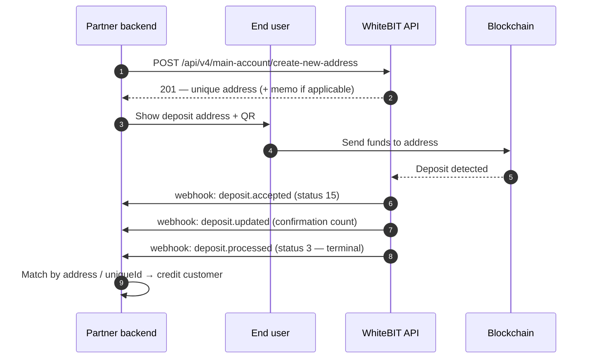
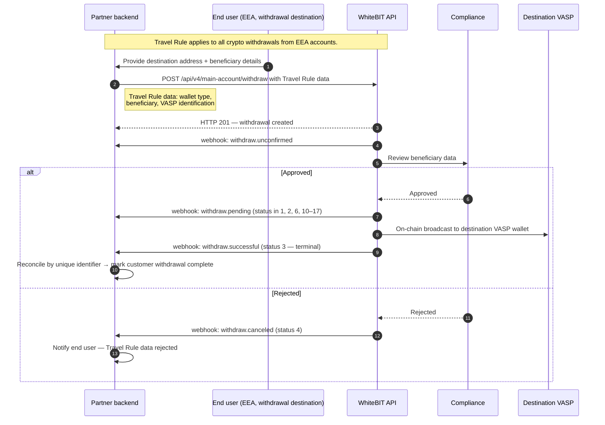
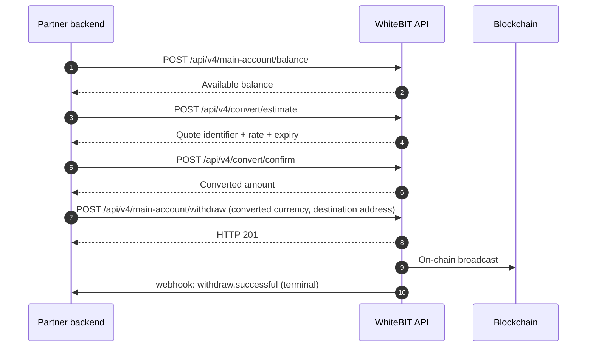
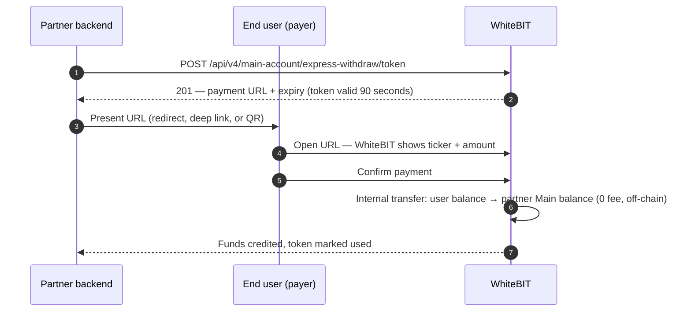
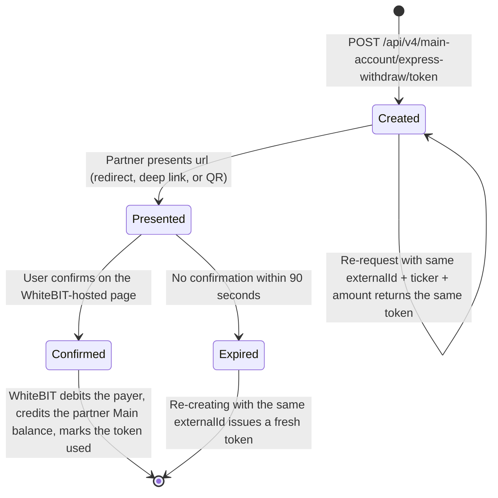
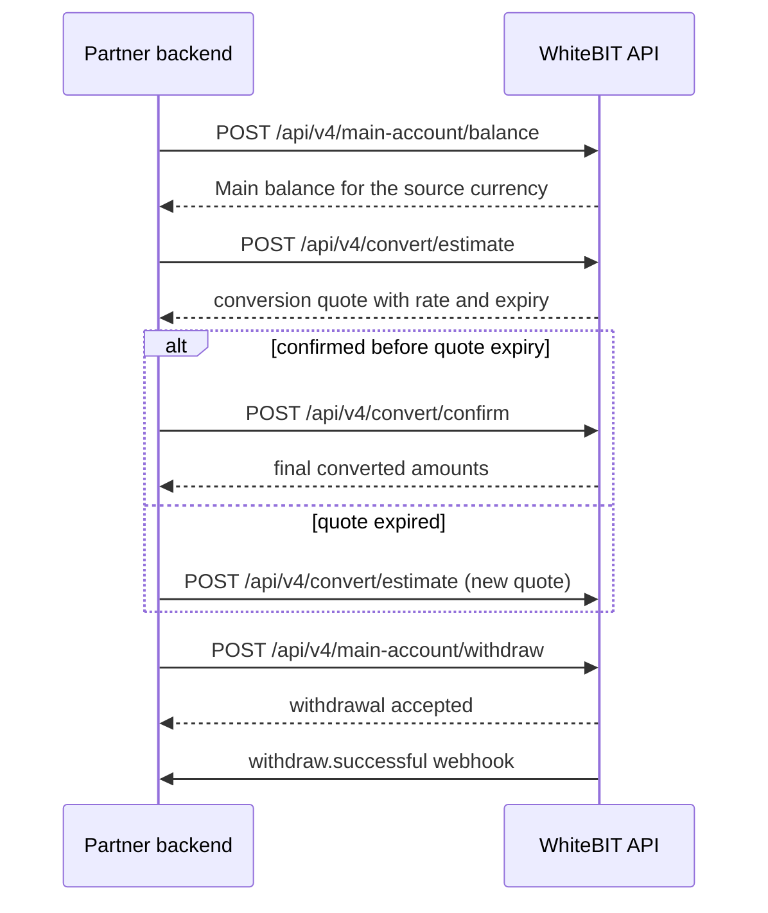

import { RegionBaseUrl } from '/snippets/RegionBaseUrl.jsx';

<RegionBaseUrl />

Move funds into and out of WhiteBIT programmatically: generate deposit addresses, submit crypto and fiat withdrawals, convert between currencies before withdrawing, settle between accounts with WhiteBIT Codes, and charge a WhiteBIT user's balance with Express Withdraw. Each flow documents the transaction lifecycle, status state machine, fee calculation, and webhook events, where each applies.

<Warning>
  **EEA users:** USDT deposits and withdrawals have been unavailable since December 30, 2024 (MiCA compliance). Use USDC or EURI as alternatives. See [Regulatory Compliance](/institutional/compliance) for details.
</Warning>

## Prerequisites

Before integrating any flow on this page:

- **API key** — create an API key with the required permissions in the WhiteBIT dashboard. Every endpoint on this page requires [HMAC-signed requests](/api-reference/authentication) (`X-TXC-APIKEY`, `X-TXC-PAYLOAD`, `X-TXC-SIGNATURE` headers). Store the secret per [Security Best Practices](/best-practices/security).
- **Webhook URL** — configure the webhook endpoint in the API key settings to receive transaction notifications. See [Webhooks](/platform/webhook).
- **Fiat access** — fiat operations additionally require completed [institutional onboarding](/institutional/onboarding) with approved fiat access.

## Use cases

Four scenarios cover the most common partner integrations. Each closes with a link to the section documenting the endpoints.

### UC1 — Payment provider with per-end-user deposit address

A payment-provider partner assigns each end customer a unique deposit address and credits the customer's account when funds arrive. Reconciliation is webhook-driven by `uniqueId` (each deposit address corresponds to one customer in the partner's database).


```mermaid
sequenceDiagram
    autonumber
    participant P as Partner backend
    participant U as End user
    participant W as WhiteBIT API
    participant B as Blockchain

    P->>W: POST /api/v4/main-account/create-new-address
    W-->>P: 201 — unique address (+ memo if applicable)
    P->>U: Show deposit address + QR
    U->>B: Send funds to address
    B-->>W: Deposit detected
    W->>P: webhook: deposit.accepted (status 15)
    W->>P: webhook: deposit.updated (confirmation count)
    W->>P: webhook: deposit.processed (status 3 — terminal)
    P->>P: Match by address / uniqueId → credit customer
```

See [Deposit address generation](#deposit-address-generation) for endpoint detail.

### UC2 — EEA crypto withdrawal with Travel Rule

A partner serving EEA end users submits withdrawals with the required `travelRule` object. The withdrawal goes through compliance review before on-chain broadcast.


```mermaid
sequenceDiagram
    autonumber
    participant P as Partner backend
    participant U as End user (EEA, withdrawal destination)
    participant W as WhiteBIT API
    participant C as Compliance
    participant V as Destination VASP

    Note over P,W: Travel Rule applies to all crypto withdrawals from EEA accounts.
    U->>P: Provide destination address + beneficiary details
    P->>W: POST /api/v4/main-account/withdraw with Travel Rule data
    Note right of P: Travel Rule data: wallet type,<br/>beneficiary, VASP identification
    W-->>P: HTTP 201 — withdrawal created
    W->>P: webhook: withdraw.unconfirmed
    W->>C: Review beneficiary data
    alt Approved
        C-->>W: Approved
        W->>P: webhook: withdraw.pending (status in 1, 2, 6, 10–17)
        W->>V: On-chain broadcast to destination VASP wallet
        W->>P: webhook: withdraw.successful (status 3 — terminal)
        P->>P: Reconcile by unique identifier → mark customer withdrawal complete
    else Rejected
        C-->>W: Rejected
        W->>P: webhook: withdraw.canceled (status 4)
        P->>P: Notify end user — Travel Rule data rejected
    end
```

See [Create a withdrawal](#create-a-withdrawal) for endpoint detail.

### UC3 — Crypto payout with conversion

When the partner holds one currency in Main balance but needs to send another, request a conversion quote, confirm it, and submit the withdrawal. The convert service handles balance routing internally; no manual Main↔Trade transfers are required.


```mermaid
sequenceDiagram
    autonumber
    participant P as Partner backend
    participant W as WhiteBIT API
    participant B as Blockchain

    P->>W: POST /api/v4/main-account/balance
    W-->>P: Available balance
    P->>W: POST /api/v4/convert/estimate
    W-->>P: Quote identifier + rate + expiry
    P->>W: POST /api/v4/convert/confirm
    W-->>P: Converted amount
    P->>W: POST /api/v4/main-account/withdraw (converted currency, destination address)
    W-->>P: HTTP 201
    W->>B: On-chain broadcast
    W->>P: webhook: withdraw.successful (terminal)
```

See [Conversion in the withdrawal flow](#conversion-in-the-withdrawal-flow) for endpoint detail.

### UC4 — Charge a WhiteBIT user's balance (Express Withdraw)

A merchant or partner service collects a crypto payment from a WhiteBIT user's balance instantly and off-chain: the partner creates a single-use payment token, presents the returned URL, and the user confirms in one tap. Settlement is an internal zero-fee transfer into the partner's Main balance.


```mermaid
sequenceDiagram
    autonumber
    participant P as Partner backend
    participant U as End user (payer)
    participant W as WhiteBIT

    P->>W: POST /api/v4/main-account/express-withdraw/token
    W-->>P: 201 — payment URL + expiry (token valid 90 seconds)
    P->>U: Present URL (redirect, deep link, or QR)
    U->>W: Open URL — WhiteBIT shows ticker + amount
    U->>W: Confirm payment
    W->>W: Internal transfer: user balance → partner Main balance (0 fee, off-chain)
    W-->>P: Funds credited, token marked used
```

See [Express Withdraw payments](#express-withdraw-payments) for endpoint detail.

## Crypto deposits

Generate deposit addresses, track the deposit lifecycle, handle refunds, and clear Travel Rule holds.

## Deposit address generation

Generate a deposit address by calling `POST /api/v4/main-account/address`. See the [API Reference](/api-reference/account-wallet/get-cryptocurrency-deposit-address) for the full endpoint specification.

**Required parameters:**

| Parameter | Type | Description |
|-----------|------|-------------|
| `ticker` | string | Currency ticker (e.g., `BTC`, `ETH`). The currency must have `can_deposit: true` in the [Asset Status](/api-reference/market-data/asset-status-list) response. |

**Optional parameters:** `network` — cryptocurrency network (e.g., `ERC20`, `TRC20`). Required for multi-network currencies like USDT; omit for single-network currencies. Query the [Asset Status](/api-reference/market-data/asset-status-list) endpoint for available networks per currency.

The endpoint returns the same address for the same ticker and network combination on repeated calls — addresses are permanent and reusable, not ephemeral.

**Key response fields:** `account.address`, `account.memo` (for currencies requiring a memo or destination tag), `required.fixedFee`, `required.flexFee`, `required.minAmount`, `required.maxAmount`.

**Rate limit:** subject to platform-level rate limits — see [Rate Limits](/api-reference/rate-limits) for current enforced values.

<Tabs>
  <Tab title="curl">
    ```bash
    # Generate a BTC deposit address
    curl -X POST "https://whitebit.com/api/v4/main-account/address" \
      -H "Content-Type: application/json" \
      -H "X-TXC-APIKEY: YOUR_API_KEY" \
      -H "X-TXC-PAYLOAD: YOUR_PAYLOAD" \
      -H "X-TXC-SIGNATURE: YOUR_SIGNATURE" \
      -d '{
        "ticker": "BTC",
        "request": "/api/v4/main-account/address",
        "nonce": 1594297865000
      }'

    # Generate an ERC20 USDT deposit address
    curl -X POST "https://whitebit.com/api/v4/main-account/address" \
      -H "Content-Type: application/json" \
      -H "X-TXC-APIKEY: YOUR_API_KEY" \
      -H "X-TXC-PAYLOAD: YOUR_PAYLOAD" \
      -H "X-TXC-SIGNATURE: YOUR_SIGNATURE" \
      -d '{
        "ticker": "USDT",
        "network": "ERC20",
        "request": "/api/v4/main-account/address",
        "nonce": 1594297865000
      }'
    ```
  </Tab>
  <Tab title="Python">
    ```python
    import hashlib
    import hmac
    import json
    import time
    import base64
    import requests

    API_KEY = "YOUR_API_KEY"
    API_SECRET = "YOUR_SECRET"
    BASE_URL = "https://whitebit.com"

    def send_request(endpoint, payload):
        payload["request"] = endpoint
        payload["nonce"] = int(time.time() * 1000)
        body = json.dumps(payload)
        encoded = base64.b64encode(body.encode()).decode()
        signature = hmac.new(
            API_SECRET.encode(), encoded.encode(), hashlib.sha512
        ).hexdigest()
        headers = {
            "Content-Type": "application/json",
            "X-TXC-APIKEY": API_KEY,
            "X-TXC-PAYLOAD": encoded,
            "X-TXC-SIGNATURE": signature,
        }
        return requests.post(f"{BASE_URL}{endpoint}", headers=headers, data=body)

    # Generate a BTC deposit address
    response = send_request("/api/v4/main-account/address", {"ticker": "BTC"})
    print(response.json())

    # Generate an ERC20 USDT deposit address
    response = send_request(
        "/api/v4/main-account/address", {"ticker": "USDT", "network": "ERC20"}
    )
    print(response.json())
    ```
  </Tab>
</Tabs>

For Go and PHP examples, see [SDKs](/sdks).

## Unique address per user

The `POST /api/v4/main-account/address` endpoint above returns the same address for the same ticker and network combination on every call. For payment provider integrations that assign a unique deposit address per end user, use `POST /api/v4/main-account/create-new-address` instead — this endpoint generates a fresh address on every call. See the [API Reference](/api-reference/account-wallet/create-new-address-for-deposit) for the full specification.

<Warning>
  The `/create-new-address` endpoint is not available by default. Contact support@whitebit.com to request access.
</Warning>

<Note>
  For sub-accounts, crypto deposits are disabled by default. To enable deposits, contact the assigned Account Manager or institutional@whitebit.com.
</Note>

**Required parameters:**

| Parameter | Type | Description |
|-----------|------|-------------|
| `ticker` | string | Currency ticker (e.g., `BTC`, `ETH`) |

**Optional parameters:** `network` (required for multi-network currencies; for USDT the default network is `ERC20`), `type` (address type for currencies that support several formats — BTC and LTC accept `p2sh-segwit` and `bech32`; the default is `bech32`).

**Rate limit:** subject to platform-level rate limits — see [Rate Limits](/api-reference/rate-limits) for current enforced values.

<Tabs>
  <Tab title="curl">
    ```bash
    # Generate a unique BTC deposit address
    curl -X POST "https://whitebit.com/api/v4/main-account/create-new-address" \
      -H "Content-Type: application/json" \
      -H "X-TXC-APIKEY: YOUR_API_KEY" \
      -H "X-TXC-PAYLOAD: YOUR_PAYLOAD" \
      -H "X-TXC-SIGNATURE: YOUR_SIGNATURE" \
      -d '{
        "ticker": "BTC",
        "request": "/api/v4/main-account/create-new-address",
        "nonce": 1594297865000
      }'
    ```
  </Tab>
  <Tab title="Python">
    ```python
    # Generate a unique BTC deposit address
    response = send_request("/api/v4/main-account/create-new-address", {
        "ticker": "BTC",
    })
    address = response.json()
    print("New address:", address["account"]["address"])
    ```
  </Tab>
</Tabs>

**Choosing between the two endpoints:** The choice depends on the partner's reconciliation model. Partners managing one consolidated wallet per asset (treasury, market-maker, single-merchant) use `/address`; repeat calls return the same address. Partners assigning one address per end customer (payment provider, per-user wallet) use `/create-new-address`; each call returns a fresh address, so an incoming deposit identifies the end user by address alone.

| Endpoint | Behavior | Best for |
|----------|----------|----------|
| `POST /api/v4/main-account/address` | Returns the same address for the same ticker + network | Single-wallet setups, treasury management |
| `POST /api/v4/main-account/create-new-address` | Generates a new address on every call | Payment providers assigning one address per end user |

## Deposit lifecycle

After funds arrive at a generated deposit address, the deposit passes through a defined sequence of states before crediting to the Main balance.

1. Address generated (`POST /api/v4/main-account/address`)
2. Funds sent by the external party — mempool detection begins
3. Confirmation tracking begins — `deposit.accepted` webhook fires while `confirmations.actual` is below `confirmations.required`
4. Each confirmation-count change fires the `deposit.updated` webhook with the new `confirmations.actual` — this event tracks progress; it does not signal completion
5. Deposit credited to Main balance — `deposit.processed` webhook fires — **terminal success state**
6. OR: Deposit canceled — `deposit.canceled` webhook fires — **terminal failure state**
7. OR (EEA/Turkey): Travel Rule hold — deposit frozen (status 27 or 28). If the Travel Rule API is enabled, submit originator data via API to unfreeze; otherwise manual action at whitebit.com is required. See [Travel Rule](#travel-rule-eea-and-turkey) below.

## Deposit status state machine

The deposit/withdraw history endpoint returns numeric status codes. The following table maps each code to the meaning and the corresponding webhook event.

<Note>
  Numeric status codes are namespaced by `transactionMethod`. The same code may mean different things for deposits (`transactionMethod: 1`) and withdrawals (`transactionMethod: 2`). Always interpret the code in the context of the `transactionMethod` that returned it.
</Note>

| Status | State | Webhook | Terminal? | Partner action | Description |
|--------|-------|---------|-----------|----------------|-------------|
| 15 | Pending | `deposit.accepted` | No | Wait for next webhook | Deposit detected, awaiting confirmations |
| 15 | Updated | `deposit.updated` | No | Wait for next webhook | Confirmation count changed |
| 3, 7 | Successful | `deposit.processed` | Yes | Credit end user, close watcher | Funds credited to Main balance |
| 4, 9 | Canceled | `deposit.canceled` | Yes | Surface refund flow — see [Refund flow](#refund-flow) | Deposit canceled (refund may be available) |
| 5 | Unconfirmed by user | — | No | Notify end user — manual action required at whitebit.com | Awaiting user action |
| 21 | AML frozen | — | No | Wait — under compliance review. Escalate to institutional team if >24h | Deposit frozen by AML controls |
| 22 | Uncredited | — | No | Wait — credit pending. Escalate to support if >24h | Detected but not credited |
| 27 | Travel Rule frozen | — | No | Notify end user — Travel Rule data required at whitebit.com | Awaiting Travel Rule data (EEA / Turkey) |
| 28 | Travel Rule processing | — | No | Wait — Travel Rule data under review | Travel Rule data submitted |

<Note>
  Use `POST /api/v4/main-account/history` with `transactionMethod: 1` and `status` filter to poll for deposits in specific states. See the [endpoint page](/api-reference/account-wallet/get-deposit-withdraw-history) for the current enforced rate limit.
</Note>

## Network confirmations

Each cryptocurrency network requires a different number of block confirmations before the platform credits a deposit.

Webhook payloads include `confirmations.actual` and `confirmations.required` fields — the `confirmations.required` value determines when the deposit completes. Query the [Asset Status](/api-reference/market-data/asset-status-list) endpoint (`GET /api/v4/public/assets`) for per-currency confirmation requirements.

Confirmation requirements vary by currency and network. Do not hardcode specific numbers — always retrieve the current values from the Asset Status endpoint.

## Partial / over-payment scenarios

Crypto deposits credit the actual on-chain amount received; the system does not flag deposits as "underpaid" or "overpaid". If a partner expects an exact amount (e.g., for invoice matching), reconciliation logic must compare the deposit amount in the `deposit.processed` webhook against the expected amount and surface mismatches as application-level alerts.

## Refund flow

When a deposit is canceled (status 4 or 9), a refund may be available.

**Endpoint:** `POST /api/v4/main-account/refund-deposit` — see the [API Reference](/api-reference/account-wallet/refund-deposit) for the full specification.

**Prerequisites:**

- The deposit must have status `canceled`.
- Obtain `transactionId` from the `deposit.canceled` webhook (`uniqueId` field) or from the deposit/withdraw history in the WhiteBIT interface.

**Required parameters:**

| Parameter | Type | Description |
|-----------|------|-------------|
| `transactionId` | string | Transaction UUID of the canceled deposit. |
| `address` | string | Destination wallet address for the refund. |

The refund `address` must satisfy three constraints:

- The address must support the same network and asset as the original deposit.
- The address must not be a WhiteBIT-generated deposit address (an address created by `/api/v4/main-account/address` or `/api/v4/main-account/create-new-address`) — the endpoint refunds to external addresses only.
- The address does not need to match the original sender address.

**Webhook events for refund outcomes:**

- `refund.successful` — refund completed (includes `refundAmount`, `refundNetworkFee`, `refundHash`)
- `refund.failed` — refund failed (the destination address does not support the required network or asset, or address validation fails; use a different address or contact support)

**Rate limit:** subject to platform-level rate limits — see [Rate Limits](/api-reference/rate-limits) for current enforced values.

<Tabs>
  <Tab title="curl">
    ```bash
    curl -X POST "https://whitebit.com/api/v4/main-account/refund-deposit" \
      -H "Content-Type: application/json" \
      -H "X-TXC-APIKEY: YOUR_API_KEY" \
      -H "X-TXC-PAYLOAD: YOUR_PAYLOAD" \
      -H "X-TXC-SIGNATURE: YOUR_SIGNATURE" \
      -d '{
        "transactionId": "5e112b38-9e12-4345-a1b2-c3d4e5f67890",
        "address": "bc1qRefundAddress1234567890abcdef",
        "request": "/api/v4/main-account/refund-deposit",
        "nonce": 1594297865000
      }'
    ```
  </Tab>
  <Tab title="Python">
    ```python
    response = send_request("/api/v4/main-account/refund-deposit", {
        "transactionId": "5e112b38-9e12-4345-a1b2-c3d4e5f67890",
        "address": "bc1qRefundAddress1234567890abcdef",
    })
    print(response.json())
    ```
  </Tab>
</Tabs>

## Required endpoints for deposits

| Endpoint | Purpose | API Reference |
|----------|---------|---------------|
| `POST /api/v4/main-account/create-new-address` | Generate a unique deposit address per user | [Create New Address](/api-reference/account-wallet/create-new-address-for-deposit) |
| Webhooks (`deposit.accepted`, `deposit.updated`, `deposit.processed`) | Deposit status notifications | [Webhooks](/platform/webhook) |
| `POST /api/v4/main-account/refund-deposit` | Refund a canceled deposit | [Refund Deposit](/api-reference/account-wallet/refund-deposit) |
| `POST /api/v4/main-account/history` | Query deposit and withdrawal history | [History](/api-reference/account-wallet/get-deposit-withdraw-history) |
| `POST /api/v4/main-account/balance` | Check Main balance | [Main Balance](/api-reference/account-wallet/main-balance) |
| `POST /api/v4/main-account/fee` | Available currencies, networks, and deposit limits | [Get Fees](/api-reference/account-wallet/get-fees) |

<Note>
  For integrations that use a single persistent deposit address instead of unique addresses per user, substitute `POST /api/v4/main-account/address` ([API Reference](/api-reference/account-wallet/get-cryptocurrency-deposit-address)) for the `/create-new-address` endpoint.
</Note>

## Travel Rule (EEA and Turkey)

Since May 18, 2025, WhiteBIT places inbound crypto deposits for EEA and Turkey accounts on hold until Travel Rule verification completes.

- **Status 27** (`DEPOSIT_TRAVEL_RULE_FROZEN`): deposit frozen, awaiting Travel Rule data from the account holder
- **Status 28** (`DEPOSIT_TRAVEL_RULE_FROZEN_PROCESSING`): Travel Rule data submitted, under review by WhiteBIT

<Note>
  **API-based verification:** When the Travel Rule API is enabled for the account, partners can submit originator data via `POST /api/v4/travel-rule/deposit/verification` to unfreeze deposits programmatically. See [Travel Rule](/concepts/travel-rule) for the full verification flow and request format.
</Note>

<Warning>
  **Manual verification fallback:** If the Travel Rule API is not enabled for the account, frozen deposits require manual action at whitebit.com. Contact institutional@whitebit.com to request Travel Rule API access.
</Warning>

See [Regulatory Compliance](/institutional/compliance) for the full Travel Rule reference. See the [Travel Rule help center article](https://help.whitebit.com/hc/en-gb/articles/24093241373341-Travel-Rule-Requirements-Updates-to-Crypto-Withdrawals-Interface-and-API) for the complete requirements.

## Crypto withdrawals

Submit crypto withdrawals, attach the Travel Rule payload for EEA accounts, and follow the withdrawal state machine and fee model.

## Create a withdrawal

Submit a crypto withdrawal by calling `POST /api/v4/main-account/withdraw`. See the [API Reference](/api-reference/account-wallet/create-withdraw-request) for the full endpoint specification.

Two withdrawal endpoints are available:

| Endpoint | Fee Handling |
|----------|-------------|
| `POST /api/v4/main-account/withdraw` | Amount **includes** the fee — the receiver gets `amount - fee` |
| `POST /api/v4/main-account/withdraw-pay` | Amount **excludes** the fee — the receiver gets the exact amount specified; the platform charges the fee on top |

<Warning>
  Crypto withdrawals cannot be reversed once broadcast on-chain. Verify the destination address and network before submitting the request — funds sent to a wrong address or an incompatible network are lost.
</Warning>

<Note>
  **Internal-transfer routing:** When the destination `address` belongs to another WhiteBIT user, the platform may route the transfer as an internal off-chain transfer rather than an on-chain broadcast, in which case no blockchain fee applies and the recipient sees the funds immediately. This routing is not guaranteed for every destination — confirm the behavior with WhiteBIT for the specific flow before designing around fee-free instant settlement, or funds may settle on-chain with the standard fee. For deterministic fee-free settlement between known WhiteBIT accounts, use [WhiteBIT Codes](#whitebit-codes-overview) rather than relying on withdrawal auto-routing.
</Note>
{/* TODO: confirm with Engineering whether a withdrawal to a WhiteBIT-owned address routes as a fee-free internal transfer, and under what conditions — payment-01. */}

**Required parameters:**

| Parameter | Type | Description |
|-----------|------|-------------|
| `ticker` | string | Currency ticker (e.g., `BTC`, `ETH`) |
| `amount` | string | Withdrawal amount |
| `address` | string | Destination wallet address |
| `uniqueId` | string | Unique transaction identifier — any unique string up to 255 characters per request. The endpoint does not validate the value as a UUID. |

**Optional parameters:** `network` (required for multi-network currencies), `memo` (for currencies requiring a memo or destination tag).

**Rate limit:** subject to platform-level rate limits — see [Rate Limits](/api-reference/rate-limits) for current enforced values.

<Tabs>
  <Tab title="curl">
    ```bash
    curl -X POST "https://whitebit.com/api/v4/main-account/withdraw" \
      -H "Content-Type: application/json" \
      -H "X-TXC-APIKEY: YOUR_API_KEY" \
      -H "X-TXC-PAYLOAD: YOUR_PAYLOAD" \
      -H "X-TXC-SIGNATURE: YOUR_SIGNATURE" \
      -d '{
        "ticker": "BTC",
        "amount": "0.001",
        "address": "bc1qExample1234567890abcdef",
        "uniqueId": "order-12345-btc-001",
        "request": "/api/v4/main-account/withdraw",
        "nonce": 1594297865000
      }'
    ```
  </Tab>
  <Tab title="Python">
    ```python
    response = send_request("/api/v4/main-account/withdraw", {
        "ticker": "BTC",
        "amount": "0.001",
        "address": "bc1qExample1234567890abcdef",
        "uniqueId": "order-12345-btc-001",
    })
    print(response.json())
    ```
  </Tab>
</Tabs>

## Travel Rule for EEA withdrawals

Crypto withdrawals from EEA accounts require a `travelRule` object in the request body. The object identifies the destination wallet and, for hosted wallets, the destination VASP (Virtual Asset Service Provider — the exchange or custodian hosting the receiving wallet).

### Structured format (recommended)

| Field | Type | Description |
|-------|------|-------------|
| `walletType` | string | `"hosted"` (VASP-hosted) or `"unhosted"` (self-custody) |
| `beneficiary` | object | Beneficiary details (`type`, `firstName`/`lastName` or `fullName`, `residenceCountry`, `address`) |
| `vaspData` | object | VASP identification (`vaspId` or `vaspName`) — required when `walletType` is `"hosted"` |

See [Travel Rule](/concepts/travel-rule) for the full schema reference and request examples.

### Legacy format (deprecated)

<Warning>
  The platform still accepts the legacy flat format, but legacy submissions **do not pass Travel Rule verification**. Migrate to the structured format above for compliance.
</Warning>

| Field | Type | Description |
|-------|------|-------------|
| `type` | string | `"individual"` or `"entity"` — the receiver type |
| `vasp` | string | Destination platform (VASP) name (e.g., `"Binance"`) |
| `name` | string | If individual: first name. If entity: entity name. |
| `address` | string | If individual: last name. If entity: entity address. |

See [Travel Rule — Legacy format](/concepts/travel-rule#legacy-format-withdrawals-only) for migration guidance.

## Withdrawal confirmation model

After a withdrawal request is submitted, the system validates the request and begins processing.

The `POST /api/v4/main-account/withdraw` endpoint returns HTTP 201 when validation succeeds. **The platform confirms and processes API-initiated withdrawals immediately** — the signed request is the authentication. There is no interactive 2FA step between the POST response and the processing start.

**Exceptions to immediate processing:**

- **Sub-account withdrawals** wait for main-account approval before processing.
- **Withdrawals to AML-blocked destination addresses** freeze pending compliance review.
- **Temporary withdrawal freeze (3 days)** applies after a password reset or a 2FA setting change on the account.

Status transitions follow the state machine below: unconfirmed → pending → successful or canceled. Webhook events track the full lifecycle.

<Note>
  A revised confirmation model for IP-whitelisted API keys is planned but not yet deployed. Contact institutional@whitebit.com for availability.
</Note>

## Withdrawal status state machine

The withdrawal lifecycle progresses through the following states.

| Status | State | Webhook | Terminal? | Partner action | Description |
|--------|-------|---------|-----------|----------------|-------------|
| — | Unconfirmed | `withdraw.unconfirmed` | No | Wait for next webhook | Withdrawal created |
| 1, 2, 6, 10–17 | Pending | `withdraw.pending` | No | Wait for next webhook | Withdrawal in progress (all codes in range indicate active pending) |
| 3, 7 | Successful | `withdraw.successful` | Yes | Mark complete, close watcher | Withdrawal completed, funds sent |
| 4 | Canceled | `withdraw.canceled` | Yes | Surface to operations | Withdrawal canceled |
| 5 | Unconfirmed by user | — | No | Notify end user — manual action required | Awaiting user action |
| 18 | Partially successful | `withdraw.partial_successful` | No | Reconcile against `requestAmount` / `processedAmount`; surface remainder to operations | Part of the withdrawal succeeded (fiat with `partialEnable: true`) |
| 21 | AML frozen | — | No | Wait — under compliance review. Escalate to institutional team if >24h | Withdrawal frozen by AML controls |

## Fee calculation

Withdrawal fees combine a fixed component and a flexible (percentage-based) component.

**Fee model** (sourced from the deposit address endpoint response and the [Asset Status](/api-reference/market-data/asset-status-list) endpoint):

- `fixedFee` — flat fee charged regardless of amount
- `flexFee` — percentage-based fee with floor and ceiling:
  - `percent` — percentage rate
  - `minFee` — minimum fee (floor)
  - `maxFee` — maximum fee (ceiling)

**Fee calculation formula:**

```text
percentFee = amount * (percent / 100)
flexComponent = clamp(percentFee, minFee, maxFee)
totalFee = fixedFee + flexComponent
```

If `maxFee` is `"0"`, no ceiling applies.

**Worked example — BTC withdrawal of 0.5 BTC:**

```text
fixedFee = 0.0004 BTC
flexFee: percent = 0, minFee = 0, maxFee = 0
percentFee = 0.5 * 0 = 0
flexComponent = clamp(0, 0, 0) = 0
totalFee = 0.0004 + 0 = 0.0004 BTC

Using /withdraw:      Sender sends 0.5 BTC,    receiver gets 0.5 - 0.0004 = 0.4996 BTC
Using /withdraw-pay:  Sender pays  0.5004 BTC,  receiver gets 0.5 BTC
```

<Note>
  Fee parameters vary by currency and network. Query the Asset Status endpoint (`GET /api/v4/public/assets`) for current fee values.
</Note>

## Required endpoints for withdrawals

| Endpoint | Purpose | API Reference |
|----------|---------|---------------|
| `POST /api/v4/main-account/balance` | Check Main balance before withdrawal | [Main Balance](/api-reference/account-wallet/main-balance) |
| `POST /api/v4/travel-rule/vasps` | Get available VASPs for Travel Rule (EEA withdrawals) | [Get VASPs](/api-reference/travel-rule/get-vasps) |
| `POST /api/v4/main-account/withdraw` or `/withdraw-pay` | Create a withdrawal request | [Create Withdraw](/api-reference/account-wallet/create-withdraw-request) |
| Webhooks (`withdraw.unconfirmed`, `withdraw.pending`, `withdraw.successful`, `withdraw.canceled`) | Withdrawal status notifications | [Webhooks](/platform/webhook) |
| `POST /api/v4/main-account/history` | Query deposit and withdrawal history | [History](/api-reference/account-wallet/get-deposit-withdraw-history) |
| `POST /api/v4/main-account/fee` | Available currencies, networks, and withdrawal limits | [Get Fees](/api-reference/account-wallet/get-fees) |

<Note>
  For withdrawals that include currency conversion before sending, see [Withdrawal with conversion](#withdrawal-with-conversion) for the extended endpoint list.
</Note>

## Fiat operations

Generate fiat deposit invoices and submit fiat withdrawals once institutional fiat access is approved.

## Prerequisites for fiat operations

Fiat deposit and withdrawal operations require completion of institutional onboarding with approved fiat access. **This flow applies to the institutional partner's master account.** For sub-account fiat scope and constraints under Embedded Trading, see the [Embedded Trading integration guide](/guides/sub-account-integration).

<Warning>
  Fiat operations require completion of institutional onboarding including business verification (KYB) and fiat provider approval. See [Institutional Onboarding](/institutional/onboarding) for the full two-phase process. Fiat endpoints are not available until WhiteBIT explicitly approves fiat access.
</Warning>

The onboarding process has two phases: Phase 1 (crypto access via KYB) and Phase 2 (fiat access via fiat processing partner review). Fiat access is **not** automatic after KYB approval — a separate review process with the fiat processing partner is required.

## Fiat deposit

The fiat deposit flow is invoice-based: generate a payment URL, hand it to the end user, and reconcile the settlement.

<Steps>
  <Step title="Generate a deposit invoice">
    Call `POST /api/v4/main-account/fiat-deposit-url` with the fiat ticker, amount, provider, and a partner-side `uniqueId`. The response contains a `url`. See the [API Reference](/api-reference/account-wallet/get-fiat-deposit-url) for the full specification.
  </Step>
  <Step title="Present the URL to the end user">
    The end user opens the returned URL and completes the payment with the provider or bank.
  </Step>
  <Step title="For SEPA: instruct the end user on the payment reference">
    The bank-side transfer must carry the `uniqueId` in the payment-reference field — see [SEPA payment reference](#sepa-payment-reference) below.
  </Step>
  <Step title="Confirm completion and reconcile">
    Confirm the credited deposit through the deposit history (`POST /api/v4/main-account/history`) or the Main balance (`POST /api/v4/main-account/balance`), matching by `uniqueId`.
  </Step>
</Steps>

<Note>
  The fiat deposit endpoint requires per-account activation. Contact WhiteBIT support and provide the API key to request access.
</Note>

**Required parameters:**

| Parameter | Type | Description |
|-----------|------|-------------|
| `ticker` | string | Fiat currency ticker (e.g., `EUR`) |
| `amount` | string | Deposit amount |
| `provider` | string | Payment provider — check Asset Status endpoint for fiat currencies with `can_deposit: true` |
| `uniqueId` | string | Unique transaction identifier |

**Optional parameters:**

| Parameter | Type | Description |
|-----------|------|-------------|
| `successLink` | string | Redirect URL after successful deposit. HTTPS only. Redirect links require feature activation — contact support before use; unactivated or non-HTTPS links fail validation. |
| `failureLink` | string | Redirect URL after failed deposit. Same HTTPS and activation requirement as `successLink`. |
| `returnLink` | string | Redirect URL the end user lands on after the deposit flow (success or failure). Optional fallback target. |
| `address` | string | For `provider: "VISAMASTER"` — the end user's card number (PAN). Required when funding by card. |
| `customer` | object | Customer identity block. Required for `provider: "VISAMASTER"` (USD/EUR) and `provider: "MERCURYO"`. Sub-fields: `firstName`, `lastName`, `email`, `birthDate` (YYYY-MM-DD), `address.{line1, line2, city, zipCode, countryCode}`. |
| `expiresAfter` | integer | Invoice expiration in seconds. Maximum 86400 (24 hours). Accepted only for `provider: "VISAMASTER"` and `provider: "CHECKOUT"`. |

<Note>
  Not every fiat ticker is depositable via API. Check `can_deposit` in the [Asset Status](/api-reference/market-data/asset-status-list) response before generating an invoice; tickers without API deposit support run through the WhiteBIT web interface.
</Note>

The endpoint returns a URL that the end user opens to complete the fiat deposit. Take the `provider` value for the currency from the [Asset Status](/api-reference/market-data/asset-status-list) response.

<Tabs>
  <Tab title="curl">
    ```bash
    # Generate a fiat deposit invoice (provider value from Asset Status)
    curl -X POST "https://whitebit.com/api/v4/main-account/fiat-deposit-url" \
      -H "Content-Type: application/json" \
      -H "X-TXC-APIKEY: YOUR_API_KEY" \
      -H "X-TXC-PAYLOAD: YOUR_PAYLOAD" \
      -H "X-TXC-SIGNATURE: YOUR_SIGNATURE" \
      -d '{
        "ticker": "EUR",
        "provider": "PROVIDER",
        "amount": "100",
        "uniqueId": "fiat-deposit-001",
        "request": "/api/v4/main-account/fiat-deposit-url",
        "nonce": 1594297865000
      }'
    ```
  </Tab>
  <Tab title="Python">
    ```python
    # Generate a fiat deposit invoice (provider value from Asset Status).
    # The send_request() helper is defined in the Crypto deposits section.
    response = send_request("/api/v4/main-account/fiat-deposit-url", {
        "ticker": "EUR",
        "provider": "PROVIDER",
        "amount": "100",
        "uniqueId": "fiat-deposit-001",
    })
    invoice_url = response.json()["url"]
    print("Send the end user to:", invoice_url)
    ```
  </Tab>
</Tabs>

### SEPA payment reference

The `uniqueId` submitted in the `/fiat-deposit-url` request must appear in the SEPA payment-reference field of the bank-side transfer initiated by the end user. WhiteBIT uses this string to match the incoming SEPA settlement to the original deposit request. If the end user omits or alters it, the deposit may settle unmatched and require manual reconciliation through institutional support.

### Card-provider flows

<Note>
  **VISAMASTER `Referer` header:** When using the VISAMASTER provider, configure the browser to send the `Referer` header when opening the invoice link. If the header is missing (e.g., when opening the link from a Telegram message or an email client that strips referrers), WhiteBIT redirects the end user to the homepage instead of the payment provider. Test the redirect path in the actual deployment surface (mobile app, email link, in-app web view) before go-live.
</Note>

### Deposit request errors

Common synchronous rejections from `/fiat-deposit-url` and the recovery for each:

| Error | Cause | Recovery |
|-------|-------|----------|
| `Your domain scheme incorrect. Use https only` | `successLink` / `failureLink` uses HTTP | Use HTTPS redirect URLs |
| `Currency is not depositable via API` | The ticker is not enabled for API fiat deposits | Check `can_deposit` in the Asset Status response; use the web interface for blocked tickers |
| `User not verified` | Account verification incomplete | Complete institutional onboarding before requesting invoices |
| `Amount is too big for deposit` / `Daily limit reached` | Amount exceeds the per-transaction or daily limit | Query `POST /api/v4/main-account/fee` for current limits and retry within the returned limits |

## Fiat withdrawal

Create a fiat withdrawal using the same `POST /api/v4/main-account/withdraw` endpoint used for crypto, specifying a fiat ticker.

The same withdrawal endpoints apply (`/withdraw` and `/withdraw-pay`). Use fiat-specific tickers such as `EUR`, `USD`, `USD_VISAMASTER`, `EUR_VISAMASTER`.

The `beneficiary` object is required for fiat withdrawals with tickers `USD_VISAMASTER`, `EUR_VISAMASTER`, `USD`, and `EUR`. Set `partialEnable` to `true` for increased maximum limits — the application must then handle status 18 ("Partially successful").

### Beneficiary object fields

Sub-field requirements vary by ticker and provider. Verify the current contract on the [Create Withdraw](/api-reference/account-wallet/create-withdraw-request) reference before integration.

| Sub-field | Required for | Notes |
|-----------|--------------|-------|
| `firstName` | USD_VISAMASTER, USD, EUR | — |
| `lastName` | USD_VISAMASTER, USD, EUR | — |
| `email` | USD_VISAMASTER, EUR_VISAMASTER | — |
| `code` | Provider-dependent | — |
| `phone` | VISAMASTER + USD/EUR | — |
| `birthDate` | USD_VISAMASTER, EUR_VISAMASTER, MERCURYO | Format: `YYYY-MM-DD` |
| `cardToken`, `cardTokenSave`, `fingerprintSession` | Card-tokenization flows | — |
| `card.{save, name, firstName, lastName, number, month, year}` | Card-funded flows | — |
| `address.{line1, line2, city, zip, country}` | Address-required flows | — |
| `bank.{routingNumber, name, address, country}` | Bank-direct flows | — |

Fiat withdrawals require KYC verification. Accounts without KYC verification cannot process fiat withdrawals.

<Note>
  In exceptional cases, the WhiteBIT institutional team may grant a per-account override that permits fiat withdrawal without standard KYC. This is exception-only — not a default capability. Contact institutional@whitebit.com for integrations with a documented case requiring the override.
</Note>

See [Institutional Onboarding](/institutional/onboarding) for the full fiat onboarding process.

## Required endpoints for fiat operations

| Endpoint | Purpose | API Reference |
|----------|---------|---------------|
| `POST /api/v4/main-account/fiat-deposit-url` | Generate a fiat deposit invoice | [Fiat Deposit URL](/api-reference/account-wallet/get-fiat-deposit-url) |
| `POST /api/v4/main-account/withdraw` or `/withdraw-pay` | Create a fiat withdrawal | [Create Withdraw](/api-reference/account-wallet/create-withdraw-request) |
| `POST /api/v4/main-account/balance` | Check Main balance | [Main Balance](/api-reference/account-wallet/main-balance) |
| `POST /api/v4/main-account/history` | Query deposit and withdrawal history | [History](/api-reference/account-wallet/get-deposit-withdraw-history) |
| `POST /api/v4/main-account/fee` | Available currencies, providers, and limits | [Get Fees](/api-reference/account-wallet/get-fees) |

## WhiteBIT Codes

Move balance fee-free between WhiteBIT accounts by creating and applying codes.

## WhiteBIT Codes overview

WhiteBIT Codes enable fee-free value transfer between WhiteBIT accounts.

WhiteBIT Codes are alphanumeric strings representing a fixed amount of a specific currency. One account creates a code, shares the code string via any channel, and another account applies the code to receive the funds.

- **Fee-free** — no fees for creating or applying codes
- Use cases: internal transfers between accounts, promotional distributions, settlement between sub-accounts or partner accounts
- Optional passphrase protection (up to 25 characters)

## Lifecycle and behavior

**State machine:** A WhiteBIT Code moves through two states: `created` (an unredeemed code exists; the platform reserves the creator's funds) and `applied` (terminal — the code has been redeemed; funds credited to the redeemer). There is no void or cancel operation; the creator cannot reclaim an unredeemed code.

**Apply failures:** Codes may fail to apply for several reasons (expired, invalid format, non-existent, wrong passphrase). The apply response distinguishes an already-applied code and a code applied by its own creator; the platform collapses the remaining failure modes into a generic rejection. If a redeemer's apply fails on a recently-created code, request a fresh code from the creator.

**Correlation:** The `code` string is the only correlation key shared between creator and redeemer. The creator-side `description` field is creator-only and not exposed to the redeemer. Partners running redemption flows must map the code to an internal user ID on the partner side.

<Warning>
  The code string is a bearer token — possession grants redemption, and the creator cannot reclaim an unredeemed code. A leaked code is spendable by whoever holds it.
</Warning>

**Security model:** Share codes through trusted channels and consider the optional passphrase for an additional protection layer. Passphrases accept Latin letters, digits, and ASCII symbols (no whitespace, no Unicode) up to 25 characters. Treat the code string as sensitive on the partner side: do not log it in plaintext, do not include it in error reports, do not commit it to version control.

## Create and apply a code

The code lifecycle has two steps: create and apply.

**Create:** `POST /api/v4/main-account/codes` — see the [API Reference](/api-reference/account-wallet/create-code)

**Required parameters:**

| Parameter | Type | Description |
|-----------|------|-------------|
| `ticker` | string | Currency ticker (e.g., `BTC`, `ETH`) |
| `amount` | string | Amount to transfer (max precision: 18 decimal places; maximum value 1e17). |

**Optional parameters:**

| Parameter | Type | Description |
|-----------|------|-------------|
| `passphrase` | string | Passphrase for protection (up to 25 characters, Latin letters, digits, and ASCII symbols). |
| `description` | string | Description visible only to the creator (up to 280 characters). |
| `async` | boolean | Processing-mode flag accepted by the endpoint. Confirm the exact semantic with the institutional team before relying on it in production. |

**Key response fields:** `code` — the generated WhiteBIT Code string to share with the redeemer; `message` — success message; `external_id` — external identifier.

**Rate limit:** subject to platform-level rate limits — see [Rate Limits](/api-reference/rate-limits) for current enforced values.

**Apply:** `POST /api/v4/main-account/codes/apply` — see the [API Reference](/api-reference/account-wallet/apply-code)

**Required parameters:**

| Parameter | Type | Description |
|-----------|------|-------------|
| `code` | string | The WhiteBIT Code string |

**Optional parameters:**

| Parameter | Type | Description |
|-----------|------|-------------|
| `passphrase` | string | Required if the code was created with a passphrase |
| `async` | boolean | Processing-mode flag accepted by the endpoint. Confirm the exact semantic with the institutional team before relying on it in production. |

**Rate limit:** subject to platform-level rate limits — see [Rate Limits](/api-reference/rate-limits) for current enforced values.

**Webhook event:** `code.apply` fires when an account applies a code.

<Tabs>
  <Tab title="curl">
    ```bash
    # Create a WhiteBIT Code
    curl -X POST "https://whitebit.com/api/v4/main-account/codes" \
      -H "Content-Type: application/json" \
      -H "X-TXC-APIKEY: YOUR_API_KEY" \
      -H "X-TXC-PAYLOAD: YOUR_PAYLOAD" \
      -H "X-TXC-SIGNATURE: YOUR_SIGNATURE" \
      -d '{
        "ticker": "USDT",
        "amount": "100",
        "passphrase": "securePass123",
        "description": "Partner settlement Q1",
        "request": "/api/v4/main-account/codes",
        "nonce": 1594297865000
      }'

    # Apply a WhiteBIT Code
    curl -X POST "https://whitebit.com/api/v4/main-account/codes/apply" \
      -H "Content-Type: application/json" \
      -H "X-TXC-APIKEY: YOUR_API_KEY" \
      -H "X-TXC-PAYLOAD: YOUR_PAYLOAD" \
      -H "X-TXC-SIGNATURE: YOUR_SIGNATURE" \
      -d '{
        "code": "WBe11f4fce-2a53-4edc-b195-66b693bd77e3USDT",
        "passphrase": "securePass123",
        "request": "/api/v4/main-account/codes/apply",
        "nonce": 1594297865000
      }'
    ```
  </Tab>
  <Tab title="Python">
    ```python
    # Create a WhiteBIT Code
    create_response = send_request("/api/v4/main-account/codes", {
        "ticker": "USDT",
        "amount": "100",
        "passphrase": "securePass123",
        "description": "Partner settlement Q1",
    })
    code = create_response.json().get("code")
    print(f"Created code: {code}")

    # Apply the WhiteBIT Code
    apply_response = send_request("/api/v4/main-account/codes/apply", {
        "code": code,
        "passphrase": "securePass123",
    })
    print(apply_response.json())
    ```
  </Tab>
</Tabs>

## Express Withdraw

Charge a WhiteBIT user's balance in one confirmation with a single-use payment token.

## Express Withdraw payments

Express Withdraw lets an approved partner charge a specific amount from a WhiteBIT user's balance in one confirmation. The partner integrates a single endpoint — `POST /api/v4/main-account/express-withdraw/token` ([API Reference](/api-reference/account-wallet/create-express-withdraw-token)) — and WhiteBIT hosts everything the paying user sees. Settlement is an internal balance move: instant, off-chain, and fee-free on both sides.

<Note>
  Express Withdraw is available only for B2B partner services and requires a separate approval process. Request access at https://institutional.whitebit.com/. Without the permission, the endpoint returns `403 Forbidden`.
</Note>

## Token lifecycle

A payment token moves through four states:


```mermaid
stateDiagram-v2
    [*] --> Created: POST /api/v4/main-account/express-withdraw/token
    Created --> Created: Re-request with same externalId + ticker + amount returns the same token
    Created --> Presented: Partner presents url (redirect, deep link, or QR)
    Presented --> Confirmed: User confirms on the WhiteBIT-hosted page
    Presented --> Expired: No confirmation within 90 seconds
    Confirmed --> [*]: WhiteBIT debits the payer, credits the partner Main balance, marks the token used
    Expired --> [*]: Re-creating with the same externalId issues a fresh token
```

1. **Created** — the partner calls the create-token endpoint with `ticker`, `amount`, and a partner-side `externalId` (order or invoice identifier). The response carries the payment `url` and `expireAt` (UTC); every token is valid for 90 seconds after creation.
2. **Presented** — the partner hands the `url` to the user as a redirect, mobile deep link, or QR code. Treat the value as opaque: WhiteBIT returns the hosted web confirmation page by default, or a deep link when one is configured for the partner at onboarding; the token travels in the `token` query parameter either way.
3. **Confirmed** (terminal) — the user, authenticated on WhiteBIT, reviews the exact `ticker` and `amount` and confirms. WhiteBIT re-validates balance, limits, and permissions, debits the user, credits the partner's Main balance in the same operation, and marks the token used.
4. **Expired** (terminal) — a token left unconfirmed for 90 seconds becomes unusable. Re-create the payment with the same `externalId`; WhiteBIT issues a fresh token.

Create the token as close as possible to the moment of presenting it — the 90-second window covers the user's review and confirmation, not the partner's checkout flow.

```python
# Create an Express Withdraw payment token (single-use, valid 90 seconds).
# The send_request() helper is defined in the Crypto deposits section.
response = send_request("/api/v4/main-account/express-withdraw/token", {
    "ticker": "USDT",
    "amount": "25.50",
    "externalId": "order-100294",
})
payment = response.json()
print("Send the user to:", payment["url"])
print("Token expires at (UTC):", payment["expireAt"])
```

## Idempotency and replay protection

The `externalId` is unique per partner account and drives both guarantees:

- Re-requesting a token for the same `externalId` with an identical `ticker` and `amount` while the token is still valid returns the **same** token — safe to retry after a timeout without double-charging.
- Changing `ticker` or `amount` for a pending `externalId` fails with error code `18` — parameters of a pending payment cannot change; use a new `externalId`.
- Re-submitting an `externalId` that the user already paid fails with error code `19` — the order is settled, and the rejection prevents a duplicate charge.

See the [endpoint page](/api-reference/account-wallet/create-express-withdraw-token) for the full error-code table.

## Limits and eligibility

- **Per-payment cap:** 10,000 USDT-equivalent, rejected with error code `191` above the cap. WhiteBIT enforces the cap at token creation and re-enforces it at confirmation.
- **Currency:** crypto only; the ticker must be withdrawal-enabled on the platform. The endpoint rejects fiat tickers.
- **No self-payments:** the paying user and the token creator must be different WhiteBIT accounts.
- **Payer eligibility:** at confirmation the user must have withdrawals enabled, pass the standard withdrawal restriction checks, and hold a sufficient balance.
- **Rate limits:** standard private-API limits apply — see [Rate Limits](/api-reference/rate-limits); the endpoint has no endpoint-specific limit.

## Withdrawal with conversion

Convert the source currency before withdrawing, using the Convert service.

## Conversion in the withdrawal flow

When the currency held in Main balance differs from the currency the end user needs to withdraw, request a conversion quote, confirm it, and then submit the withdrawal. The [Convert](/platform/convert) service handles balance routing internally — manual transfers between Main and Trade balances are not required.

## Step-by-step flow

<Steps>
  <Step title="Check Main balance">
    Verify the source currency is available in Main balance.

    **Endpoint:** `POST /api/v4/main-account/balance` — [API Reference](/api-reference/account-wallet/main-balance)
  </Step>
  <Step title="Request a conversion estimate">
    Request a quote for converting the source currency to the withdrawal currency. The response includes an `id` (quote identifier), the quoted `rate`, and `expireAt` (Unix timestamp).

    **Endpoint:** `POST /api/v4/convert/estimate` — [API Reference](/api-reference/convert/convert-estimate)
  </Step>
  <Step title="Confirm the conversion">
    Confirm the quote using `quoteId` from the estimate response. The conversion executes atomically.

    **Endpoint:** `POST /api/v4/convert/confirm` — [API Reference](/api-reference/convert/convert-confirm)
  </Step>
  <Step title="Create withdrawal request">
    Submit a withdrawal to the end user's external address using the converted currency.

    **Endpoint:** `POST /api/v4/main-account/withdraw` or `POST /api/v4/main-account/withdraw-pay` — [API Reference](/api-reference/account-wallet/create-withdraw-request)
  </Step>
  <Step title="Receive webhook confirmation">
    The `withdraw.successful` webhook fires when the withdrawal completes. See [Webhooks](/platform/webhook) for setup and signature verification.
  </Step>
  <Step title="Verify via history">
    Query the history endpoint to confirm the withdrawal status. See [Withdrawal status state machine](#withdrawal-status-state-machine) for the full status state machine.

    **Endpoint:** `POST /api/v4/main-account/history` — [API Reference](/api-reference/account-wallet/get-deposit-withdraw-history)
  </Step>
</Steps>

<Note>
  The convert service sets quote expiry per quote and returns the value in `expireAt` (Unix timestamp). Confirm the quote before that time elapses, or request a new estimate. See [Convert](/platform/convert) for full parameter details, direction options, and history queries.
</Note>

## Conversion errors

Common synchronous rejections from `/convert/confirm` and the recovery for each:

| Error code | Cause | Recovery |
|------------|-------|----------|
| `20` (`api.converter.quoteExpired`) | The quote expired before confirmation | Request a new estimate and confirm within the quote window |
| `37` | Insufficient balance at confirm time — the platform re-checks the balance on confirm, and the balance can change within the quote window even when the estimate succeeded | Top up the Main balance or request a new estimate for a smaller amount |
| `0` with the `quoteId` field key `frontendServerSide.converter.quoteInvalid` | The quote was already used or never existed — the response does not distinguish the two | Request a new estimate |

<Note>
  Error `message` values may arrive as translation keys (e.g., `api.converter.quoteExpired`) rather than finalized English strings. Treat the `code` and the field name under `errors` as the stable contract.
</Note>

## Code example

Convert USDT to BTC and withdraw BTC to an external address. The estimate returns a short-lived quote — confirm it before it expires, or request a new one:


```mermaid
sequenceDiagram
    participant Partner as Partner backend
    participant WB as WhiteBIT API

    Partner->>WB: POST /api/v4/main-account/balance
    WB-->>Partner: Main balance for the source currency
    Partner->>WB: POST /api/v4/convert/estimate
    WB-->>Partner: conversion quote with rate and expiry
    alt confirmed before quote expiry
        Partner->>WB: POST /api/v4/convert/confirm
        WB-->>Partner: final converted amounts
    else quote expired
        Partner->>WB: POST /api/v4/convert/estimate (new quote)
    end
    Partner->>WB: POST /api/v4/main-account/withdraw
    WB-->>Partner: withdrawal accepted
    WB->>Partner: withdraw.successful webhook
```

The critical-path call is the estimate — every later step reuses identifiers from its response. The Crypto deposits section defines the `send_request()` helper used below.

<Tabs>
  <Tab title="Python">
    ```python
    # Request a conversion estimate (USDT → BTC). The response carries the
    # quote "id" for /convert/confirm, the "rate", and "expireAt".
    estimate = send_request("/api/v4/convert/estimate", {
        "from": "USDT",
        "to": "BTC",
        "direction": "from",
        "amount": "100",
    })
    data = estimate.json()
    print("Quote:", data["id"], "Rate:", data["rate"], "Expires at:", data["expireAt"])
    ```
  </Tab>
  <Tab title="curl">
    ```bash
    # Request a conversion estimate (USDT → BTC). The response carries the
    # quote "id" for /convert/confirm, the "rate", and "expireAt".
    curl -X POST "https://whitebit.com/api/v4/convert/estimate" \
      -H "Content-Type: application/json" \
      -H "X-TXC-APIKEY: YOUR_API_KEY" \
      -H "X-TXC-PAYLOAD: YOUR_PAYLOAD" \
      -H "X-TXC-SIGNATURE: YOUR_SIGNATURE" \
      -d '{
        "from": "USDT",
        "to": "BTC",
        "direction": "from",
        "amount": "100",
        "request": "/api/v4/convert/estimate",
        "nonce": 1594297865000
      }'
    ```
  </Tab>
</Tabs>

For Go and PHP examples, see [SDKs](/sdks).

## Required endpoints for withdrawal with conversion

| Endpoint | Purpose | API Reference |
|----------|---------|---------------|
| `POST /api/v4/main-account/balance` | Check Main balance | [Main Balance](/api-reference/account-wallet/main-balance) |
| `POST /api/v4/convert/estimate` | Request a conversion quote | [Convert Estimate](/api-reference/convert/convert-estimate) |
| `POST /api/v4/convert/confirm` | Confirm and execute a conversion | [Convert Confirm](/api-reference/convert/convert-confirm) |
| `POST /api/v4/main-account/withdraw` | Create a withdrawal request | [Create Withdraw](/api-reference/account-wallet/create-withdraw-request) |
| Webhooks (`withdraw.successful`) | Withdrawal status notifications | [Webhooks](/platform/webhook) |
| `POST /api/v4/main-account/history` | Query deposit and withdrawal history | [History](/api-reference/account-wallet/get-deposit-withdraw-history) |
| `POST /api/v4/main-account/fee` | Currencies, networks, and withdrawal limits | [Get Fees](/api-reference/account-wallet/get-fees) |

## Webhook reconciliation

Reliable fund tracking requires both webhook-based and polling-based reconciliation.

**Primary method — webhooks for real-time notifications:**

- Configure the webhook URL in API key settings (see [Webhooks](/platform/webhook))
- Verify the HMAC-SHA512 signature on every incoming webhook. Each delivery includes three headers — `X-TXC-APIKEY` (the API key the webhook is bound to), `X-TXC-PAYLOAD` (base64-encoded JSON body), and `X-TXC-SIGNATURE` (HMAC-SHA512 of the payload with the API secret). See [Security Best Practices](/best-practices/security) for the verification algorithm.
- Track the `nonce` field — each webhook nonce is strictly greater than the previous. The nonce travels inside the JSON payload, not in a separate header.

**Retry policy:** The platform retries failed deliveries over a 24-hour window — see [Webhooks](/platform/webhook) for the retry schedule.

**Fallback method — poll `POST /api/v4/main-account/history`:**

- Use `transactionMethod: 1` for deposits, `transactionMethod: 2` for withdrawals
- Filter by `status` array for specific states
- Recommended polling interval: every 5 minutes for active monitoring
- See [Rate Limits](/api-reference/rate-limits) for current enforced values

For balance endpoints, WebSocket account streams, and polling-interval guidance beyond deposits and withdrawals, see [Account Monitoring](/guides/account-monitoring).

**Deduplication:** Use the `uniqueId` from webhook payloads and history responses to deduplicate across webhook and polling paths.

<Note>
  The meaning of `uniqueId` differs by direction: for withdrawals, the value echoes the identifier supplied in the withdrawal request; for deposits, the platform assigns the value (the transaction identifier that the refund endpoint consumes as `transactionId`). Both are unique per transaction and safe as idempotency keys.
</Note>

<Note>
  WhiteBIT does not offer a webhook replay mechanism. Implement polling as a fallback for outages longer than the 24-hour retry window. Store all processed `uniqueId` values to prevent double-processing.
</Note>

**Reconciliation pattern:**

1. Receive webhook — verify signature — extract `uniqueId` and `status`
2. Store the event with `uniqueId` as the idempotency key
3. On polling cycle: query the history endpoint — compare `uniqueId` values against stored events
4. Process any events found via polling that the webhook path did not deliver
5. Mark transactions as complete only when the transaction reaches a terminal status (3/7 for success, 4/9 for canceled deposits, 4 for canceled withdrawals)

## What's next

<CardGroup cols={2}>
  <Card title="Webhooks" icon="bell" href="/platform/webhook">
    Webhook setup, event types, signature verification, and retry behavior.
  </Card>
  <Card title="Convert" icon="rotate" href="/platform/convert">
    Estimate and confirm flow, plus conversion history queries.
  </Card>
  <Card title="Security Best Practices" icon="shield-halved" href="/best-practices/security">
    API key management, IP whitelisting, and secret storage.
  </Card>
  <Card title="On/Off-Ramp Guide" icon="arrow-right-arrow-left" href="/guides/on-off-ramp-integration">
    Journey-level guide for corporate fiat ↔ crypto clients: onboarding gates, EUR/SEPA flows, and failure paths.
  </Card>
</CardGroup>
