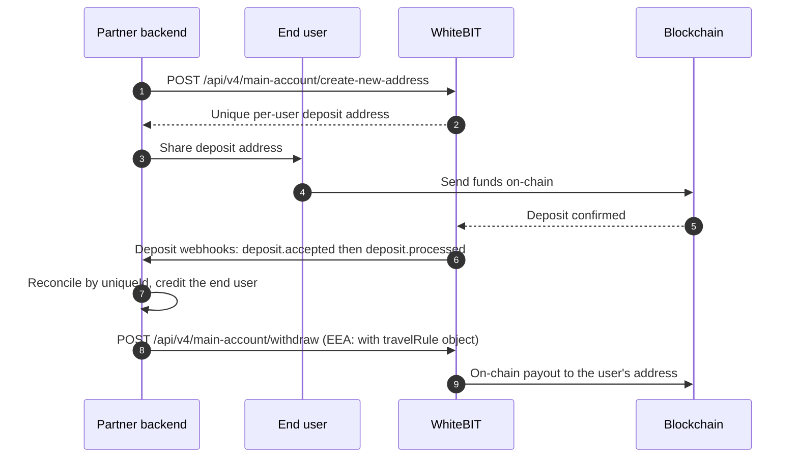

import PartnerEligibility from '/snippets/partner-eligibility.mdx';
import FeeShare from '/snippets/fee-share.mdx';

<Note>
**For developers.** This page covers the technical integration. For what WaaS is, the models at a
business level, and how to apply, see the [WaaS overview](/guides/waas-overview).
</Note>

The integration models are described in the
[Integration models](/concepts/integration-models) concept. This guide covers where to
start for each and the flows the models share.

## Prerequisites

- **Approved WaaS partner enrollment** — see the [WaaS overview](/guides/waas-overview) for what WaaS provides and how to apply.
- **A chosen backend model** — managed sub-accounts, attribution, or KYC reliance; compare on the [integration models](/concepts/integration-models) concept.
- **API access** — [HMAC-signed requests](/api-reference/authentication); per-user deposit addresses (`create-new-address`) enabled for the account.

## Where to start per model

| Model | Start here |
|---|---|
| Managed sub-accounts | [Broker Program](/guides/sub-account-integration) + [Sub-Accounts](/products/sub-accounts/overview) |
| Attribution (own account + OAuth) | [Fast API Key via OAuth](/guides/fast-api-key-integration) |
| Sub-accounts with KYC reliance | [Broker Program](/guides/sub-account-integration) + [Institutional Onboarding](/institutional/onboarding) |

The KYC-reliance model has specific eligibility requirements — see [KYC reliance eligibility](#kyc-reliance-eligibility) below.

Commercial terms for the program:

<FeeShare />

## KYC reliance eligibility

<PartnerEligibility />

## Payment and payout flows

Fund-movement flows, with parameters and code examples, are in the
[Payment Integration guide](/guides/payment-integration). The per-user deposit and payout cycle:

Reconcile by webhook, and poll transaction history as a **required** fallback: webhook delivery is
retried but has no replay, so an event can be missed and must be recovered by polling. Deduplicate
by `uniqueId`. See [Webhooks](/platform/webhook) for signatures and delivery semantics. API
[rate limits](/api-reference/rate-limits) apply per endpoint; sub-account limits are set per agreement.

<Note>
  Fiat deposit and withdrawal operate at the **master-account** level (institutional fiat access).
  Per-end-user fiat rails are not a standard shipped capability; confirm any such requirement with
  WhiteBIT first.
</Note>

<Warning>
**Compliance requirements that affect the requests:**
- EEA withdrawals require a `travelRule` object; in the sub-account models the partner submits it
  for each sub-account withdrawal it initiates. Inbound EEA/Turkey deposits are held until
  verification completes. See [Travel Rule](/concepts/travel-rule).
- For EEA users, use USDC or EURI, not USDT. See [Regulatory Compliance](/institutional/compliance).
</Warning>

## More flows

Additional use cases (conversion payouts, refunds, exact-amount payouts, multichain payouts) are
catalogued in [Recipes](/guides/waas-recipes), with the full parameter reference in the
[Payment Integration guide](/guides/payment-integration).

**Travel Rule (programmatic):** submit originator data via `travel-rule/deposit/verification` and
fetch the VASP list via `travel-rule/vasps` (EEA and Turkey). See [Travel Rule](/concepts/travel-rule).

## Testing

WhiteBIT does not offer a public testnet or sandbox. Test on the live API with minimum amounts,
and check per-asset minimums via the [Asset Status](/api-reference/market-data/asset-status-list)
endpoint first. The WhiteBIT Codes flow is a low-risk way to try a real signed call on a small
amount (see [Recipes](/guides/waas-recipes)).

## What's next

<CardGroup cols={2}>
  <Card title="WaaS Recipes" icon="sparkles" href="/guides/waas-recipes">
    Runnable examples and the starter repo.
  </Card>
  <Card title="Payment Integration" icon="arrow-right-arrow-left" href="/guides/payment-integration">
    Endpoint-level reference for every payment and payout flow.
  </Card>
  <Card title="FAQ" icon="circle-question" href="/guides/waas-faq">
    Scope, integration models, onboarding, and compliance questions.
  </Card>
</CardGroup>
