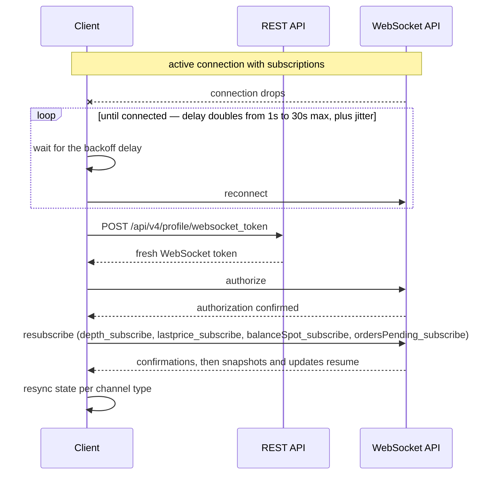

import { RegionBaseUrl } from '/snippets/RegionBaseUrl.jsx';

<RegionBaseUrl />

Connect to the WhiteBIT WebSocket API for real-time streaming data. The guide targets developers building trading bots, live price feeds, or account monitoring dashboards. The same authorized connection also places orders — see [Placing orders over the same connection](#placing-orders-over-the-same-connection) (available 2 September 2026, global platform only).

## Prerequisites

- A terminal with a WebSocket client (Python `websocket-client` library, or `wscat` for interactive testing)
- For private channels: a WhiteBIT API key with **Trading** permission and familiarity with [Authentication](/api-reference/authentication)
- No special setup for public channels — same zero-authentication principle as the [Market Data API](/products/market-data/overview)

<Warning>
  WhiteBIT has no public testnet or sandbox. Private channel subscriptions
  expose live account data. Store API credentials securely — never commit
  secrets to version control or expose credentials in shared environments.
  For risk-free balance-change testing, use Demo Tokens (DBTC/DUSDT) —
  activate from the [WhiteBIT Codes page](https://whitebit.com/codes).
</Warning>

## Connection parameters

| Detail | Value |
|--------|-------|
| Endpoint | `wss://api.whitebit.com/ws` |
| Protocol | JSON-RPC 2.0 over WebSocket |
| Inactivity timeout | 60 seconds — send `ping` every 50 seconds or less |
| Rate limit | 200 requests per minute per connection |

<Steps>
  <Step title="Connect to the WebSocket endpoint">
    Establish a WebSocket connection.

    <Tabs>
      <Tab title="Python">
        ```python
        import websocket
        import json

        ws = websocket.create_connection("wss://api.whitebit.com/ws")
        print("Connected to WebSocket API")
        ```
      </Tab>
      <Tab title="wscat">
        ```bash
        wscat -c wss://api.whitebit.com/ws
        ```
      </Tab>
    </Tabs>

    A successful connection produces no immediate response. The server is ready to receive subscription messages.

    For Go and PHP examples, see [SDKs](/sdks).
  </Step>

  <Step title="Subscribe to last price updates">
    Subscribe to real-time price updates for BTC_USDT.

    <Tabs>
      <Tab title="Python">
        ```python
        # Subscribe to BTC_USDT last price
        subscribe_msg = {
            "id": 1,
            "method": "lastprice_subscribe",
            "params": ["BTC_USDT"]
        }
        ws.send(json.dumps(subscribe_msg))

        # Receive subscribe confirmation
        result = json.loads(ws.recv())
        print(f"Subscribe result: {result}")

        # Receive price updates
        update = json.loads(ws.recv())
        print(f"Price update: {update}")
        ```
      </Tab>
      <Tab title="wscat">
        ```bash
        > {"id": 1, "method": "lastprice_subscribe", "params": ["BTC_USDT"]}
        ```
      </Tab>
    </Tabs>

    **Subscribe confirmation:**
    ```json
    {"id": 1, "result": {"status": "success"}, "error": null}
    ```

    **Update message:**
    ```json
    {
      "id": null,
      "method": "lastprice_update",
      "params": ["BTC_USDT", "65432.10"]
    }
    ```

    The `params` array contains: market name (index 0) and last traded price (index 1). The server pushes updates at 1-second intervals while the subscription is active.
  </Step>

  <Step title="Subscribe to orderbook depth">
    Subscribe to orderbook depth updates for BTC_USDT with 5 price levels.

    <Tabs>
      <Tab title="Python">
        ```python
        # Subscribe to BTC_USDT depth, 5 levels, no aggregation
        depth_msg = {
            "id": 2,
            "method": "depth_subscribe",
            "params": ["BTC_USDT", 5, "0", True]
        }
        ws.send(json.dumps(depth_msg))

        # Receive subscribe confirmation
        result = json.loads(ws.recv())
        print(f"Depth subscribe: {result}")

        # Receive depth snapshot/update
        depth = json.loads(ws.recv())
        print(f"Depth update: {depth}")
        ```
      </Tab>
      <Tab title="wscat">
        ```bash
        > {"id": 2, "method": "depth_subscribe", "params": ["BTC_USDT", 5, "0", true]}
        ```
      </Tab>
    </Tabs>

    **Parameters:** market name, depth limit (a fixed set of values from 1 to 100), price aggregation interval (`"0"` = no aggregation), and the multiple-subscription flag. Full parameter semantics, including flag and unsubscribe behavior: [Depth channel](/websocket/market-streams/depth).

    **Update message:**
    ```json
    {
      "id": null,
      "method": "depth_update",
      "params": [
        true,
        {
          "asks": [["65450.00", "0.500"], ["65460.00", "1.200"]],
          "bids": [["65430.00", "0.800"], ["65420.00", "1.500"]],
          "timestamp": 1700000000.123,
          "event_time": 1700000000.125,
          "update_id": 12345
        },
        "BTC_USDT"
      ]
    }
    ```

    The first element in `params` is a boolean: `true` = full snapshot, `false` = incremental update. To maintain a local orderbook, apply incremental updates to the initial snapshot.
  </Step>

  <Step title="Authenticate for private channels">
    <Note>
      Steps 1–3 cover public channels (no authentication required). Steps 4–5
      require an API key — see [Authentication](/api-reference/authentication)
      for key creation and HMAC-SHA512 signing details.
    </Note>

    Private channels (balance updates, order updates) require authentication. First obtain a WebSocket token via the REST API, then send an `authorize` message.

    <Tabs>
      <Tab title="Python">
        ```python
        import base64
        import hashlib
        import hmac
        import time
        import requests

        API_KEY = "YOUR_API_KEY"
        API_SECRET = "YOUR_API_SECRET"
        BASE_URL = "https://whitebit.com"

        # Part A — Get WebSocket token via REST API
        path = "/api/v4/profile/websocket_token"
        data = {"request": path, "nonce": int(time.time() * 1000)}
        data_json = json.dumps(data)
        payload_b64 = base64.b64encode(data_json.encode()).decode()
        signature = hmac.new(
            API_SECRET.encode(), payload_b64.encode(), hashlib.sha512
        ).hexdigest()
        headers = {
            "Content-Type": "application/json",
            "X-TXC-APIKEY": API_KEY,
            "X-TXC-PAYLOAD": payload_b64,
            "X-TXC-SIGNATURE": signature,
        }
        token_response = requests.post(BASE_URL + path, headers=headers, data=data_json)
        ws_token = token_response.json().get("websocket_token")
        print(f"WebSocket token obtained")

        # Part B — Send authorize message over WebSocket
        auth_msg = {
            "id": 3,
            "method": "authorize",
            "params": [ws_token, "public"]
        }
        ws.send(json.dumps(auth_msg))
        auth_result = json.loads(ws.recv())
        print(f"Auth result: {auth_result}")
        ```
      </Tab>
      <Tab title="wscat">
        ```bash
        # First obtain a token via REST (see Python example),
        # then send in wscat:
        > {"id": 3, "method": "authorize", "params": ["YOUR_WS_TOKEN", "public"]}
        ```
      </Tab>
    </Tabs>

    **Token endpoint:** `POST /api/v4/profile/websocket_token` (authenticated REST call).

    **Authorization response:**
    ```json
    {"id": 3, "result": {"status": "success"}, "error": null}
    ```
  </Step>

  <Step title="Subscribe to spot balance updates">
    After authentication, subscribe to real-time spot balance changes.

    <Tabs>
      <Tab title="Python">
        ```python
        # Subscribe to USDT and BTC balance updates
        balance_msg = {
            "id": 4,
            "method": "balanceSpot_subscribe",
            "params": ["USDT", "BTC"]
        }
        ws.send(json.dumps(balance_msg))

        # Receive subscribe confirmation
        result = json.loads(ws.recv())
        print(f"Balance subscribe: {result}")

        # Updates arrive within 1 second of any balance change
        update = json.loads(ws.recv())
        print(f"Balance update: {update}")
        ```
      </Tab>
      <Tab title="wscat">
        ```bash
        > {"id": 4, "method": "balanceSpot_subscribe", "params": ["USDT", "BTC"]}
        ```
      </Tab>
    </Tabs>

    **Update message — sent within 1 second of any balance change (trade or transfer):**
    ```json
    {
      "id": null,
      "method": "balanceSpot_update",
      "params": [
        {
          "USDT": {
            "available": "985.50",
            "freeze": "14.50"
          }
        }
      ]
    }
    ```

    Key fields: `available` (funds ready for trading), `freeze` (funds locked in open orders).
  </Step>

  <Step title="Send a keepalive ping">
    The server closes the connection after 60 seconds of inactivity. Send a ping message to verify the connection is alive.

    <Tabs>
      <Tab title="Python">
        ```python
        ping_msg = {"id": 0, "method": "ping", "params": []}
        ws.send(json.dumps(ping_msg))
        pong = json.loads(ws.recv())
        print(f"Ping result: {pong}")
        ```
      </Tab>
      <Tab title="wscat">
        ```bash
        > {"id": 0, "method": "ping", "params": []}
        ```
      </Tab>
    </Tabs>

    **Expected response:**
    ```json
    {"id": 0, "result": "pong", "error": null}
    ```

    In production, send a ping every 50 seconds or less to prevent disconnection.
  </Step>
</Steps>

## Error responses

Failed requests return a JSON-RPC error object in the `error` field:

```json
{
  "id": 3,
  "result": null,
  "error": {
    "code": 1,
    "message": "invalid argument"
  }
}
```

Check the `error` field on every response before treating a request as confirmed. Typical failures: an expired or invalid token in `authorize` — obtain a fresh one via `POST /api/v4/profile/websocket_token` — and a market name that does not exist in a subscribe call. Error codes and connection limits: [WebSocket Rate Limits & Error Codes](/websocket/rate-limits).

The six steps above cover a single connection. Production integrations need automatic reconnection and state recovery, covered next.

## Reconnection and state recovery

WebSocket connections can drop due to network issues or server maintenance. Production integrations require automatic reconnection, re-authentication, and state recovery logic.

### Reconnection with exponential backoff

The recovery flow after a dropped connection: reconnect with growing delays, re-authenticate with a fresh token, resubscribe every channel, then resync local state.



The critical path is the reconnect loop — wait with backoff and jitter, reconnect, resubscribe, and reset the delay only after a successful connection:

```python
import asyncio, json, random, websockets

SUBSCRIPTIONS = [
    {"method": "depth_subscribe", "params": ["BTC_USDT", 20, "0", True]},
    {"method": "balanceSpot_subscribe", "params": ["USDT", "BTC"]},
]

async def listen_with_reconnect():
    delay = 1
    while True:
        try:
            async with websockets.connect("wss://api.whitebit.com/ws") as ws:
                delay = 1  # reset backoff after a successful connection
                # Private channels: authorize first with a fresh token
                # ("Authenticate for private channels" above)
                for msg_id, sub in enumerate(SUBSCRIPTIONS, start=1):
                    await ws.send(json.dumps({"id": msg_id, **sub}))
                # Ping every 50 seconds in a background task
                # ("Send a keepalive ping" above)
                while True:
                    update = json.loads(await ws.recv())
                    # Resync per channel type ("State recovery after reconnect" below)
        except (OSError, websockets.exceptions.ConnectionClosed):
            wait = min(delay + random.uniform(0, delay * 0.5), 30)
            delay = min(delay * 2, 30)  # exponential backoff, 1s → 30s max
            await asyncio.sleep(wait)
```

Key points:
- **Keepalive ping** — send `ping` every 50 seconds from a background task, staying inside the 60-second inactivity timeout even when no updates flow
- **Exponential backoff** — delays double on each failure (1s → 2s → 4s → ... → 30s max) with random jitter to prevent thundering herd
- **Fresh token** — obtain a new WebSocket token on every reconnect; tokens may expire during long disconnections
- **Full resubscription** — re-subscribe to all channels after reconnecting; the server does not remember previous subscriptions

For an implementation with fill monitoring, grid strategy logic, and error recovery, see [Building a Trading Bot — Auto-resubscription](/guides/building-a-trading-bot#auto-resubscription-after-reconnect).

### State recovery after reconnect

Different channels use different update models. The recovery strategy depends on the channel type:

| Update model | Channels | Recovery strategy |
|---|---|---|
| Snapshot on subscribe | [Depth](/websocket/market-streams/depth) | First message after subscribe is a full snapshot — local state auto-recovers. Apply incremental updates from subsequent messages. Detect gaps via the `past_update_id` chain on incremental deltas; keepalive snapshots (`params[0]` is `true`) are full resets, not gaps. |
| Periodic full snapshot | [Positions](/websocket/account-streams/positions), [Borrows](/websocket/account-streams/borrows), [Market](/websocket/market-streams/market), [Market Today](/websocket/market-streams/market-today) | Full state arrives within 1–1.5s of subscribing — no gap to fill. |
| Incremental delta | [Balance Spot](/websocket/account-streams/balance-spot), [Balance Margin](/websocket/account-streams/balance-margin) | **Query first, then subscribe.** Send a one-time query (`balanceSpot_request` / `balanceMargin_request`) to get full state, then subscribe for incremental changes. |
| Event stream | [Orders Pending](/websocket/account-streams/orders-pending), [Orders Executed](/websocket/account-streams/orders-executed), [Deals](/websocket/account-streams/deals), [Trades](/websocket/market-streams/trades) | **Query first, then subscribe.** The server does not buffer events during a disconnection. Use the one-time query operation or the REST equivalent to backfill, then subscribe. Trades resubscription replays a snapshot of up to the 100 latest trades — deduplicate by trade `id`. |
| Event-only (no snapshot) | [Margin Positions Events](/websocket/account-streams/margin-positions-events), [Borrows Events](/websocket/account-streams/borrows-events) | Pair with the snapshot channel ([Positions](/websocket/account-streams/positions) / [Borrows](/websocket/account-streams/borrows)) for complete state awareness. |
| Simple replacement | [Last Price](/websocket/market-streams/lastprice), [Book Ticker](/websocket/market-streams/book-ticker), [Kline](/websocket/market-streams/kline) | Each message replaces previous value — no gap handling needed. |

For incremental-delta and event-stream channels, use a **query-then-subscribe** pattern:

```python
async def recover_and_subscribe(ws):
    """Query current state, then subscribe for live updates."""
    # Step 1 — query full state
    await ws.send(json.dumps({
        "id": 10, "method": "balanceSpot_request", "params": []
    }))
    snapshot = json.loads(await ws.recv())
    # Initialize local state from snapshot["result"]

    # Step 2 — subscribe for incremental updates
    await ws.send(json.dumps({
        "id": 11, "method": "balanceSpot_subscribe", "params": ["USDT", "BTC"]
    }))
```

## Placing orders over the same connection

<Note>
Coming soon — order placement over WebSocket becomes available on 2 September 2026, on the global platform only; the EU platform is not yet supported.
</Note>

The connection this guide opens and authorizes also carries order flow. The [WebSocket Order Management](/websocket/order-management/overview) methods place, modify, and cancel spot, margin, and futures orders as JSON-RPC calls — the same envelope as a subscribe frame, with two differences: `params` carries a single object rather than positional values, and the error codes are numbered independently of REST. A placement uses the same frame shape as a subscribe request:

```json
{
  "id": 101,
  "method": "order_limit_place",
  "params": [
    { "market": "BTC_USDT", "side": "buy", "amount": "0.01", "price": "60000", "client_order_id": "quote-1" }
  ]
}
```

The server answers with one frame echoing `id`; correlate it against the interleaved subscription pushes by `id`. See [Order Management](/websocket/order-management/overview) for the full method set, parameters, and error reference.

## What's next

<CardGroup cols={3}>
  <Card title="Market Data Overview" icon="chart-bar" href="/products/market-data/overview">
    REST API counterpart — polling-based market data for simpler integrations.
  </Card>
  <Card title="Building a Trading Bot" icon="robot" href="/guides/building-a-trading-bot">
    Combine WebSocket data with order placement for automated trading.
  </Card>
  <Card title="Order Management" icon="pen-to-square" href="/websocket/order-management/overview">
    Place, modify, and cancel orders over the same connection (from 2 September 2026, global platform only).
  </Card>
  <Card title="Price Dashboard" icon="gauge" href="/guides/building-a-price-dashboard">
    Combine a REST snapshot and a WebSocket stream into a live price board — no API key.
  </Card>
  <Card title="WebSocket Channels" icon="satellite-dish" href="/websocket/overview">
    Full channel catalog — market and account streams with schema references.
  </Card>
</CardGroup>
