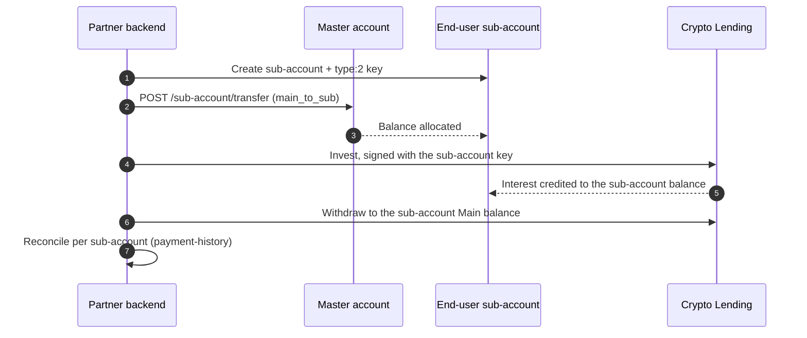

import { RegionBaseUrl } from '/snippets/RegionBaseUrl.jsx';

<Note>
**For developers.** This page covers the technical integration. For what YaaS is, the model, and how
to apply, see the [Yield-as-a-Service overview](/guides/yaas-overview).
</Note>

<RegionBaseUrl />

Yield-as-a-Service uses **Model A** — one [sub-account](/products/sub-accounts/overview) per end
user, with the [Crypto Lending](/products/lending/overview) lifecycle run inside each sub-account
using that sub-account's own API key. This guide covers the B2B layer — provisioning, funding, and
per-user reconciliation. The lending lifecycle itself is documented in the
[Crypto Lending quickstart](/products/lending/quickstart); the only difference here is the signing
key.

## Prerequisites

- **Crypto Lending enabled where it runs.** Lending is available on the master account with B2B access; on sub-accounts it is **not enabled by default** — request enablement for each end-user sub-account via the account manager or `institutional@whitebit.com` (see the [overview](/guides/yaas-overview#how-to-get-started)). Until it is enabled, the lending endpoints are not available on that sub-account.
- **A sub-account per end user**, each with its own **type:2** API key (info, trading, deposits, withdraws) — type:2 is required to run lending on a sub-account.
- **Funds in the master Main balance** to allocate to each sub-account.
- **HMAC-signed requests** — see [Authentication](/api-reference/authentication).

## Integration building blocks

### 1. Provision a sub-account per end user

Create one sub-account per end user and issue that sub-account a type:2 API key. Build with
[Sub-Accounts](/products/sub-accounts/overview) for account creation and key management, and the
[Embedded Trading integration guide](/guides/sub-account-integration) for the full walkthrough
(per-customer keys, KYC-URL branding).

| Endpoint | Purpose |
|----------|---------|
| `POST /api/v4/sub-account/create` | Create a sub-account (`alias`, `permissions`) |
| `POST /api/v4/sub-account/api-key/create` | Issue the sub-account a key (`type: 2`, `subAccountId`, `title`) |

### 2. Fund the sub-account

Move funds from the master Main balance to the end user's sub-account with a fee-free transfer.

| Endpoint | Purpose |
|----------|---------|
| `POST /api/v4/sub-account/transfer` | `id` (sub-account), `direction: main_to_sub`, `ticker`, `amount` |

### 3. Offer yield inside the sub-account

Run the Crypto Lending lifecycle — fetch plans, invest, track, withdraw — signed with the
**sub-account's own key**, so investments and interest stay in that sub-account's balance. The
request and response fields are documented in the
[Crypto Lending quickstart](/products/lending/quickstart); the only B2B difference is the signing key.

```bash
# Invest on an end user's behalf — signed with THAT sub-account's type:2 key
curl -X POST https://whitebit.com/api/v4/main-account/smart-flex/investments/invest \
  -H "Content-Type: application/json" \
  -H "X-TXC-APIKEY: SUBACCOUNT_API_KEY" \
  -H "X-TXC-PAYLOAD: PAYLOAD" \
  -H "X-TXC-SIGNATURE: SIGNATURE" \
  -d '{
    "plan": "PLAN_ID",
    "amount": "100.00",
    "withReinvest": true,
    "request": "/api/v4/main-account/smart-flex/investments/invest",
    "nonce": 1709340000000
  }'
```

<Note>
The `main-account/` path segment addresses the **signing account's own Main balance** — for a
sub-account key, that is the sub-account's balance, not the master's. This is why a sub-account key
runs the lending lifecycle against that end user's funds.
</Note>

| Endpoint | Purpose |
|----------|---------|
| `POST /api/v4/main-account/smart-flex/plans` | Available flexible plans |
| `POST /api/v4/main-account/smart-flex/investments/invest` | Invest on the end user's behalf |
| `POST /api/v4/main-account/smart-flex/investments/withdraw` | Withdraw to the sub-account Main balance |
| `POST /api/v4/main-account/smart/plans` | Available fixed plans |

### 4. Reconcile earnings per user

Each sub-account's investments and payment history are that end user's earnings. There is no
aggregated cross-sub report, so attribution is per sub-account — read each sub-account with its own key.

| Endpoint | Purpose |
|----------|---------|
| `POST /api/v4/main-account/smart-flex/investments` | The end user's active flexible investments |
| `POST /api/v4/main-account/smart-flex/investments/payment-history` | Interest credited to the end user |

Per-user lifecycle:



## Testing

WhiteBIT does not offer a public testnet or sandbox. Test on the live API with minimum amounts, and
check available plans and per-plan minimums via the plans endpoints first.

## Reference

- [Sub-Accounts](/products/sub-accounts/overview) — create and manage per-user accounts and keys.
- [Crypto Lending](/products/lending/overview) — Fixed and Flex plan mechanics, supported assets, and the full endpoint reference.
- [Crypto Lending quickstart](/products/lending/quickstart) — the invest, track, and withdraw lifecycle.

## What's next

<CardGroup cols={3}>
  <Card title="FAQ" icon="circle-question" href="/guides/yaas-faq">
    How B2B yield differs from the self-service flow.
  </Card>
  <Card title="Crypto Lending" icon="piggy-bank" href="/products/lending/overview">
    Plan mechanics, supported assets, and the endpoint reference.
  </Card>
  <Card title="Sub-Accounts" icon="sitemap" href="/products/sub-accounts/overview">
    Create and manage the per-user accounts this program provisions.
  </Card>
</CardGroup>
