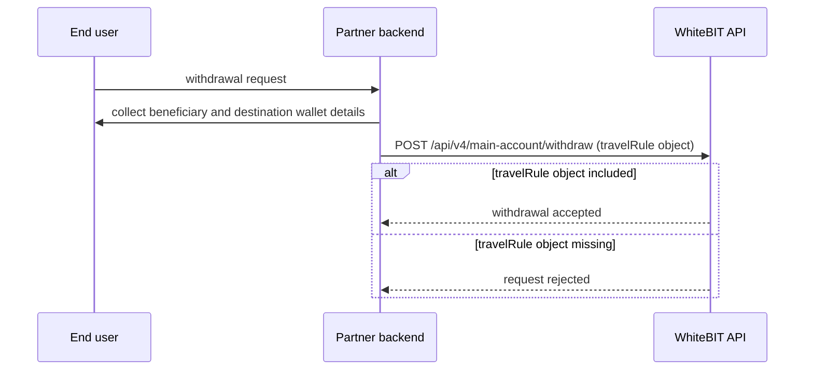

import { RegionBaseUrl } from '/snippets/RegionBaseUrl.jsx';

<RegionBaseUrl />

Regulatory requirements affect API behavior depending on account jurisdiction. Two active regimes require integration changes for European Economic Area ([EEA](/glossary#european-economic-area-eea)) accounts: MiCA restrictions on USDT operations and Travel Rule data requirements on crypto withdrawals.

| Regulation | Affected accounts | API impact |
|------------|-------------------|------------|
| [MiCA — USDT restrictions](#mica-usdt-restrictions-for-eea-users) | EEA | USDT deposits, withdrawals, and WhiteBIT Codes rejected since December 30, 2024 |
| [Travel Rule](#travel-rule-eea-crypto-withdrawals) | EEA (and Turkey) | `travelRule` object required on crypto withdrawals since May 19, 2025; deposit status codes 27 and 28 |
| [Data processing (GDPR)](#data-processing-and-privacy) | All | No API impact — data processing terms and DPA availability |

## MiCA: USDT restrictions for EEA users

Since **December 30, 2024**, EEA accounts cannot deposit, withdraw, or create WhiteBIT Codes in USDT. The restriction implements Markets in Crypto-Assets Regulation (MiCA) requirements — Tether (USDT issuer) has not obtained EU e-money authorization.

### Impact on API integrations

- The server rejects USDT deposit requests from EEA accounts
- The server rejects USDT withdrawal requests from EEA accounts
- The server blocks WhiteBIT Codes denominated in USDT for EEA accounts
- No endpoint schema changes — the same endpoints apply, but the server returns an error for USDT operations from EEA-jurisdiction accounts
- Non-EEA accounts are not currently affected

### Recommended alternatives

| Stablecoin | Peg | MiCA status |
|------------|-----|-------------|
| **USDC** | US dollar | EU e-money license obtained (issuer: Circle) |
| **EURI** | Euro | MiCA-compliant |

### MiCA integration guidance

Do not hardcode USDT as the default stablecoin for EEA users. Use the [Asset Status endpoint](/api-reference/market-data/asset-status-list) (`GET /api/v4/public/assets`) to check available currencies dynamically. Build currency selection logic that respects jurisdiction-specific restrictions.

**Source:** [Changes to USDT Services for EEA Users (Help Center)](https://help.whitebit.com/hc/en-gb/articles/23937597184413-Important-Update-Changes-to-USDT-Services-for-EEA-Users)

### MiCA transaction thresholds

The following platform-level thresholds apply to EEA users under MiCA. Any integration should account for the possibility that end users may encounter additional verification steps at these levels:

| Threshold | Platform behavior |
|-----------|-------------------|
| > 1,000 EUR | Anonymous transactions prohibited — know-your-customer (KYC) verification required |
| ≥ 10,000 EUR per transaction | Additional verification checks may apply |
| > 50,000 EUR annually | Enhanced due diligence required |

Only fiat-backed stablecoins (e.g., USDC, EURI) are permitted under MiCA. Algorithmic stablecoins are not allowed for EEA accounts.

## Travel Rule: EEA crypto withdrawals

Since **May 19, 2025**, crypto withdrawals from EEA accounts (and Turkey) require a `travelRule` object in the withdrawal request body. The requirement implements the Financial Action Task Force (FATF) Travel Rule for Virtual Asset Service Providers (VASPs).

<Note>
  The Travel Rule API endpoints are not available to all accounts. To request access, contact the
  assigned Account Manager or email institutional@whitebit.com. See the
  [Travel Rule overview](/api-reference/travel-rule/overview) for details.
</Note>

### Timeline

| Date | Event |
|------|-------|
| May 18, 2025 | New deposit status codes (27, 28) activated |
| May 19, 2025 | Travel Rule enforcement activated for withdrawals |

### Withdrawal request: travelRule object

The `travelRule` object is required on [`POST /api/v4/main-account/withdraw`](/api-reference/account-wallet/create-withdraw-request) for crypto withdrawals from EEA accounts (and Turkey). The object uses a structured format:

| Parameter | Description |
|-----------|-------------|
| `walletType` | Destination wallet type: `hosted` (VASP-hosted — exchange or custodian) or `unhosted` (self-custody wallet) |
| `beneficiary` | Receiver details: `type` (`individual` or `entity`), `firstName` and `lastName` (individual) or `fullName` (entity), `residenceCountry`, and an `address` object |
| `vaspData` | Required when `walletType` is `hosted`: `vaspId` from the [Get VASPs](/api-reference/travel-rule/get-vasps) endpoint, or `vaspName` when the destination VASP is not in the list |

For the complete field-level reference, see the [withdraw endpoint](/api-reference/account-wallet/create-withdraw-request) and the [Travel Rule concept page](/concepts/travel-rule).

<Warning>
  The API still accepts a legacy flat format (`type`, `vasp`, `name`, `address`), but withdrawals
  submitted in the legacy format **do not pass Travel Rule verification**. Use the structured
  format for all integrations and migrate existing ones — see the
  [legacy field mapping](/concepts/travel-rule#legacy-format-withdrawals-only) for the migration.
</Warning>

### Code example: withdrawal with Travel Rule

The flow: collect the beneficiary and destination-wallet details from the end user first, then submit the withdrawal with the `travelRule` object attached.



<Tabs>
  <Tab title="cURL">
    ```bash
    # EEA crypto withdrawal with Travel Rule (individual, hosted wallet)
    curl -X POST https://whitebit.com/api/v4/main-account/withdraw \
      -H "Content-Type: application/json" \
      -H "X-TXC-APIKEY: YOUR_API_KEY" \
      -H "X-TXC-PAYLOAD: YOUR_PAYLOAD" \
      -H "X-TXC-SIGNATURE: YOUR_SIGNATURE" \
      -d '{
        "ticker": "ETH",
        "amount": "0.5",
        "address": "0x742d35Cc6634C0532925a3b844Bc9e7595f2bD18",
        "uniqueId": "withdrawal-001",
        "travelRule": {
          "walletType": "hosted",
          "beneficiary": {
            "type": "individual",
            "firstName": "John",
            "lastName": "Doe",
            "residenceCountry": "DEU"
          },
          "vaspData": {
            "vaspId": "vasp-001"
          }
        },
        "request": "/api/v4/main-account/withdraw",
        "nonce": 1709340000000
      }'
    ```
  </Tab>
  <Tab title="Python">
    ```python
    # EEA crypto withdrawal with Travel Rule (individual, hosted wallet).
    # Request body for POST /api/v4/main-account/withdraw:
    body = {
        "ticker": "ETH",
        "amount": "0.5",
        "address": "0x742d35Cc6634C0532925a3b844Bc9e7595f2bD18",
        "uniqueId": "withdrawal-001",
        "travelRule": {
            "walletType": "hosted",
            "beneficiary": {
                "type": "individual",
                "firstName": "John",
                "lastName": "Doe",
                "residenceCountry": "DEU",
            },
            "vaspData": {"vaspId": "vasp-001"},
        },
    }
    # To send: add "request" and "nonce" to the body, serialize with compact
    # separators (the server rejects spaced JSON), sign with HMAC-SHA512, and
    # send with the X-TXC-APIKEY / X-TXC-PAYLOAD / X-TXC-SIGNATURE headers —
    # implementation in the First API Call guide linked below.
    ```
  </Tab>
</Tabs>

[First API Call](/guides/first-api-call) documents the signing details (payload construction, nonce, and headers).

For Go and PHP examples, see [SDKs](/sdks).

**Entity example:**

For entity withdrawals, set `beneficiary.type` to `"entity"` and provide the legal name in `fullName`:

```json
"travelRule": {
  "walletType": "hosted",
  "beneficiary": {
    "type": "entity",
    "fullName": "Acme Trading Ltd",
    "residenceCountry": "DEU"
  },
  "vaspData": {
    "vaspName": "Famous Vasp Inc"
  }
}
```

### Deposit status codes

Two deposit status codes indicate Travel Rule verification in progress. Travel Rule deposit holds apply to EEA and Turkey accounts.

| Status code | Name | Description |
|-------------|------|-------------|
| 27 | `DEPOSIT_TRAVEL_RULE_FROZEN` | Deposit frozen — awaiting Travel Rule verification |
| 28 | `DEPOSIT_TRAVEL_RULE_FROZEN_PROCESSING` | Travel Rule verification in progress |

Deposits with status 27 or 28 are not credited to the account balance until Travel Rule verification completes. Build deposit monitoring logic to handle status codes 27 and 28 gracefully — do not treat frozen deposits as failed deposits.

To resolve a frozen deposit: when the Travel Rule API is enabled for the account, submit the required data via [Submit deposit verification](/api-reference/travel-rule/submit-deposit-verification); otherwise the depositor provides the data manually through the WhiteBIT interface.

### Travel Rule integration guidance

Partners must collect beneficiary information (wallet type, beneficiary details, VASP identification) from end users **before** submitting withdrawal requests. The server rejects withdrawal requests from EEA (and Turkey) accounts that omit the `travelRule` object.

**Source:** [Travel Rule Requirements (Help Center)](https://help.whitebit.com/hc/en-gb/articles/24093241373341-Travel-Rule-Requirements-Updates-to-Crypto-Withdrawals-Interface-and-API)

## Data processing and privacy

- **Data residency:** WhiteBIT processes data in the European Union. A Data Processing Agreement (DPA) is available on request.
- **GDPR:** WhiteBIT processes data in accordance with the General Data Protection Regulation (GDPR).
- **Sub-processors:** For the current list of sub-processors, contact compliance@whitebit.com.
- **Data retention:** For data retention policies, contact compliance@whitebit.com.

## Certifications and audits

| Certification | Details |
|---------------|---------|
| ISO 27001 | Information security management. Audited by Hacken. |
| PCI DSS Level 1 | Payment card data security. Audited by Hacken. |
| CCSS Level 3 | Cryptocurrency Security Standard. Audited by Hacken. |

For certificate numbers, issuing bodies, and validity dates, contact institutional@whitebit.com. Independent verification is available on request.

## VASP registrations

WhiteBIT holds VASP registrations in multiple jurisdictions. For a complete list of registration jurisdictions, supervising authorities, and registration numbers, contact compliance@whitebit.com.

{/* If specific jurisdictions become available from the legal team, list them here in a table: Jurisdiction | Registration Number | Supervising Authority */}

## Restricted jurisdictions

For a current list of restricted and prohibited jurisdictions, contact compliance@whitebit.com.

{/* If the restricted jurisdictions list is published, add it here. The compliance persona flagged this as a critical gap. */}

## Regulatory scope

Regulatory requirements are evolving. Travel Rule enforcement and MiCA restrictions currently apply to EEA accounts (and Turkey for Travel Rule). WhiteBIT may extend enforcement to additional jurisdictions. Monitor the [WhiteBIT Help Center](https://help.whitebit.com/hc/en-gb) and the [Changelog](/changelog) for updates.

{/* SME pending (2026-07-05): confirm whether withdrawal-side travelRule enforcement includes Turkey — deposit-side holds do (openapi/private/main_api_v4.yaml deposit-hold description). */}

## Contact

- **compliance@whitebit.com** — DPA requests, sub-processor lists, data retention policies, VASP registration details, and restricted-jurisdiction confirmations
- **institutional@whitebit.com** — certificate verification, Travel Rule API access, and institutional onboarding

Include the account jurisdiction, the partner type, and the specific request in the first message to avoid an extra clarification round-trip.

## What's Next

<CardGroup cols={2}>
  <Card title="Institutional Overview" icon="building" href="/institutional/overview">
    Product catalog and partner-type routing.
  </Card>
  <Card title="Onboarding" icon="clipboard-check" href="/institutional/onboarding">
    Step-by-step institutional onboarding process.
  </Card>
</CardGroup>
