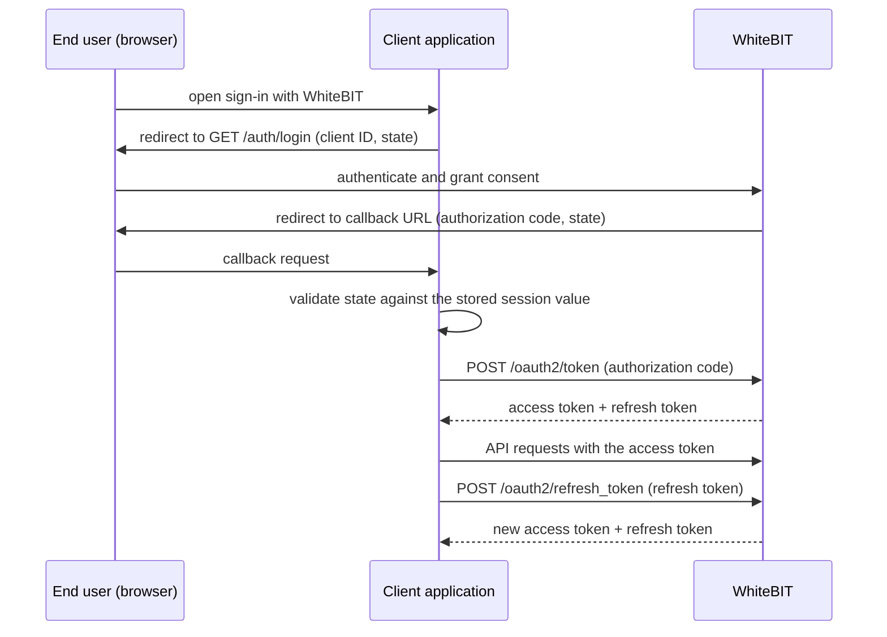

import { RegionBaseUrl } from '/snippets/RegionBaseUrl.jsx';

<RegionBaseUrl />

<Warning>
**Deprecated.** The OAuth 2.0 Authorization Code Grant flow for direct account-data access is deprecated and will be removed on **November 1, 2026**. New partner integrations should use the [Fast API Key flow](/guides/fast-api-key-via-oauth), which issues a WhiteBIT API key on the user's behalf and calls the standard [V4 API](/api-reference/authentication).
</Warning>

## Introduction

WhiteBIT OAuth 2.0 implementation uses the standard **Authorization Code Grant** flow. This flow is suitable for server-side applications where the client secret can be securely stored.

The OAuth 2.0 endpoints documented on this page cover the Authorization Code Grant flow for read access to account data. For partner-issued API keys, a separate OAuth API key flow uses Authorization Code with PKCE (S256), a 4-hour access token, and no refresh token. See the [Fast API Key integration guide](/guides/fast-api-key-via-oauth) for the full integration.

## Authorization Code Grant flow

The flow involves three parties: the end user in a browser, the client application backend, and WhiteBIT. The client application redirects the user to WhiteBIT for authentication and consent, receives a one-time authorization code on the registered callback URL, exchanges the code for tokens server-side, and refreshes the access token on expiry.



Generate a cryptographically secure random `state` value before redirecting to [`GET /auth/login`](/api-reference/oauth/usage/authorize), store the value in the session, and validate the callback against the stored value before exchanging the code — treat mismatched or missing state as a possible CSRF attempt and abort the flow. Access tokens are short-lived; refresh the access token server-side instead of re-running the consent flow.

## Token exchange

Exchange the authorization code received on the callback URL for an access token by calling [`POST /oauth2/token`](/api-reference/oauth/usage/get-access-token) with a form-encoded body:

```bash
curl -X POST https://whitebit.com/oauth2/token \
  -H "Content-Type: application/x-www-form-urlencoded" \
  -d "client_id=YOUR_CLIENT_ID" \
  -d "client_secret=YOUR_CLIENT_SECRET" \
  -d "code=AUTHORIZATION_CODE"
```

```json
{
  "data": {
    "access_token": "MZM1MDBMMJYTNWM4MI0ZNTIYLTKXNDATNZY1MZHKM2Y2MJY3",
    "expires_in": 300,
    "refresh_token": "ODK5ZTVKZDUTYTI5ZC01NWJHLTGZZDMTYWFKYTNMNJHHMGZM",
    "scope": "codes.apply,show.userinfo",
    "token_type": "Bearer"
  }
}
```

Store both tokens server-side. The `expires_in` value is the access-token lifetime in seconds. See the [Get Access Token reference](/api-reference/oauth/usage/get-access-token) for the full request and error contract, including the IP allowlist requirement.

## Token refresh

When the access token expires, obtain a new one with [`POST /oauth2/refresh_token`](/api-reference/oauth/usage/refresh-token) — without user interaction:

```bash
curl -X POST https://whitebit.com/oauth2/refresh_token \
  -H "Content-Type: application/x-www-form-urlencoded" \
  -d "client_id=YOUR_CLIENT_ID" \
  -d "client_secret=YOUR_CLIENT_SECRET" \
  -d "token=REFRESH_TOKEN"
```

```json
{
  "data": {
    "access_token": "NTBLZJKYNZETNJFIZC0ZNGM1LWJMYTMTODBJYZRKNWE2NMRM",
    "expires_in": 300,
    "refresh_token": "ODZMNMRHM2ETMZQZZI01OTQYLWEWMZATNWQ0NDYZNJBMOWUW",
    "scope": "codes.apply,show.userinfo",
    "token_type": "Bearer"
  }
}
```

Each refresh returns a new refresh token — replace the stored pair on every refresh. The refresh token is also short-lived and rate-limited; see the [Refresh Token reference](/api-reference/oauth/usage/refresh-token) for the token lifetimes and rate limit.

## Scopes

Available Scopes (requested during client setup):
- `general`: General API access
- `show.userinfo`: Access to basic user information
- `users.read`: Read user data
- `users.email.read`: Read user email information
- `users.kyc.read`: Information about whether a user has passed KYC verification
- `orders.read`: Read trading orders
- `orders.create`: Create trading orders
- `orders.delete`: Delete trading orders
- `balances.read`: Read account balances
- `markets.read`: Read market information
- `deals.read`: Read trading deals
- `orders_history.read`: Read order history
- `users.transactions.read`: Read user transactions
- `users.converts.read`: Read currency conversion history
- `users.balances.read`: Read user account balances
- `users.orders.read`: Read user orders
- `users.deals.read`: Read user deals
- `apikeys.create`: Issue an OAuth-bound API key during the consent flow
- `apikeys.read`: Read OAuth-issued API key state and retrieve its secret once
- `apikeys.delete`: Delete an OAuth-issued API key owned by the OAuth2 client
