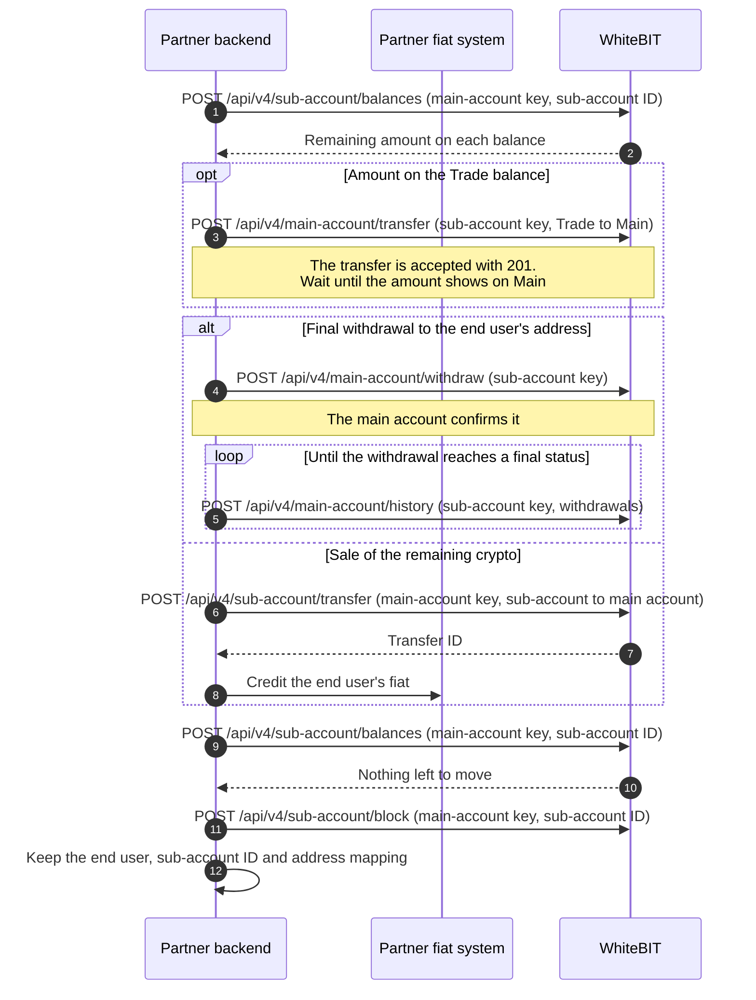

```mermaid
sequenceDiagram
    autonumber
    participant P as Partner backend
    participant F as Partner fiat system
    participant W as WhiteBIT

    P->>W: POST /api/v4/sub-account/balances (main-account key, sub-account ID)
    W-->>P: Remaining amount on each balance
    opt Amount on the Trade balance
        P->>W: POST /api/v4/main-account/transfer (sub-account key, Trade to Main)
        Note over P,W: The transfer is accepted with 201.<br/>Wait until the amount shows on Main
    end
    alt Final withdrawal to the end user's address
        P->>W: POST /api/v4/main-account/withdraw (sub-account key)
        Note over P,W: The main account confirms it
        loop Until the withdrawal reaches a final status
            P->>W: POST /api/v4/main-account/history (sub-account key, withdrawals)
        end
    else Sale of the remaining crypto
        P->>W: POST /api/v4/sub-account/transfer (main-account key, sub-account to main account)
        W-->>P: Transfer ID
        P->>F: Credit the end user's fiat
    end
    P->>W: POST /api/v4/sub-account/balances (main-account key, sub-account ID)
    W-->>P: Nothing left to move
    P->>W: POST /api/v4/sub-account/block (main-account key, sub-account ID)
    P->>P: Keep the end user, sub-account ID and address mapping
```
