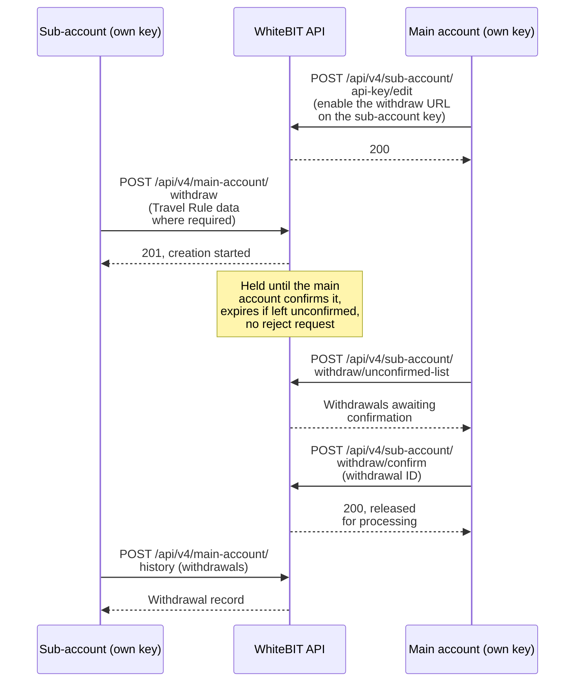

```mermaid
sequenceDiagram
    participant Sub as Sub-account (own key)
    participant WB as WhiteBIT API
    participant Main as Main account (own key)
    Main->>WB: POST /api/v4/sub-account/<br/>api-key/edit<br/>(enable the withdraw URL<br/>on the sub-account key)
    WB-->>Main: 200
    Sub->>WB: POST /api/v4/main-account/<br/>withdraw<br/>(Travel Rule data<br/>where required)
    WB-->>Sub: 201, creation started
    Note over WB: Held until the main<br/>account confirms it,<br/>expires if left unconfirmed,<br/>no reject request
    Main->>WB: POST /api/v4/sub-account/<br/>withdraw/unconfirmed-list
    WB-->>Main: Withdrawals awaiting<br/>confirmation
    Main->>WB: POST /api/v4/sub-account/<br/>withdraw/confirm<br/>(withdrawal ID)
    WB-->>Main: 200, released<br/>for processing
    Sub->>WB: POST /api/v4/main-account/<br/>history (withdrawals)
    WB-->>Sub: Withdrawal record
```
